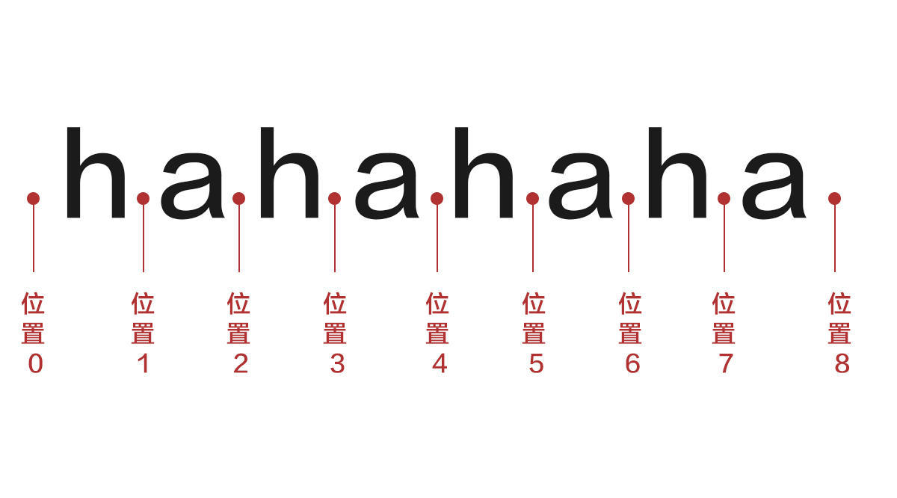

# 正则表达式

## 原理概论

### 正则引擎

#### DFA 确定型有穷自动机

Deterministic finite automaton 
不需要进行回溯 -- 匹配效率高 -- 不支持捕获

#### NFA 非确定型有穷自动机

Non-deterministic finite automaton
大部分都是NFA

### 知识储备

#### 字符和位置

#### 控制权和传动

控制权: 是指哪一个正则表达式(可能为一个普通字符, 元字符或元字符序列组成)在匹配字符串, 那么控制权就在哪
传动: 是指正则引擎的一种机制, 传动装置将从字符串的哪里开始匹配

### 匹配之旅"浅"度游

## 语法一览

### 某类常见字符 - 简单元字符

- `.` 匹配换行(`\n`)符以外的任意字符
- `\w` 任意字母, 数字, 下划线 等价 `[0-9a-zA-Z_]`
- `\s` 匹配任何空白字符 等价 `[\f\n\r\t\v]`
- `\d` 匹配数字 等价 `[0-9]`
- `\b` 单词的边界
- `\un` 匹配n, 其中n是一个用四个十六进制数字组成的Unicode字符

### "非"语义 - 反义

- `\W` 任意不是字母, 数字, 下划线的字符 等价 `[^0-9a-zA-Z_]`
- `\S` 任意不是空白字符的字符
- `\D` 任意非数字字符 等价 `[^0-9]`
- `\B` 不是单词开始或结束的位置
- `[^aeiou]` 除了 aeiou 这5个字符外的字符

### 整体看待和捕获 - 分组和后向引用

- (abc)+ 将 abc 看成一个整体, 这个整体出现一次
  括号表示分组, 括起来表示一个整体, 也表示指定子表达式
- (exp) 匹配exp 并捕获文本到自动命名的组中, 自动命名以左括号为标志, 从1开始命名捕获组, 分组0对应整个正则匹配的内容.
- ~~(?<name>exp) 匹配exp, 指定捕获组为name~~
- \n 后向引用一个捕获组, \1将引用前面匹配的捕获组1
- ~~\k<name> 后向引用命名为name的捕获组~~

### 转义

- \ 使用在正则中有语义的字符必须要转义, 如 ^ $ [ 等
- 有些情况下, 不需要显示转义, 比如 [(] 和 [\(] 都能匹配左括号, 但推荐使用后者

### 优先级问题

- 1.转义
- 2.圆括号和方括号
- 3.字符和位置
- 4.或,  使用括号包裹左右表达式

### JS 中的匹配修饰符

- ?
  限定符后面不加问号 -- 贪婪匹配 -- 尽可能多的匹配
  限定符后面加问号 -- 非贪婪模式 -- 尽可能少匹配
- g 全局匹配
- i 忽略大小写
- m 多行模式 修改^和$的行为

### 出现次数 - 限定符

- `*` 出现>= 0次
- `?` 出现0次或者1次
- `+` 出现>= 1次
- `{n}` 出现 n 次
- `{n,}` 出现>= n次
- `{n,m}` 出现 n 到 m 次, 包含n和m

### 匹配位置 - 定位符和零段断言

- `\b` 匹配一个位置, 这个位置前后字符不能全是\w
- `^` 匹配字符串开始的位置
- `$` 匹配字符串结尾的位置
- `(?=exp)` 匹配一个位置, 要求这个位置后面能匹配表达式exp
- ~~`(?<=exp)` 匹配一个位置, 要求这个位置前面能匹配表达式exp~~
- `(?!exp)` 匹配一个位置, 要求这个位置后面不能匹配表达式exp
- ~~`(?<!exp)` 匹配一个位置, 要求这个位置前面不能匹配表达式exp~~

### "或"语义 - 字符簇和分歧

- [aeiou] 方括号, aeiou中字符中任选一个, 可以理解为从方括号中的字符中任选一个
- | 竖线, 类似编程语言的"或", 会有短路操作

## ES5 中的正则

### 创建正则表达式

- 字面量--推荐 `var 变量名 = /表达式/模式修饰符;`
  比如: var pattern = /\b[aeiou][a-z]+\b/gi
- 构造函数 -- 不推荐  `var 变量名 = new RegExp("表达式", "模式修饰符")`
  可能会导致某些字符的双重转义
  比如上面的例子: var pattern=new RegExp("\\b[aeiou][a-z]+\\b","gi");

### 匹配提取方法 exec()

参数: 字符串

返回值: 数组 || null

    结果数组包含两个额外属性
    index 匹配项在字符串中的位置
    input 源字符串
    结果数组
      matches的第一项
      matches[0]表示匹配整个正则表达式匹配的字符串
      matches[n] 表示第n个捕获的字符串
是否有修饰符 g

    不设置 返回第一个匹配项
    设置 在字符串中继续查找

### 测试匹配与否 test()

参数: 字符串
返回值: 找到匹配项 -- true, 没有找到 -- false

### RegEx 构造函数属性

- 最近一次要匹配的字符串 `RegExp.input` 或 `RegExp["$_"]`
- 最近一次匹配项 `RegExp.lastMatch` 或 `RegExp["$&"]`
- 最近一次匹配的捕获组 `RegExp.lastParen` 或 `RegExp["$+"]`
- input 字符串中 `lastMatch` 之前的文本 `RegExp.leftContext` 或 `RegExp["$`"]`
- input 字符串中 `lastMatch` 之后的文本 `RegExp.rightContext` 或 `RegExp["$'"]`
- 表示第 n 个捕获组的内容 n 取值 1-9 `RegExp["$n"]`

### String 类型上的模式匹配

#### 匹配捕获的 match()

本质上与 exec 相同, 但返回的结果没有 input 和 index 属性

#### 返回索引的 search()

接收的参数是正则或者RegExp对象

#### 查找并替换的 replace()

- 第一个参数是字符串 -- 只会替换第一个字符串
- 第一个参数是正则 有修饰符 g -- 会替换所有匹配的地方
- 第二个参数是字符串
- 可以使用一些特殊的字符序列，将正则表达式操作的值插进入，这是很常用的。
  - \$n：匹配第n个捕获组的内容，n取0-9
  - \$nn：匹配第nn个捕获组内容，nn取01-99
  - \$`：匹配子字符串之后的字符串
  - \$'：匹配子字符串之前的字符串
  - \$&：匹配整个模式得字符串
  - \$\$：表示$符号本身
- 第二个参数是函数
  - 在只有一个匹配项的情况下，会传递3个参数给这个函数：模式的匹配项、匹配项在字符串中的位置、原始字符串
  - 在有多个捕获组的情况下，传递的参数是模式匹配项、第一个捕获组、第二个、第三个...最后两个参数是模式的匹配项在字符串位置、原始字符串

这个函数要返回一个字符串，表示要替换掉的匹配项

#### 分隔字符串的 split()

基于指定的分隔符将一个字符串分割成多个子字符串，将结果放入一个数组，接受的第一个参数可以是RegExp对象或者是一个字符串（不会被转为正则），第二个参数可选指定数组大小，确保数组不会超过既定大小。

### ES5 中的正则的局限性

JS（ES5）中不支持以下正则特性（在一览图中也可以看到）：

- 匹配字符串开始和结尾的\A和\Z锚
- 向后查找（所以不支持零宽度后发断言）
- 并集和交集类
- 原子组
- Unicode支持（\uFFFF之后的）
- 命名的捕获组
- 单行和无间隔模式
- 条件匹配
- 注释

## ES6 中的加强

- 构造函数也可以传字面量
- Unicode 修饰符 -u
  会正确处理大于\uFFFF的Unicode，意味着4个字节的Unicode字符也可以被支持了
- sticky 修饰符 -y

正则表达式在ES6中的增强见:[ES6 正则的扩展](http://caibaojian.com/es6/regex.html)

## 常用正则

- 邮箱验证
  `/^[0-9a-zA-Z_.-]+[@][0-9a-zA-Z._-]+([.][a-zA-Z]+){1,2}$/`
- 匹配中文
  `/^[\u4e00-\u9fa5]{2,4}$/`