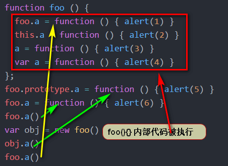
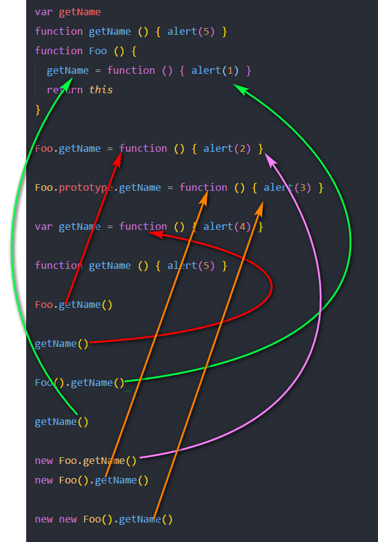

demo1:

```javascript
var name1 = "zs";
function f1() {
  name1 = "ls";   // 此处 name 是隐式全局变量
}
f1();
console.log(name1); // ls

```

demo2:

```javascript
var name2 = "zs";
function f2() {
  var name2 = "ls";
}
f2();
console.log(name2); // zs

```

demo3:

```javascript
var color = "red";
function outer() {
  var anotherColor = "blue";
  function inner() {
    var tmpColor = color;
    color = anotherColor;
    anotherColor = tmpColor;
    console.log(anotherColor);  // red
  }
  inner();
}
outer();
console.log(color);   // blue

```

demo4:

```javascript
var name3 = "zs";
function f3() {
  var name3 = "ls"; //'ww'
  function f4() {
    name3 = "ww";
  }
  f4();
  console.log(name3); //'ww'
}
f3();
console.log(name3); //'zs'

```

```javascript
function foo () {
  foo.a = function () { alert(1) }
  this.a = function () { alert(2) }
  a = function () { alert(3) }
  var a = function () { alert(4) }
};
foo.prototype.a = function () { alert(5) }
foo.a = function () { alert(6) }
foo.a()
var obj = new foo()
obj.a()
foo.a()

```




```javascript
var getName
function getName () { alert(5) }
function Foo () {
  getName = function () { alert(1) }
  return this
}

Foo.getName = function () { alert(2) }

Foo.prototype.getName = function () { alert(3) }

var getName = function () { alert(4) }

function getName () { alert(5) }

Foo.getName()

getName()

Foo().getName()

getName()

new Foo.getName()
new Foo().getName()

new new Foo().getName()


```

