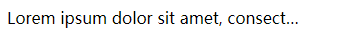
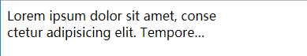

meta标签
===
```html
<!--
width=device-width,  // 宽度为设备款
initial-scale=1.0,   // 初始缩放比例 1.0
minimum-scale=1.0,   // 允许用户最小缩放比例 1.0
maximum-scale=1.0,   // 允许用户最大缩放比例 1.0
user-scalable=0"     // 禁止用户缩放
-->
<meta name="viewport" 
  content="width=device-width, initial-scale=1.0, user-scalable=0,
           minimum-scale=1.0, maximum-scale=1.0">

<!-- 忽略将页面中的数字识别成电话号码 -->
<meta name="format-detection" content="telephone=no">

<!-- 忽略Android对邮箱地址的识别-->
<meta name="format-detection" content="email=no">

<!-- iOS的Safari创建的桌面快捷方式启动的应用, 隐藏地址栏-->
<meta name="apple-mobile-web-app-capable" content="yes">

<!-- iOS的Safari创建的桌面快捷方式启动的应用, 控制状态看样式 可选值: default、black、black-translucent-->
<meta name="apple-mobile-web-app-status-bar-style" content="black" />
```

使用rem
===
  将设计稿设置100px字体, 适配的手机的字体大小为: 适配手机的宽度/设计稿的宽度 * 基准值
```less
@psdWidth:750; // 设计稿的宽度
@baseSize:100; // 基准值
@adapterDevice:320px,350px,360px,375px,384px,400px,414px,424px,450px,480px,540px,640px,720px,750px; // 适配的手机的分辨率数组
@len:length(@adapterDevice); // 数组的长度
.adapterFuc(@index) when ( @index <= @len ){
  @media (min-width: extract(@adapterDevice,@index)) {
    html{
      font-size: extract(@adapterDevice,@index)/@psdWidth*@baseSize;
    }
  }
  .adapterFuc( @index + 1 );
}

.adapterFuc(1); // 调用代码块
```
```scss
$psdWidth:750; // 设计稿的宽度
$baseSize:100; // 基准值
$adapterDevice:(320px, 350px, 360px, 375px, 384px, 400px, 414px, 424px, 450px, 480px, 540px, 640px, 720px, 750px); // 适配的手机的分辨率数组
$len:length($adapterDevice); // 数组的长度
@mixin adapterFuc {
  @for $i from 1 to $len {
    @media (min-width: nth($adapterDevice, $i)) {
      html {
        font-size: nth($adapterDevice, $i)/$psdWidth * $baseSize;
      }
    }
  }
}

@include adapterFuc; // 调用代码块
```
移动端专有样式
===
- 去除默认高亮效果 -- 暗色背景
```css
body {
    -webkit-tap-highlight-color: rgba(0,0,0,0);
}
```
- 字体变清晰
```css
body {
  /* 浏览器对字体的光滑处理:  none用于小像素的文本、subpixel-antialiased浏览器默认的、antialiased反锯齿。*/
  -webkit-font-smoothing:antialiased;
}
```
- 禁止页面文字选择
```css
body {
  -webkit-user-select: none;
}
```
- 禁止设备旋转后字体大小改变
```css
body {
  -webkit-text-size-adjust: none;
}
```
- 禁止页面长按时弹出菜单
```css
body {
  -webkit-touch-callout:none
}
```
- iOS局部滚动
```css
.box {
  -webkit-overflow-scrolling:touch;
}
```
- 移除 `<input type="number">` 的上下小箭头
```css
/* chrome下*/
input::-webkit-outer-spin-button,
input::-webkit-inner-spin-button {
  -webkit-appearance: none !important;
  margin: 0;
}
/* Firefox下*/
input[type="number"]{
  -moz-appearance:textfield;
}
```
- `overflow: hidden` 在iOS下卡顿的问题
```css
/* 在css的属性上添加*/
-webkit-overflow-scrolling: touch;
```
- iOS清除输入框内阴影
```css
input,textarea {
  -webkit-appearance: none;
}
```
flex布局
===
<font color="red">TODO</font>

移动端事件
===

- 原生事件
  + touchstart  当手指触碰屏幕时候发生。不管当前有多少只手指
  + touchmove  当手指在屏幕上滑动时连续触发。通常我们再滑屏页面，会调用event的preventDefault()可以阻止默认情况的发生：阻止页面滚动
  + touchend  当手指离开屏幕时触发
  + touchcancel  系统停止跟踪触摸时候会触发。例如在触摸过程中突然页面alert()一个提示框，此时会触发该事件，这个事件比较少用

- TouchEvent
  + touches 屏幕上所有手指的信息
  + targetTouches  手指在目标区域的手指信息
  + changedTouches  最近一次触发该事件的手指信息
    + clientX、clientY在显示区的坐标
    + target：当前元素
  + touchend时，touches与targetTouches信息会被删除，changedTouches保存的最后一次的信息，最好用于计算手指信息

- 点击事件
  200-300ms延迟响应
  + fastclick
  + zepto的touch模块tap事件
- 衍生事件
  + tap
  + swipe
- 事件 `window.onorientation` ±90表示横屏, 0|180表示竖屏
```javascript
//判断手机横竖屏状态：
window.addEventListener("onorientationchange" in window ? "orientationchange" : "resize", function() {
  if (window.orientation === 180 || window.orientation === 0) { 
      alert('竖屏状态！');
  } 
  if (window.orientation === 90 || window.orientation === -90 ){ 
      alert('横屏状态！');
  }  
}, false); 
```
```css
/* 写在一个css中 */
@media screen and (orientation: portrait) {
  /*竖屏 css*/
} 
@media screen and (orientation: landscape) {
  /*横屏 css*/
}
```
```html
<!-- 写在两个个css中 -->
<!-- 竖屏 -->
<link rel="stylesheet" media="all and (orientation:portrait)" href="portrait.css">
<!-- 横屏 -->
<link rel="stylesheet" media="all and (orientation:landscape)" href="landscape.css">
```

常见代码片段
===
- 单行文本溢出显示省略号
```html
<style>
  .one {
    width: 300px;
    overflow: hidden;
    white-space: nowrap;
    text-overflow: ellipsis;
  }
</style>
<div class="one"> 
  Lorem ipsum dolor sit amet, consectetur adipisicing elit. Tempore veritatis, eaque dolore explicabo. Dolorum explicabo illo voluptates consectetur vitae minus.
</div>
```
运行效果:<br>

- 多行文本溢出显示省略号
```html
<style>
  .two {
    width: 300px;
    display: -webkit-box;
    -webkit-box-orient: vertical;
    -webkit-line-clamp: 2;
    overflow: hidden;
  }
</style>
<div class="two"> 
  Lorem ipsum dolor sit amet, conse ctetur adipisicing elit. Tempore veritatis, eaque dolore explicabo. Dolorum explicabo illo voluptates consectetur vitae minus.
</div>
```
运行效果:<br>


- 两栏自适应

<font color="red">TODO</font>

判断用户的设备
===
```javascript
var u = navigator.userAgent.toLowerCase();
if (u.indexOf('android') > -1 || u.indexOf('linux') > -1) {
  // android
} else if (u.indexOf('iphone') > -1) {
  // 苹果手机
} else if (u.indexOf('windows phone') > -1) {
  // winPhone
}
```
