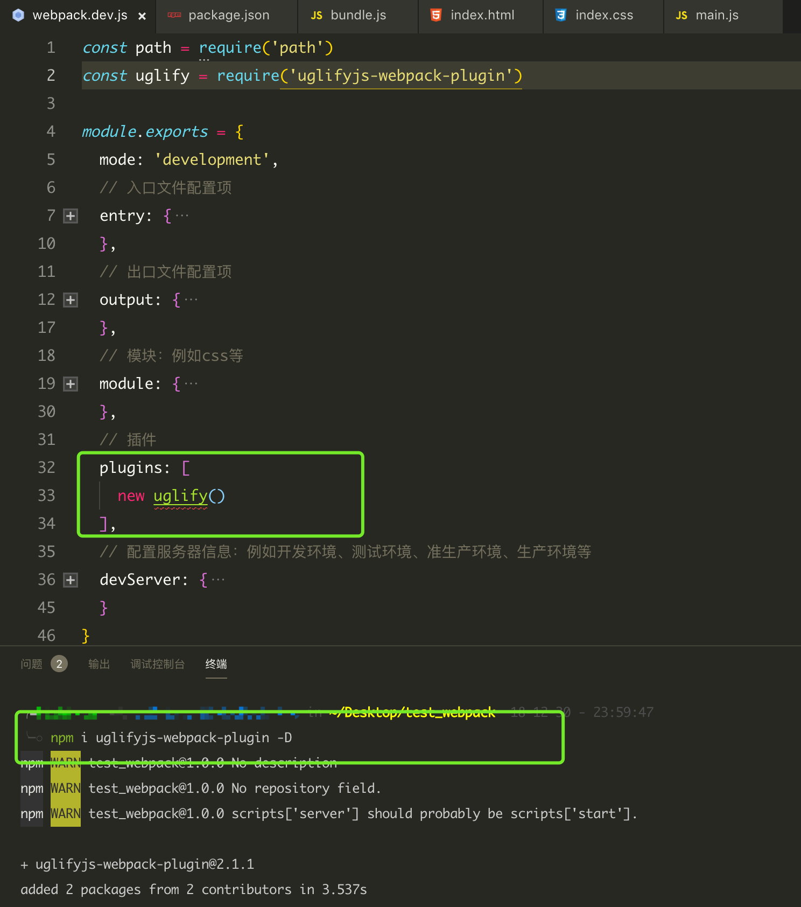
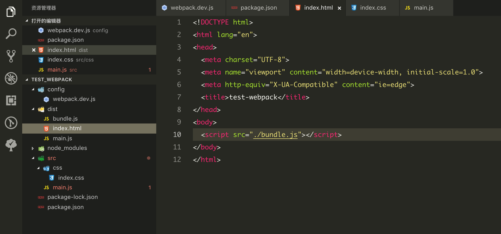

# webpack4

1. 安装 webpack 依赖 `npm install webpack webpack-cli webpack-dev-server -g`
2. 创建项目文件夹

    ```bash
    mkdir config dist src
    touch dist/index.html src/index.js
    touch config/webpack.dev.js
    ```

3. 新建项目 `npm init -y`
4. 配置项目

    ```js
    // config/webpack.dev.js
    const path = require('path')
    module.exports = {
      mode: 'development',
      // 入口文件配置项
      entry: {
        // main里面的可以根据项目改变
        main: './src/main.js'
      },
      // 出口文件配置项
      output: {
        // 打包的路径
        path: path.resolve(__dirname, '../dist'),
        // 打包的名称
        filename: 'bundle.js'
      },
      // 模块：例如css等
      module: {},
      // 插件
      plugins: [],
      // 配置服务器信息：例如开发环境、测试环境、准生产环境、生产环境等
      devServer: {}
    }
    ```

5. 输入 `npm run build` 测试
  首先，在 `package.json` 的 `scripts` 加入 `"build": "webpack --config=config/webpack.dev.js"`，然后在命令行中输入 `npm run build` 测试，如图：
  

    ```json
    "scripts": {
      "build": "webpack --config=config/webpack.dev.js"
    }
    ```

6. 配置 config/webpack.dev.js 中的 devServer

    ```js
    devServer: {
      // 设计基本目录结构
      contentBase: path.resolve(__dirname, '../dist'),
      // 服务器地址
      host: 'localhost',
      // 是否压缩
      compress: true,
      // 端口号
      port: 8888
    }
    ```

7. 输入 `npm run server` 测试
  首先，在 `package.json` 的 `scripts` 加入 `"server": "webpack-dev-server --config=config/webpack.dev.js"`，然后在命令行中输入 `npm run server` 测试，如图：
  
  
    ```json
    "scripts": {
      "server": "webpack-dev-server --config=config/webpack.dev.js"
    }
    ```

8. loader的配置
  webpack 中的 loader 可以将 sass 转为 css，可以将 ES6/7/8的语法转换为ES5等。

- js压缩的配置

  压缩js需要引入`uglifyjs-webpack-plugin(JS压缩插件，简称uglify)`插件，需要执行`npm i uglifyjs-webpack-plugin -D`安装。

  ```js
  // webpack.dev.js
  const uglify = require('uglifyjs-webpack-plugin')
  module.exports = {
    // ...
    plugins: [
      new uglify()
    ],
    // ...
  }
  ```

  
  
  

- html压缩的配置

  压缩js需要引入`html-webpack-plugin`插件，需要执行`npm i html-webpack-plugin -D`安装。

  ```js
  // webpack.dev.js
  const uglify = require('html-webpack-plugin')
  module.exports = {
    // ...
    plugins: [
    new Uglify(),
    new HtmlPlugin({
      minify: { // 是对html文件进行压缩
        removeAttributeQuotes: true // removeAttrubuteQuotes是去掉属性的双引号
      },
      hash: true,
      template: './src/index.html'
    })
  ],
    // ...
  }
  ```

  
  

- CSS的配置

  打包 CSS 需要的loader有：`style-loader 和 css-loader`，需要在命令中执行`npm i style-loader css-loader -D`.
  - 在 `webpack.dev.config.js` 中对module属性中的代码进行配置
  
    ```json
    // webpack.dev.js
    module: {
      rules: [
        // css-loader
        {
          test: /\.css$/,
          use: [
            { loader: 'style-loader' },
            { loader: 'css-loader' }
          ]
        }
      ]
    },
    ```
  
  

- CSS的图片配置
  在HTML中引入图片，此时执行`npm run dev`会报错：
  
  此时，需要下载两个解析图片的loader:`file-loader` 和 `url-loader`，执行`npm i file-loader url-loader -D`.
  
  >> 为什么没有使用 file-loader?
  >> url-loader 已经内置 file-loader, 为使用方便，仍安装 file-loader。
  >>
  >> url-loader 工作方式：
  >> 当图片小于limit大小时：url-loader 会把图片转为 Base64；
  >> 当图片大于limit大小时：url-loader 会调用 file-loader 进行处理。

  目前虽然执行没有报错，但是打包后css文件和图片路径并不正确，此时需要下载css分离的插件:`mini-css-extract-plugin`，执行`npm i mini-css-extract-plugin -D`.
  
  
  修改图片路径：
  
  执行`npm run build`后：
  

- 添加 babel 支持
  `npm i @babel/core babel-loader @babel/preset-env @babel/preset-react -D`
  