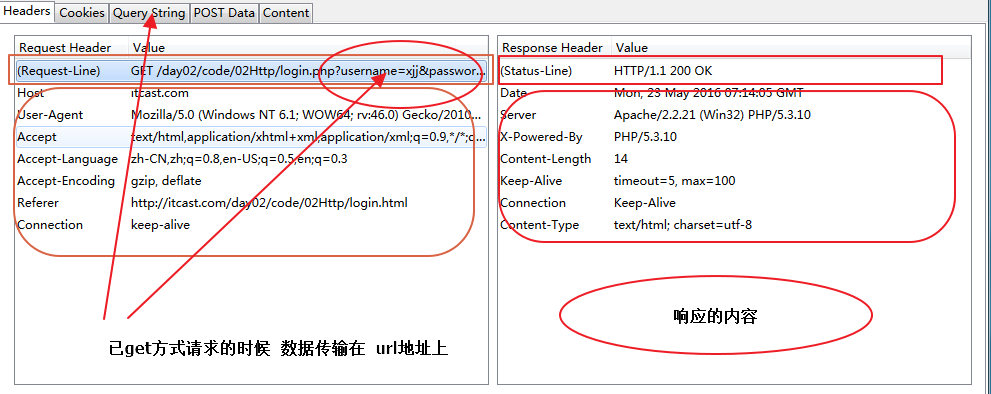
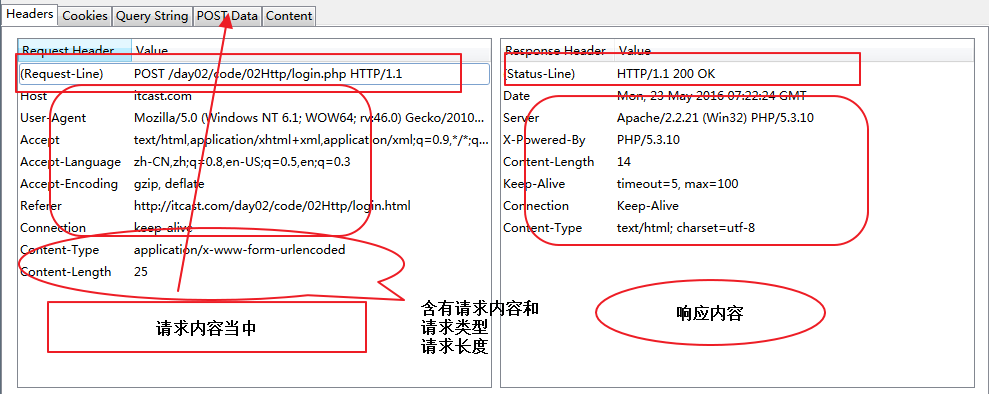
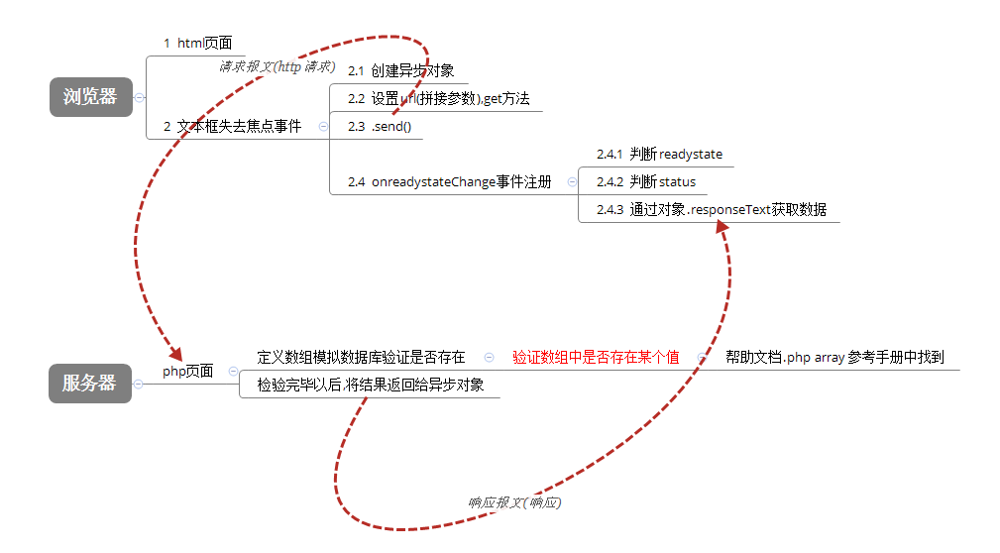
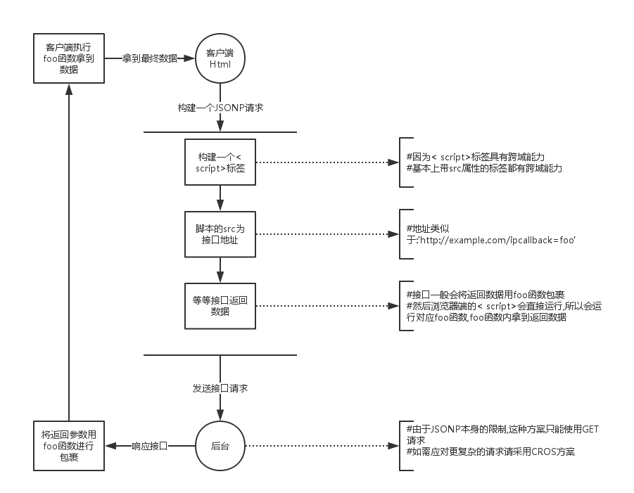
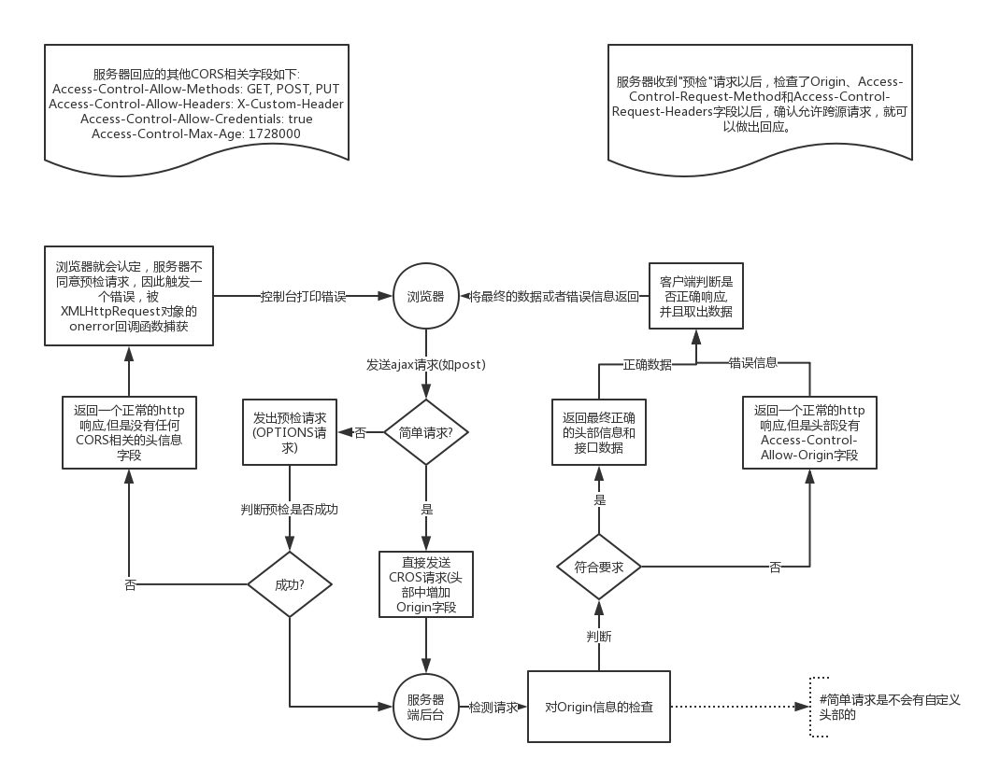

表单提交
===
    必须有name属性
    <input type="text" name="username" placeholder="请输入用户名">

> 判断浏览器是否支持 placeholder ？

- `enctype="multipart/form-data"` 数据--复杂数据类型
```html
<form action="file.php" method="POST" enctype="multipart/form-data">
  <input type="file" name="icon" accept="image/png,image/jpg" multiple>
  <input type="submit">
</form>
```

- get与post
  + 提交数据的地方不一样
      get: url拼接
      post: 请求报文 **更安全**
  + 提交数据的大小不一样
      get: 4k
      post: 没有限制


网络传输协议
===
请求和请求报文
---
1. 请求行
  由请求方式, 请求url, 和协议版本构成
  ```http
  GET login.php?username=zhangsan&password=123 HTTP/1.1
  ```
  ```http
  POST login.php HTTP/1.1
  ```
2. 请求头
  `Host:localhost` 请求的主机
  `Cache-Control:max-age=0 ` 控制缓存
  `Accept:*/*` 接受文档的MIME类型
  `User-Agent	Mozilla/5.0 (Windows NT 10.0; Win64; x64; rv:54.0) Gecko/20100101 Firefox/54.0` 很重要
  `Referer	https://www.baidu.com/` 从哪个URL跳转过来的
  `Accept-Encoding	gzip, deflate, br` 接受的压缩格式
  `If-None-Match	"16e36-540b1498e39c0"` 记录服务器响应的ETag值，用于控制缓存 --  服务器生成
  `If-Modified-Since	Mon, 07 Nov 2016 07:51:11 GMT` 记录服务器响应的Last-Modified值 -- 服务器生成

3. 请求主体
  传递给服务器的数据
  GET: 不需要, 需要传递的信息在地址栏
  POST: `Content-Type: application/x-www-form-urlencoded`

响应和报文
---
  响应有服务器发出, 格式: **状态行, 响应头, 响应主体**
1. 状态行
  构成: <font color="red">**协议版本号, 状态码, 信息**</font>
  `HTTP 1.1 200 OK`

2. 响应头
    Date 响应时间
    ```http
    Server 服务器信息	 
    Last-Modifie 资源最后修改时间 -- 服务器生成
    Etag 资源修改后生成的唯一标识符 -- 服务器生成
    Content-Length 响应主体长度
    Content-Type 响应资源的类型
    ```

3. 响应主体
  服务器返回给客户端的内容
  状态码:
      200: 成功
      304: 文档未修改
      403: 没有权限
      404: 未找到
      500: 服务器错误

- get请求<br>
  
- post请求<br>
  

Ajax
===
  异步的 javascript 和 XML, 是一种无需加载整个页面, 更新部分页面的技术

XMLHttpRequest
---
  浏览器内置对象 -- 用于与后台服务器交换数据

  

  ```javascript
  var xhr = new XMLHttpRequest();
  // 请求行 
  // open（method，url，async） async: 异步true|同步false
  xhr.open('post', '01.php'); 
  // 请求头
  xhr.setRequestHeader('Content-Type','application/x-www-form-urlencoded'); // get请求没必要设置, post请求必须设置
  // 请求主体
  xhr.send('name=xjj&age=10'); // 发送请求

  /*
  var xhr = new XMLHttpRequest();
  // 请求行
  xhr.open('get', '01.php?name=xjj&age=10'); 
  // 请求头
  // 请求主体
  xhr.send(null); // 发送请求
  */

  xhr.onreadystatechange = function(){
    /*
    xhr.readyStatus:
    0: 请求未初始化（还没有调用 open()）
    1: 请求已经建立，但是还没有发送（还没有调用 send()） 
    2: 请求已发送，正在处理中（通常现在可以从响应中获取内容头）
    3: 请求在处理中；通常响应中已有部分数据可用了，但是服务器还没有完成响应的生成 
    4: 响应已完成；您可以获取并使用服务器的响应了
    */
    if(xhr.readyStatus == 4) {
      // 获取响应头
      console.log(xhr.getAllResponseHeaders());
      console.log(xhr.getResponseHeader('Content-Type'));
      // 状态码
      if(xhr.status == 200) {
        // 响应主体
        xhr.responseText
        xhr.responseXML
      }
    }
  };
  ```
  **GET和POST请求方式的差异（面试题）**

    1、GET没有请求主体，使用xhr.send(null)
    2、GET可以通过在请求URL上添加请求参数
    3、POST可以通过xhr.send('name=itcast&age=10')
    4、POST需要设置
    5、GET效率更好（应用多）
    6、GET大小限制约4K，POST则没有限制

XML
---

    1、必须有一个根元素  
    2、不可有空格、不可以数字或.开头、大小写敏感  
    3、不可交叉嵌套  
    4、属性双引号（浏览器自动修正成双引号了）  
    5、特殊符号要使用实体  
    6、注释和HTML一样  
    虽然可以描述和传输复杂数据，但是其解析过于复杂并且体积较大，所以实现开发已经很少使用了。

```xml
<?xml version="1.0" encoding="UTF-8"?>
<root>
    <arrayList>
        <array>
            <src>images/banner.jpg</src>
            <newPirce>12.00</newPirce>
            <oldPrice>30.00</oldPrice>
        </array>
        <array>
            <src>images/banner.jpg</src>
            <newPirce>12.00</newPirce>
            <oldPrice>30.00</oldPrice>
        </array>
    </arrayList>
</root>
```
```php
<?php 
    header('Content-Type:text/xml;charset=utf-8');
    /*以xml格式传输数据的时候要求响应内容格式是   text/xml*/

    /*file_get_contents 获取文件内容*/
    $xml = file_get_contents('01.xml');

    /*输出xml内容*/
    echo $xml;
?>
```
```javascript
var xhr = new XMLHttpRequest;
xhr.open('get','01.php');
xhr.send(null);
xhr.onreadystatechange = function(){
    if(xhr.status == 200 && xhr.readyState == 4){
        /*获取到XML格式内容  放回的是DOM对象  document*/
        var xml = xhr.responseXML;
        /*通过选着器可以获取到xml的数据*/
        console.log(xml.querySelectorAll('array')[0].querySelector('src').innerHTML);
    }
}
```

JSON
---

即 `JavaScript Object Notation`，另一种轻量级的文本数据交换格式，独立于语言。

    1、数据在名称/值对中  
    2、数据由逗号分隔(最后一个健/值对不能带逗号)  
    3、花括号保存对象方括号保存数组  
    4、使用双引号  

```json
[
  {"src":"images/detail01.jpg","oldPrice":"10.12","newPrice":"130.00"},
  {"src":"images/detail02.jpg","oldPrice":"1.00","newPrice":"11.00"},
  {"src":"images/detail03.jpg","oldPrice":"100.00","newPrice":"1000.00"}
]
```

*JSON数据在不同语言进行传输时，类型为字符串，不同的语言各自也都对应有解析方法，需要解析完成后才能读取*


PHP解析方法
---

json_encode()、json_decode()  

```php
<?php 
    header('Content-Type:text/html;charset=utf-8');
    /*以json格式传输数据的时候要求响应内容格式是   application/json*/
    /*注意也可以不设置  但是这遵循的一个规范*/

    /*file_get_contents 获取文件内容*/
    $json = file_get_contents('01.json');

    /*输出json内容*/
    echo $json;
    echo '<br><br>';

    $array = array(
        array('src'=>'images/detail01.jpg','newPrice'=>'12.00','oldPrice'=>'455.00'),
        array('src'=>'images/detail02.jpg','newPrice'=>'65.00','oldPrice'=>'878.00'),
        array( 'src'=>'images/detail01.jpg','newPrice'=>'100.00','oldPrice'=>'1000.00')
    );

    /*将php数组转化成json字符*/
    $json_array = json_encode($array);
    echo $json_array;
    echo '<br><br>';

    /*将json字符转化成php数组*/
    $array_json = json_decode($json_array);
    echo $array_json;
    echo '<br><br>';
?>
```

javascript解析方法
---

JSON.parse()、JSON.stringify();

```javascript
var xhr = new XMLHttpRequest;
xhr.open('get','01.php');
xhr.send(null);
xhr.onreadystatechange = function(){
    if(xhr.status == 200 && xhr.readyState == 4){
        /*获取仅仅是字符串*/
        var text = xhr.responseText;
        
        /*需要把字符串转化成JSON对象*/
        var json_obj = JSON.parse(text);
        console.log(json_obj);

        /*我们也可以把JSON对象转化成字符串*/
        var json_str = JSON.stringify(json_obj);
        console.log(json_str);
    }
}
```

兼容性
---

了解即可. 市面上已经没有 IE5.5 IE5等

```javascript
function XHR() {
  var xhr;
  try {
      xhr = new XMLHttpRequest();
  }
  /*如果 try内的程序运行错误  抛出异常  捕捉异常  上面程序当中运行的错误*/
  catch(e) {
    /*在不同的IE版本下初始  ActiveXObject  需要传入的标识*/
    var IEXHRVers =["Msxml3.XMLHTTP","Msxml2.XMLHTTP","Microsoft.XMLHTTP"];

    for (var i=0;i<IEXHRVers.length;i++) {
      try {
        xhr = new ActiveXObject(IEXHRVers[i]);
      }
      catch(e) {
        /*如果出现错误的时候  停止当次的循环*/
        continue;
      }
    }
  }
  return xhr;
}
```

封装ajax
---
```javascript
/**
 * 仿 jQuery 封装 ajax 
 * @param {object} options 
 *
 * {object} options 所需参数:
 * 参数名称          参数类型          参数默认值        参数说明
 * type             string            get              请求的方式
 * url              string            当前地址          请求的地址
 * async            boolean           true             是否的异步的方式 false
 * data             object            {}               需要发送的数据｛name:xgg｝
 * success          function                           成功回调函数
 * error            function                           失败回调函数
 */
window.$ = {};

$.ajax = function (options) {

  // 如果没有传递 options 或者 options 不是对象 退出
  if (!options || typeof options != 'object') return false;

  // 默认类型 只要输入的不是 post , 默认为 get 方式
  var type = options.type.toLowerCase() !== 'post' ? 'get' : 'post';
  // 默认 url 用户没有输入就是当前路径
  var url = options.url || location.pathname;
  // 用户没有明确指定则为异步
  var async = options.async !== false ? true : false;
  // 要发送的数据
  var data = typeof options.data == 'object' ? options.data : {};

  /*
   * data 的格式: {k:v, k2:v2,...}
   * 要发送色温数据的格式: k=v&k2=v2...
   */
  var dataString = '';
  for (var key in data) {
    dataString += key + '=' + data[key] + '&';
  }
  dataString = dataString && dataString.slice(0, -1);

  var xhr = new XMLHttpRequest();
  // get请求: xxx.php?k=v&k2=v2...
  // post请求: xxx.php
  xhr.open(type, type == 'get' ? url + '?' + dataString : url, async);
  // post请求 xhr.setRequestHeader
  type == 'post' && xhr.setRequestHeader('Content-Type', 'application/x-www-form-urlencoded')

  xhr.send(type == 'get' ? null : dataString);

  xhr.onreadystatechange = function () {
    if (xhr.readyState === 4) {
      if (xhr.status === 200) {
        // 获取响应的content-type 得到返回的数据类型
        var contentType = xhr.getResponseHeader('Content-Type');

        var result = null;

        if (contentType.indexOf('xml') > -1) {
          result = xhr.responseXML;
        } else if (contentType.indexOf('json') > -1) {
          result = xhr.responseText;
          result = result && JSON.parse(result);
        } else {
          result = xhr.responseText;
        }

        // 成功回调函数
        options.success && options.success(result);
      } else {
        // 错误信息
        var errmsg = {
          status: xhr.status, // 状态码
          statusText: xhr.statusText
        }
        options.error && options.error(errmsg);
      }
    }
  };
};
```

jQuery的ajax
---
```javascript
$(function(){
    $.ajax({
      type:'post',
      url:'jqueryAjax.php',
      data:{name:'xgg'},
      async:true,
      success:function(data){

      },
      error:function(info){

      },
      dataType:'json', // 强制转换数据
      timeout:4000,
      beforeSend:function(){ // 在ajax发送之前调用

      },
      complete:function(){ // 通讯完成后调用

      }
    });
  });
```

跨域解决方案
===
[简书:ajax跨域，这应该是最全的解决方案了][http://www.jianshu.com/p/82b82d5dd1ea]
[跨域资源共享 CORS 详解(阮一峰)][http://www.ruanyifeng.com/blog/2016/04/cors.html]

同源: 协议, 域名, 端口号都一样 -- **浏览器的一种安全策略**
跨域: 不同源则跨域

浏览器会阻止跨域的操作

具备跨域请求资源能力的标签
```html
<iframe src="http://www.taobao.com"></iframe>
<link href="">
<image src="">
<video src="">
<audio src="">
<script src="">
```

解决操作问题: domain  在同一个顶级域名
```javascript
// 需要操作的页面设置
document.domain = 'baidu.com'
```

JSONP
---

由于同源策略的限制，XMLHttpRequest只允许请求当前源（域名、协议、端口）的资源，为了实现跨域请求，可以通过script标签实现跨域请求，然后在服务端输出JSON数据并执行回调函数，从而解决了跨域的数据请求具体原理如图:<br>
  

下边这一DEMO实际上是JSONP的简单表现形式，在客户端声明回调函数之后，客户端通过script标签向服务器跨域请求数据，然后服务端返回相应的数据并动态执行回调函数。

html代码:

```html
<meta content="text/html; charset=utf-8" http-equiv="Content-Type" />  
<script type="text/javascript">  
    function jsonpCallback(result) {  
        //alert(result);  
        for(var i in result) {  
            alert(i+":"+result[i]);//循环输出a:1,b:2,etc.  
        }  
    }  
    var JSONP=document.createElement("script");  
    JSONP.type="text/javascript";  
    JSONP.src="http://crossdomain.com/services.php?callback=jsonpCallback";  
    document.getElementsByTagName("head")[0].appendChild(JSONP);  
</script>  
```

或者:

```html
<meta content="text/html; charset=utf-8" http-equiv="Content-Type" />  
<script type="text/javascript">  
    function jsonpCallback(result) {  
        alert(result.a);  
        alert(result.b);  
        alert(result.c);  
        for(var i in result) {  
            alert(i+":"+result[i]);//循环输出a:1,b:2,etc.  
        }  
    }  
</script>  
<script type="text/javascript" src="http://crossdomain.com/services.php?callback=jsonpCallback"></script>  
```

**JavaScript的链接，必须在function的下面。**

服务端PHP代码 （services.php）:

```php
<?php  
  
//服务端返回JSON数据  
$arr=array('a'=>1,'b'=>2,'c'=>3,'d'=>4,'e'=>5);  
$result=json_encode($arr);  
//echo $_GET['callback'].'("Hello,World!")';  
//echo $_GET['callback']."($result)";  
//动态执行回调函数  
$callback=$_GET['callback'];  
echo $callback."($result)";  
```

客户端JS代码在jQuery中的实现方式1：

```html
<script type="text/javascript" src="jquery.js"></script>  
<script type="text/javascript">  
    $.getJSON("http://crossdomain.com/services.php?callback=?",  
    function(result) {  
        for(var i in result) {  
            alert(i+":"+result[i]);//循环输出a:1,b:2,etc.  
        }  
    });  
</script>
```

客户端JS代码在jQuery中的实现方式2：

```html
<script type="text/javascript" src="jquery.js"></script>  
<script type="text/javascript">  
    $.ajax({  
        url:"http://crossdomain.com/services.php",  
        dataType:'jsonp',  
        data:'',  
        jsonp:'callback',  
        success:function(result) {  
            for(var i in result) {  
                alert(i+":"+result[i]);//循环输出a:1,b:2,etc.  
            }  
        },  
        timeout:3000  
    });  
</script> 
```

客户端JS代码在jQuery中的实现方式3：

```html
<script type="text/javascript" src="jquery.js"></script>  
<script type="text/javascript">  
    $.get('http://crossdomain.com/services.php?callback=?', {name: encodeURIComponent('tester')}, function (json) { for(var i in json) alert(i+":"+json[i]); }, 'jsonp');  
</script>  
```

其中 jsonCallback 是客户端注册的，获取 跨域服务器 上的json数据 后，回调的函数。
`http://crossdomain.com/services.php?callback=jsonpCallback`
这个 url 是跨域服务 器取 json 数据的接口，参数为回调函数的名字，返回的格式为`jsonpCallback({msg:'this is json data'})  `.


**Jsonp原理：** 
首先在客户端注册一个callback, 然后把callback的名字传给服务器。

此时，服务器先生成 json 数据。
然后以 javascript 语法的方式，生成一个function , function 名字就是传递上来的参数 jsonp.

最后将 json 数据直接以入参的方式，放置到 function 中，这样就生成了一段 js 语法的文档，返回给客户端。

客户端浏览器，解析script标签，并执行返回的 javascript 文档，此时数据作为参数，传入到了客户端预先定义好的 callback 函数里.（动态执行回调函数）


CORS
---

  

  跨域资源共享(`Cross-origin resource sharing`).
  允许浏览器向跨源服务器, 发出XMLHttpRequest请求, 从而克服Ajax只能同源使用的限制.

    1. 简介
    CORS需要浏览器和服务器同时支持.
    浏览器发现ajax请求跨源, 就会自动添加一些附加的信息头.
    实现CORS通信的关键是服务器, 只要服务器实现了CORS接口, 就可以跨源通信.
    
    2. 分类

  + 简单请求

    + 条件:
        + 请求方式是 `head` `get` `post` 之一
        + http的头信息不超过一下几种字段:
        ```http
        Accept
        Accept-Language
        Content-Language
        Last-Event-ID
        Content-Type：只限于三个值application/x-www-form-urlencoded、multipart/form-data、text/plain
        ```

    + 流程
        对于简单请求, 浏览器直接发出CORS请求. -- 在头信息中添加一个*Origin*字段, 例如:
        ```http
        GET /cors HTTP/1.1
        Origin: http://api.bob.com
        Host: api.alice.com
        Accept-Language: en-US
        Connection: keep-alive
        User-Agent: Mozilla/5.0...
        ```
        Origin字段用来说明本次请求来自哪个源(协议 + 域名 + 端口), 服务器根据这个值, 决定是否同意这次请求. 如果指定的源不在许可范围( `Access-Control-Allow-Origin` )内, 服务器的回应头信息不会有 `Access-Control-Allow-Origin` 字段, 抛出的错误会被 `XMLHttpRequest` 的 `onerror` 回调函数捕获. 注意: **这种错误无法被状态码识别**

        Origin指定的域名在许可范围内, 服务器返回:
        ```http
        Access-Control-Allow-Origin: http://api.bob.com
        Access-Control-Allow-Credentials: true
        Access-Control-Expose-Headers: FooBar
        Content-Type: text/html; charset=utf-8
        ```
        + `Access-Control-Allow-Origin`
          必须, 如果是 `*` 表示接受任何跨域请求.
        + `Access-Control-Allow-Credentials`
          可选. 布尔值, 表示是否允许发送cookie. 默认Cookie不包括在CORS请求之中. true,即表示服务器明确许可，Cookie可以包含在请求中，一起发给服务器.
          ```http
          Access-Control-Allow-Credentials: true
          ```
          ```javascript
          var xhr = new XMLHttpRequest();
          xhr.withCredentials = true;
          ```
        + `Access-Control-Expose-Headers`
          可选. CORS请求时，XMLHttpRequest对象的getResponseHeader()方法只能拿到6个基本字段：Cache-Control、Content-Language、Content-Type、Expires、Last-Modified、Pragma。如果想拿到其他字段，就必须在Access-Control-Expose-Headers里面指定。

  + 非简单请求
    + 预检请求
      非简单请求是那种对服务器有特殊要求的请求，比如请求方式是`put`或`delete`, 或者`Content-Type`字段的类型时`application/json`.
      非简单的CORS请求, 会在正式通信之前增加一次http查询请求 -- 预检(preflight). 只有得到肯定答复, 浏览器才会发出正式的 XMLHttpRequest 请求.
      ```javascript
      var url = 'http://api.alice.com/cors';
      var xhr = new XMLHttpRequest();
      xhr.open('PUT', url, true);
      xhr.setRequestHeader('X-Custom-Header', 'value');
      xhr.send();
      ```
      上面代码中，HTTP请求的方法是 `PUT`，并且发送一个自定义头信息 `X-Custom-Header`。
      "预检"请求的HTTP头信息:
      ```http
      OPTIONS /cors HTTP/1.1
      Origin: http://api.bob.com
      Access-Control-Request-Method: PUT
      Access-Control-Request-Headers: X-Custom-Header
      Host: api.alice.com
      Accept-Language: en-US
      Connection: keep-alive
      User-Agent: Mozilla/5.0...
      ```
      "预检"请求用的请求方法是 `OPTIONS`，表示这个请求是用来询问的。头信息里面，关键字段是 `Origin` ，表示请求来自哪个源。
      + `Access-Control-Request-Method`
        必须. 浏览器的CORS请求会用到的HTTP方法
      + `Access-Control-Request-Headers`
        浏览器CORS请求会额外发送的头信息字段

    + 预检请求的回应
      服务器收到"预检"请求以后，检查了 `Origin`、 `Access-Control-Request-Method` 和 `Access-Control-Request-Headers` 字段以后，确认允许跨源请求，就可以做出回应。
      ```http
      HTTP/1.1 200 OK
      Date: Mon, 01 Dec 2008 01:15:39 GMT
      Server: Apache/2.0.61 (Unix)
      Access-Control-Allow-Origin: http://api.bob.com
      Access-Control-Allow-Methods: GET, POST, PUT
      Access-Control-Allow-Headers: X-Custom-Header
      Content-Type: text/html; charset=utf-8
      Content-Encoding: gzip
      Content-Length: 0
      Keep-Alive: timeout=2, max=100
      Connection: Keep-Alive
      Content-Type: text/plain
      ```
      `Access-Control-Allow-Origin` 字段，表示 http://api.bob.com 可以请求数据。该字段也可以设为星号( `*` )，表示同意任意跨源请求。
      如果浏览器否定了预检, 会触发错误. 被XMLHttpRequest对象的onerror回调函数捕获。控制台会打印出如下的报错信息。
      ```http
      XMLHttpRequest cannot load http://api.alice.com.
      Origin http://api.bob.com is not allowed by Access-Control-Allow-Origin.
      ```
      服务器回应的其他CORS相关字段如下:
      ```http
      Access-Control-Allow-Methods: GET, POST, PUT
      Access-Control-Allow-Headers: X-Custom-Header
      Access-Control-Allow-Credentials: true
      Access-Control-Max-Age: 1728000
      ```
      + `Access-Control-Allow-Methods`
        该字段必需，它的值是逗号分隔的一个字符串，表明服务器支持的所有跨域请求的方法。注意，返回的是所有支持的方法，而不单是浏览器请求的那个方法。这是为了避免多次"预检"请求。
      + `Access-Control-Allow-Headers`
        如果浏览器请求包括 `Access-Control-Request-Headers` 字段，则 `Access-Control-Allow-Headers` 字段是必需的。它也是一个逗号分隔的字符串，表明服务器支持的所有头信息字段，不限于浏览器在"预检"中请求的字段。
      + `Access-Control-Allow-Credentials`
        该字段与简单请求时的含义相同。
      + `Access-Control-Max-Age`
        可选，用来指定本次预检请求的有效期，单位为秒。在此期间，不用发出另一条预检请求。

    + 浏览器的正常请求和回应
      一旦服务器通过了"预检"请求，以后每次浏览器正常的CORS请求，就都跟简单请求一样，会有一个Origin头信息字段.
    ```http
    PUT /cors HTTP/1.1
    Origin: http://api.bob.com
    Host: api.alice.com
    X-Custom-Header: value
    Accept-Language: en-US
    Connection: keep-alive
    User-Agent: Mozilla/5.0...
    ```
    服务器正常的回应:
    ```http
    Access-Control-Allow-Origin: http://api.bob.com
    Content-Type: text/html; charset=utf-8
    ```


JSONP 与 json
---

|  名称   | 作用   | 说明        |
| :---: | :--- | :-------- |
| json  | 传数据  | 数据交换格式    |
| jsonp | 跨域   | 非官方跨域交互协议 |

为了便于客户端使用数据，逐渐形成了一种非正式传输协议，人们把它称作JSONP，该协议的一个要点就是允许用户传递一个callback参数给服务端，然后服务端返回数据时会将这个callback参数作为函数名来包裹住JSON数据，这样客户端就可以随意定制自己的函数来自动处理返回数据了。

1 ajax和jsonp这两种技术在调用方式上“看起来”很像，目的也一样，都是请求一个url，然后把服务器返回的数据进行处理，因此jquery和ext等框架都把jsonp作为ajax的一种形式进行了封装；

2 但ajax和jsonp其实本质上是不同的东西。ajax的核心是通过XmlHttpRequest获取非本页内容，而jsonp的核心则是动态添加`<script>`标签来调用服务器提供的js脚本。

3 所以说，其实ajax与jsonp的区别不在于是否跨域，ajax通过服务端代理一样可以实现跨域，jsonp本身也不排斥同域的数据的获取。

4 还有就是，jsonp是一种方式或者说非强制性协议，如同ajax一样，它也不一定非要用json格式来传递数据，如果你愿意，字符串都行，只不过这样不利于用jsonp提供公开服务。

总而言之，jsonp不是ajax的一个特例，哪怕jquery等巨头把jsonp封装进了ajax，也不能改变着一点！


