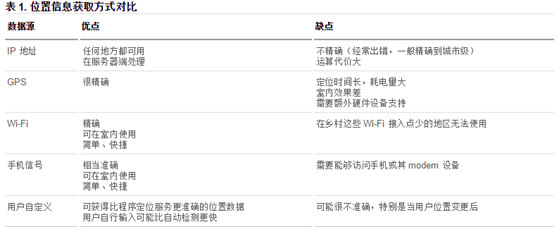

HTML5
===
## 了解HTML5
+ HTML5 是 HTML 标记语言的一个**最新版本**
+ HTML5 制定了web应用开发的一系列标准, 成为第一个将web作为**应用开发平台**的HTML语言
+ 日常所得H5其实是一个泛称, 他指的是由`HTML5 + css3 + javascript`等技术组合而成的**应用开发平台**.
+ HTML5 新增了一些元素, 如语义化的标签, 智能表单, 多媒体标签等.
+ HTML5 提供了javascript API: 地理位置, 重力感应, 硬件访问, 结合css3制作动画等等.
+ HTML5 默认的编码是`utf-8`, 可以大小写混写(**不推荐**)
+ HTML5 是跨平台的

## 语法规范
> 较之前相比**更简洁**, **更宽松**

+ HTML5 的优点:
  1. 提高可用性和改进用户的友好体验.
  2. 新增的标签有益于开发人员定义重要的内容
  3. 可以给站点带来更多的多媒体元素(音频和视频)
  4. 可以很好的代替`FLASH`和`silverlight`
  5. 涉及到网站抓取和索引的时候, 对SEO友好
  6. 将被大量应用于移动应用程序和游戏
  7. 可移植性好
+ HTML5 的缺点
  低版本的浏览器不支持, 很多标签浏览器支持效果不好, 也有安全漏洞.


### 语义化
1. 语义化标签: 语义元素清楚地向浏览器和开发者描述其意义.
  传统的做法是添加语义化类名, 如`class="header"`, `class="footer"`等.
  HTML5 则是通过标签语义化来解决这个问题.
2. 常用语义化标签

    |       标签       |  语义   | 备注                  |
    | :------------: | :---: | ------------------- |
    |    `<nav>`     |  导航   |                     |
    |   `<header>`   |  页眉   |                     |
    |  ` <footer>`   |  页脚   |                     |
    |  `<section>`   |  区块   |                     |
    |  `<article>`   |  文章   |                     |
    |   `<aside>`    |  侧边栏  |                     |
    |  `<progress>`  |  进度条  |                     |
    |   `<figure>`   |  图形   | 与`<figcaption>`配合使用 |
    | `<figcaption>` | 元素的标题 | 与`<figure>`配合使用     |

    本质上与`<div>`, `<span>`没有区别, 但是其**具有语义性**
    **尽量避免全局使用`header`, `footer`, `aside`等语义标签.**

### 兼容性
1. IE8以及以下版本, HTML5新增的标签会被解析成`inline`, 所以**在css中要将其转换为块级元素(`block`)**,  在js代码中创建自定义的标签`document.createElement('tagName')`.
2. 在实际开发中, 使用第三方js库
  ```html
  <!--[if lte IE 8]>
    <script src="html5shiv.min.js"></script>
  <![endif]-->
  ```

### 微数据
  在span, div等标签内添加属性, 让搜索引擎识别其含义.
  >　itemscope：声明你所要添加的属性的作用域，加在最外层的元素。
  >　itemtype：声明所使用的词汇表，加在最外层的元素中。
  >　itemprop：声明属性名，具体的内容要参加所引用的词汇表。
  ```html
  <!--微数据,就是为div和span添加属性,浏览器识别的时候具有语义化的意义-->
  <div itemscope itemtype="http://data-vocabulary.org/Review">
    <span itemprop="reviewer">猪猪</span>
    <span itemprop="dtreviewed" datatime="2017-07-17T16:20:21">2017年7月17日16:20:48</span>
    <span itemprop="description"> 评论内容</span>
  </div>
  ```
  WAI-ARIA: 针对残障人士开发应用

## 表单 form
  表单分组: `fieldset`
  分组名: `legend `
### 输入类型
|    类型    |           使用示例            |     含义     |    备注    |
| :------: | :-----------------------: | :--------: | :------: |
|  email   |  `<input type="email">`   |   输入邮箱格式   |          |
|   tel    |   `<input type="tel">`    |  输入手机号码格式  |          |
|   url    |   `<input type="url">`    |  输入url格式   |          |
|  number  |  `<input type="number">`  |   输入数字格式   | step 步长  |
|  search  |  `<input type="search">`  | 搜索框（体现语义化） | 手机端会显示键盘 |
|  range   |  `<input type="range">`   |   自由拖动滑块   |          |
|  color   |  `<input type="color">`   |    拾色器     |          |
|   time   |   `<input type="time">`   |            |          |
|   date   |   `<input type="date">`   |            |          |
| datetime | `<input type="datetime">` |            |          |
|  month   |  `<input type="month">`   |            |          |
|   week   |   `<input type="week">`   |            |          |

### 表单元素
|      元素      |   含义    | 备注                                    |
| :----------: | :-----: | :------------------------------------ |
| `<datalist>` |  数据列表   | datalist的id匹配input的list属性, 子元素是option |
|  `<keygen>`  | 生成加密字符串 | 表单需要定义name属性                          |
|  `<output>`  |  输出结果   |                                       |
|  `<meter>`   |   度量器   | low, high, value, min,max             |

### 表单属性
|      属性      |                   使用示例                   |   含义   |   备注   |
| :----------: | :--------------------------------------: | :----: | :----: |
| placeholder  | `<input type="text" placeholder="请输入用户名">` |  占位符   |        |
|  autofocus   |     `<input type="text" autofocus>`      | 自动获得焦点 |        |
|   multiple   |      `<input type="file" multiple>`      | 多文件上传  |   多选   |
| autocomplete | `<input type="text" autocomplete="off">` |  自动完成  | on/off |
|     form     |    `<input type="text" form="某表单ID">`    |        |        |
|  novalidate  |        `<form novalidate></form>`        |  关闭验证  |        |
|   required   |      `<input type="text" required>`      |  必填项   |        |
|   pattern    |    `<input type="text" pattern="\d">`    | 自定义验证  |   正则   |

## 多媒体
### 音频
```html
<!--
  controls: 显示播放的相关控件
  autoplay:自动播放
-->
<audio [src=""] [autoplay][controls][loop]></audio>
```
```html
<audio width="300" hight="200" controls autoplay>
  <!--解决兼容问题-->
  <source src="music/1.mp3"> 
  <source src="music/1.wav">
  <source src="music/1.wma">
  您的浏览器不支持HTML音频播放
</audio>
```
### 视频
```html
<video [src=""] [autoplay][controls][loop]></video>
```
```html
<video width="300" [hight="200"] controls autoplay><!--一般宽高只会给一个, 让其等比例缩放-->
  <!--解决兼容问题-->
  <source src="mov/cz.mp4">
  <source src="mov/cz.ogg">
  您的浏览器不支持HTML视频播放
</video>
```
### 常见多媒体事件
|         属性         |   值    | 描述                                   |
| :----------------: | :----: | :----------------------------------- |
|  **`oncanplay` **  | script | 当文件就绪可以开始播放时运行的脚本（缓冲已足够开始时）。         |
|   **`onended`**    | script | 当媒介已到达结尾时运行的脚本（可发送类似“感谢观看”之类的消息）。    |
|     `onerror`      | script | 当在文件加载期间发生错误时运行的脚本。                  |
|     `onpause`      | script | 当媒介被用户或程序暂停时运行的脚本。                   |
|      `onplay`      | script | 当媒介已就绪可以开始播放时运行的脚本。                  |
|    `onplaying`     | script | 当媒介已开始播放时运行的脚本。                      |
| **`ontimeupdate`** | script | 当播放进度改变时运行的脚本。                       |
|  `onvolumechange`  | script | 每当音量改变时（包括将音量设置为静音）时运行的脚本。           |
|    `onwaiting`     | script | 当媒介已停止播放但打算继续播放时（比如当媒介暂停已缓冲更多数据）运行脚本 |

## DOM扩展
### 获取元素
+ `document.getElementsByClassName ('class')`
+ `document.querySelector('selector')` 通过css选择器获取元素, 返回符合条件的**第一个**元素
+ `document.querySelectorAll('selector')` 通过css选择器获取元素, 返回符合条件的**伪数组**

### 类名操作
+ `Node.classList.add('class')`添加class
+ `Node.classList.remove('class')`移除class
+ `Node.classList.toggle('class')`切换class, 有则删除, 无则添加
+ `Node.classList.contains('class')` 检测是否含有class

### 自定义属性
  **必须以`data-`开头**, 如data-name
```js
//自定义属性的属性名为data-my-name
box.dataset["myName"]; // 需要遵循驼峰命名
```
```js
var dvObj=document.getElementById("dv");
console.log(dvObj.dataset);//所有的自定义属性及值
```

### 其他API
#### 网络状态
  属性: `navigator.online`用户当前的网络状况, 返回值: `true`|`false`
  事件: `window.online`用户网络连接时被调用; `window.offline`用户网络断开时被调用
  ```js
  window.addEventlistener("online", function(){
    alert("网络已连接");
  });
  window.addEventlistener("offline", function(){
    alert("网络已断开");
  });

  var online=window.navigator.online;
  if(online){
    alert("发送请求");
  }else{
    alert("发送失败了");
  }
  ```

#### 文件本地操作

  通过`FileReader`对象可以读取本地储存的文件, 使用`File`对象来指定要读取的文件或数据. 
  `FileReader`是HTML5 内置对象.
  属性: `result` 文件读取的结果.
  事件: `onload` 文件读取结束
  方法: `readAsDataURL()`, `readAsText()`
  ```js
  var file = document.querySelector("#fl");
  file.onchange = function () {
    var fl = file.files[0];
    var fReader = new FileReader;
    fReader.readAsText(fl);

    fReader.onload = function () {
//      console.log(fReader.result);
      var result = fReader.result;

      var dv = document.createElement("div");
      dv.innerHTML = result;
      document.querySelector("body").appendChild(dv);

    };
  };
  ```
#### 地理定位 

  地理定位: LBS: Location Base Service

  1. 获取方式: IP地址, 三维坐标, GPS, WIFI, 手机信号等

    

  2. 获取当前地理信息
    `navigator.geolocation.getCurrentPosition(successCallback, errorCallback)`
  3. 获取实时地理位置
    `navigator.geolocation.watchPosition(successCallback, errorCallback)`
    获取成功后会调用successCallback, 获取失败后会调用errorCallback
    其他参数:
    ```js
    position.coords.latitude  //纬度
    position.coords.longitude  //经度
    position.coords.accuracy  //精度
    position.coords.altitude  //海拔高度
    ```
    ```js
    navigator.geolocation.getCurrentPosition(function(){
      console.log("可以定位");
    }, function(){
      console.log("不可以定位");
    });

    navigator.geolocation.getCurrentPosition(function(position){
      console.log(position.coords.latitude);
      console.log(position.coords.longitude);
    }, function(error){
      console.log(error);
    });
    ```
  4. 百度地图的调用: [http://lbsyun.baidu.com/](http://lbsyun.baidu.com/)
    ```js
    window.navigator.geolocation.getCurrentPosition(function (position) {
      // position.coords.latitude纬度
      //position.coords.longitude经度
      //纬度
      var latitude=position.coords.latitude;
      //经度
      var longitude=position.coords.longitude;
      // 百度地图API功能
      var map = new BMap.Map("allmap");    // 创建Map实例
      map.centerAndZoom(new BMap.Point(longitude, latitude), 11);
      // 初始化地图,设置中心点坐标和地图级别
      map.addControl(new BMap.MapTypeControl());   //添加地图类型控件
      map.setCurrentCity("北京");          // 设置地图显示的城市 此项是必须设置的
      map.enableScrollWheelZoom(true);     //开启鼠标滚轮缩放
    },function (error) {
    });
    ```
## WEB存储
### cookie
  以文件的方式进行储存, 储存大小4kb
  `cookie`中的数据是字符串(键值对, 使用`;`隔开)
  > 例如: `__jdv=122270672|direct|-|none|-|1500348678727; o2-webp=true; __jda=122270672.15003486787262104419343.1500348679.1500348679.1500348679.1; __jdb=122270672.2.15003486787262104419343|1.1500348679; __jdc=122270672; __jdu=15003486787262104419343`

  jQuery对cookie操作做了很好的封装, [https://plugins.jquery.com/cookie/](https://plugins.jquery.com/cookie/)
  ```js
  <script src="jquery-1.12.1.js"></script>
  <script src="jquery.cookie.js"></script>
  <script>
  if (typeof $.cookie("_name") != "undefined") {
    $("#sp").text($.cookie("_name"));
  }else {
    $("#sp").text("菜鸟");
  }

  $("#btn").click(function () {
    // 设置过期时间
    $.cookie("_name", $("#txt").val(),{expires:7});
    location.reload();
  });
  </script> 
  ```
### Web Storage
  + 存储大小5M
  + 仅支持IE8以上版本
  + 只能操作字符串, 所以json对象要进行转换
  + 明文储存, 没有隐私性可言, 不能存储重要信息
  + 会使浏览器加载速度在一定程度上变慢
  + 无法被爬虫程序爬取
  + 判断浏览器对Web Storage的支持性
  ```js
  if(window.localStorage){//或者window.sessionStorage     
    alert("浏览器支持localStorage")
    //主逻辑业务
  }else{      
    alert("浏览不支持localStorage")
    //替代方法
  } 
  ```
#### localStorage
  永久储存, 除非手动删除不过期, 
  方法: `getItem`读取, `setItem`设置, `removeItem`移除, `key(index)`索引, `clear`清空
  ```js
  window.localStorage.setItem(key, value);
  window.localStorage.getItem(key);
  window.localStorage.removeItem(key);
  window.localStorage.clear();
  var k = window.localStorage.key(0);
  ```
#### sessionStorage
  在重启浏览器, 关闭页面时失效
  方法: `getItem`读取, `setItem`设置, `removeItem`移除, `key`索引, `clear`清空
  ```js
  window.sessionStorage.setItem(key, value);
  window.sessionStorage.getItem(key);
  window.sessionStorage.removeItem(key);
  window.sessionStorage.clear();
  ```
#### json转换字符串
  ```js
  JSON.stringify // 序列化->字符串
  JSON.parse // 反序列化->对象
  ```
