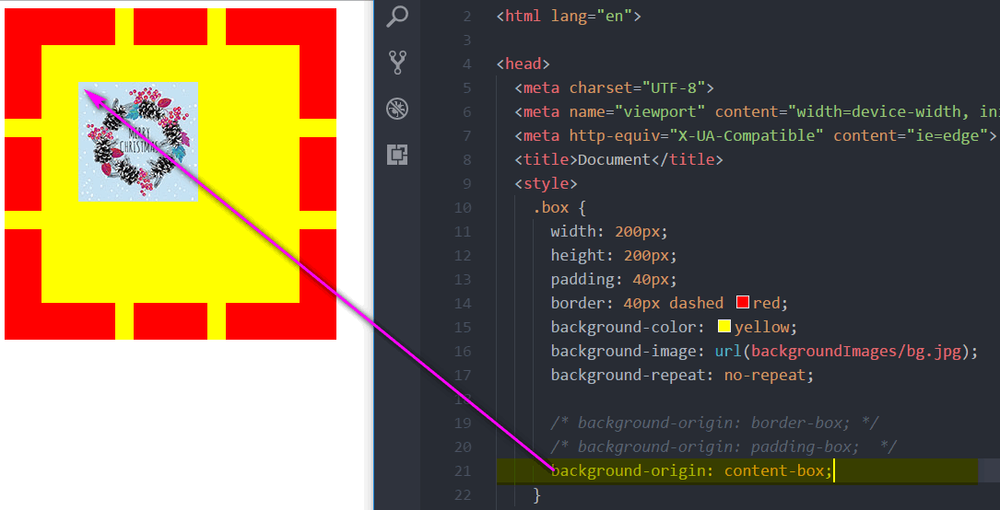

CSS3
===

## 选择器
  > 类选择器
  > 标签选择器
  > id选择器
  > \* 通配符选择器

### 属性选择器
  + `E[attr]` 选择具有att属性的E元素。
  + `E[attr="val"]` 选择具有att属性且属性值等于val的E元素。
  + `E[att~="val"]` 选择具有att属性且属性值为一用空格分隔的字词列表，其中一个等于val的E元素。
  + `E[attr^="val"]` 选择具有att属性且属性值为以val开头的字符串的E元素。
  + `E[attr$="val"]` 选择具有att属性且属性值为以val结尾的字符串的E元素。
  + `E[attr*="val"]` 选择具有att属性且属性值为包含val的字符串的E元素。
  ```css
  /*具有href的a标签的背景为红色*/
  a[href]{background-color: red;}
  /*把href属性值为:海阔天空.mp3 的背景为绿色*/
  a[href="海阔天空.mp3"]{background-color: green;}
  /*把href开头为: 大 的背景颜色为黄色*/
  a[href^="大"]{background-color: yellow;}
  /*把href结尾为: ogg 的背景颜色为粉色*/
  a[href$=".ogg"]{background-color: pink;}
  /*把href属性包含:老师 a的背景为黑色*/
  a[href*="美"]{background-color: black;}
  ```

### 伪类选择器
  + `E:first-child` 匹配第一个子元素E。
  + `E:last-child` 匹配最后一个子元素E。
  + `E:nth-child(n)` 匹配第n个子元素E。
  + `E:nth-last-child(n)` 匹配倒数第n个子元素E。
  + `E:not(s)` 匹配不含有s选择符的元素E。
  + `E:empty` 匹配子元素（包括text节点）空的元素E。
  + `E:target` 匹配相关URL指向的E元素。
  ```css
    /*把第一个li的字体颜色为红色*/
    li:first-child {color: red;}
    /*把最后一个li的字体颜色为红色*/
    li:last-child {color: red;}
    /*把第三个li的字体颜色为pink*/
    li:nth-child(3) {color: pink;}
    /*把偶数的li背景为红色:*/
    li:nth-child(even) {background-color: red;}
    /*把奇数的li背景为绿色*/
    li:nth-child(odd) {background-color: green;}
    /*把最后一列的li字体颜色为黄色*/
    li:nth-child(7n) {color: yellow;}
    /*把后面第二列的li字体颜色改成黄色*/
    li:nth-child(7n+2) {color: yellow;}
    /*把前三个li的背景颜色为黑色*/
    li:nth-child(-n+3) {background-color: #000;}
    /*把后三个li的背景颜色为黑色*/
    li:nth-last-child(-n+3) {background-color: #000;} 
    
    /*空的意思*/
    /*如果span中没有内容就隐藏,如果有就显示*/
    span:empty {display: none;}
    /*h3是a标签锚点目标*/
    h3:target {background-color: yellow;}
    /*排除某个应用two类样式的元素*/
    li:not(.two) {background-color: blue;}
  ```


### 伪元素选择器
  + `E:first-letter/E::first-letter` 设置对象内的第一个字符的样式。
  + `E:first-line/E::first-line`设置对象内的第一行的样式。
  + `E::selection`设置对象被选择时的颜色。
  ```css
  /*改变的是每个li中第一个字符的颜色*/
  li::first-letter{color: yellow;}
  /*字体下沉*/
  p:first-child:first-letter {font-size: 40px; float: left;}
  /*第一行的字体颜色改变*/
  p:first-line {color: green;}
  ```
## 颜色
  + css2 
    > `opacity`, `transparent`
  + RGBA
    > red 0-255
    > green 0-255
    > blue 0-255
    > alpha 0-1
  + HSLA
    > H: 色调 0-360
    > S: 饱和度 0%-100%
    > L: 亮度 0%-100%
    > A: alpha 0-1

## 文字阴影
  `text-shadow` 可以设置多个, 用逗号隔开
  参数1: x轴偏移量, 允许负值
  参数2: y轴偏移量, 允许负值
  参数3: 模糊的距离(可以省略), 不允许为负值
  参数4: 阴影颜色(可以省略), 可以设置透明度
  ```css
  /*浮雕效果*/
  .tu{
    text-shadow: -1px -1px 1px #fff, 1px 1px 1px #000;
  }
  .ao{
    text-shadow: -1px -1px 1px #000, 1px 1px 1px #fff;
  }
  ```

## 盒子模型
  `box-sizing`: `content-box`|`border-box`
  + `content-box`:对象的实际宽度等于设置的`width`值和`border`、`padding`之和
  + `border-box`： 对象的实际宽度就等于设置的`width`值

## 边框
### 边框圆角
  `border-radius` 参数: 水平半径{1,4}[/垂直半径{1,4}], 每个参数都可以是数值或者百分比.
  可以展开分着写:
  `border-top-left-radius`: 左上角 
  `border-top-right-radius`: 右上角 
  `border-bottom-right-radius`: 右下角 
  `border-bottom-left-radius`: 左下角 
  ```css
  /*半圆效果*/
  .circle{
    width: 100px;
    height: 100px;
    background-color: #ff0;
    border-radius: 50px 50px 0 0;
  }
  ```

### 边框阴影 盒子阴影
  `box-shadow` 可以设置多个, 用逗号隔开
  参数1: x轴偏移量, 允许负值
  参数2: y轴偏移量, 允许负值
  参数3: 模糊的距离(可以省略), 不允许为负值
  参数4: 阴影颜色(可以省略), 可以设置透明度

### 边框图片
  ```css
  /*引入了图片的路径*/
  border-image-source: url("images/border.png");
  /*切割的大小*/
  border-image-slice: 27;/*四个参数:没有单位 图片被拆为九宫格*/
  /*是否平铺*/
  /*默认的stretch 拉伸  repeat:平铺, round:按照比例显示 */
  border-image-repeat: stretch;
  border-image-width: 27px;/*盒子整体大小没有变化 不会影响布局 border-width影响布局*/
  ```
  

## 背景
### 背景尺寸
  ```css
  background-image: url();
  /*设置图片的宽高*/
  background-size: 600px 600px;
  background-size: 100% 100%;/*图片会变形*/
  background-size: 600px auto;/*高度自适应*/
  background-size: auto 600px;/*宽度自适应*/
  background-size: cover;/*可以把图片铺满整个元素 -- 自适应*/
  background-size: contain;/*按比例缩放显示 但是不会铺满元素*/
  ```

### 背景原点
  ```css
  background-image: url();/*显示背景图 默认位置border左上角里面*/
  background-origin: padding-box;/**/
  background-origin: border-box;/**/
  background-origin: content-box;/*背景图片在内容区显示(padding的位置也让出来)*/
  ```
### 背景颜色裁剪
  ```css
  background-color: yellow;
  background-clip: border-box;/*边框下面显示背景颜色*/
  background-clip: padding-box;/*padding左上角显示背景颜色*/
  background-clip: content-box;/*内容区域显示背景颜色*/
  background-image: url();
  background-origin: *-box;/*调整 以显示完整背景图*/
  ```
  
  
  

### 多背景
  ```css
  background: url(bg1.png) left top no-repeat,
              url(bg2.png) right top no-repeat,
              url(bg3.png) right bottom no-repeat,
              url(bg4.png) left bottom no-repeat,
              url(bg.png) center no-repeat;
  ```
  
### 渐变
#### 线性渐变 linear-gradient
  ```css
  /* left right top bottom 度数*/
  background-image: linear-gradient(to right, yellow, green);
  background-image: linear-gradient(30deg, yellow, green);
  background-image: linear-gradient(90deg, yellow, green);/*左到右*/
  background-image: linear-gradient(180deg, yellow, green);/*上到下*/
  background-image: linear-gradient(to right, yellow 20%, green 50%);/*从25%长度之后开始渐变到50% 之前是黄色 之后是绿色*/
  background-image: linear-gradient(to right, yellow 20%, green 50%, pink 75%);
  background-image: linear-gradient(to right, yellow 25%, green 25%,green 50%, pink 50%, pink 75%, blue 75%);/*四段纯色*/
  ```
  
#### 径向渐变 radial-gradient
  ```css
  background-image: radial-gradient(半径at位置, 颜色, 颜色);
  background-image: radial-gradient(10px at left top, yellow, green);
  background-image: radial-gradient(10px at center, yellow, green);
  background-image: radial-gradient(10px at 150px 30px, yellow, green);
  background-image: radial-gradient(100px at center, yellow 25%, green 25%, green 50%);/*百分比针对半径*/
  ```
  
## 动画
### 过渡 -- 补间动画
  ```css
  /*transition: 元素(all|单个属性) 过渡时间 [linear匀速|ease先快后慢|ease-in|ease-out][延迟时间]  逗号连接, 可以写多个*/
  /*不要设置display[block|none]的补间动画, 设置opacity代替*/
  p span{
    margin: 0 20px;
    opacity: .3;
    transition: all 1s linear 2s;/*transition: width 1s, height 1s;*/
  }
  p:hover span {
    margin: 0 5px;
    opacity: 1;
  }
  ```
  
### 2D转换
  ```css
  /*移动*//*配合过渡使用 可以连写 没有逗号*/
  transform: translate(100px, 100px); /*与是否脱标无关*/
  /*缩放(倍数, 倍数)*/
  transform: scale(2,2);
  /*倾斜(x轴, y轴)*/
  transform: skew(45deg, 0deg);
  /*旋转*/
  transform: rotate(45deg);
  ```
  
  ```css
/* 上图代码
<div class="translate">
    <div class="box"></div>
</div>
*/  
.translate {
    width: 200px;
    height: 200px;
  }
  .box {
    width: 200px;
    height: 200px;
    background-color: red;
    position: absolute;
    bottom: 0;
    left: 0;
    transition: all 1s;
  }
  translate:hover .box {
   transform: translate(100%, -50%);
  }
  ```
  
  ```css
  /*其他代码同上*/
  .translate:hover .box {
    transform: scale(2, 2);
  }
  ```
  
  ```css
  /*其他代码同上*/
  .translate:hover .box {
    transform: rotate(45deg);
  }
  ```
  
  
  ```css
/*
	<div class="skew"></div>
*/  
.skew {
    width: 200px;
    height: 200px;
    margin: 100px auto;
    background-color: green;
    border-width: 5px;
    border-style: solid;
    border-color: red pink blue yellow;
    transition: all 3s;
  }
  .skew:hover {
    transform: skew(45deg, 0);/*x轴倾斜*/
    /* transform: skew(0,45deg); *//*y轴倾斜*/
  }
  ```
  2d转换例子: 纸牌旋转
  

### 3D
  
  > [张鑫旭](http://www.zhangxinxu.com/wordpress/2012/09/css3-3d-transform-perspective-animate-transition/)
  > [博客园](https://www.cnblogs.com/changlel/p/6385953.html)

#### transform: translate*
  + translate3d
    `transform:translate3d( x , y , z );`
  + translateX
    `transform: translateX(300px)` 沿着x轴移动300px
  + translateY
    `transform: translateY(300px)` 沿着y轴移动300px
  + translateZ
    `transform: translateZ(300px)` 沿着z轴移动300px, **必须给父盒子加透视**

#### transform: scale3d
  `transform: scale3d( x , y , z)`; 定义3个方向上的缩放，同时可以分别实现3个方向的分别设置

#### transform: rotate*
  + rotate3d( x , y , z , angle )
  + rotateX
      `transform: rotateX(180deg);` 沿着x轴旋转
        
  + rotateY
      `transform: rotateY(180deg);` 沿着y轴旋转
        
  + rotateZ
      `transform: rotateZ(180deg);` 沿着z轴旋转
        


#### perspective
  透视:就是视距:眼睛到这个物体的距离,近大远小

#### transform-style: preserve-3d
  加给变换元素的父盒子，让子盒子存在三维空间中，保持3d效果
  `flat`:默认值 （让子盒子被扁平化）

### CSS3动画
  如果用`@keyframes` 创建动画，把它绑定到一个选择器，否则动画不会有任何效果。
指定至少这两个CSS3的动画属性绑定向一个选择器：
规定动画的名称
规定动画的时长

`animation-play-state: paused`  鼠标` :hover`暂停

#### from-to
```css
#pic2: target {
  animation: ani2 2s linear;
  z-index: 3;
}

@keyframes ani2 {
  from {
    transform: scale(0);
  }
  to {
    transform: scale(1);
  }
}
```
运行效果:


#### 百分比
```html
<!DOCTYPE html>
<html lang="en">

<head>
  <meta charset="UTF-8">
  <title>CSS3 动态进度条</title>
  <style>
    .progress {
      width: 500px;
      height: 40px;
      margin: 100px auto;
      background-color: yellow;
      border-radius: 5px;
      background-image: linear-gradient( 135deg,
      green 25%,
      transparent 25%,
      transparent 50%,
      green 50%,
      green 75%,
      transparent 75%,
      transparent 100%);
      background-size: 40px 40px;
      background-position: 0 0;

      animation: move 1s linear infinite;
    }
    /*动画序列*/

    @keyframes move {
      0% {
        background-position: 0 0;
      }

      100% {
        background-position: 40px 0;
      }
    }
  </style>
</head>

<body>
  <div class="progress"></div>
</body>

</html>
```

运行效果:


### 网页常见效果
[简书](http://www.jianshu.com/p/7d8cbf3e5a47)

## 布局
### 多列布局
> 兼容性差
```css
  /*设置列数*/
  column-count: 3;

  /*设置列宽*/
  column-width: 400px;
	
  /*设置列间距*/
  column-gap: 20px;
	
  /*设置边线*/
  column-rule: 1px dashed #CCC;
```
### 伸缩布局(弹性布局)
  > 弹性布局是css3一种新的布局方式, 是一种当前页面需要适用不同的屏幕大小及设备类型时确保有用恰当的行为的布局方式.
  > 弹性布局设置`display`为`flex`或`inline-flex`

#### 弹性布局父元素的属性
##### `flex-direction` 

> 顺序指定了弹性子元素在父容器中的位置

参数:

+ `row`: 从左到右排列 -- 左对齐, 默认
+ `row-reverse`: 反向横向排列 -- 右对齐
+ `column` 纵向排列 -- 上到下
+ `column-reverse` 反向纵向排列 -- 下到上
```html
<!--例子-->
<!DOCTYPE html>
<html lang="en">
<head>
    <meta charset="UTF-8">
    <title>CSS3伸缩布局</title>
    <style>
    body {
        margin: 0;
        padding: 0;
        font-family: '微软雅黑';
        background-color: #F7F7F7;
    }
    ul {
        margin: 0;
        padding: 0;
        list-style: none;
    }
    .wrapper {
        width: 1024px;
        margin: 0 auto;
    }
    .wrapper>section {
        min-height: 300px;
        margin-bottom: 30px;
        box-shadow: 1px 1px 4px #DDD;
        background-color: #FFF;
    }
    .wrapper>header {
        text-align: center;
        line-height: 1;
        padding: 20px;
        margin-bottom: 10px;
        font-size: 30px;
    }
    .wrapper section>header {
        line-height: 1;
        padding: 10px;
        font-size: 22px;
        color: #333;
        background-color: #EEE;
    }
    .wrapper .wrap-box {
        padding: 20px;
    }
    .wrapper .brief {
        min-height: auto;
    }
    .wrapper .flex-img {
        width: 100%;
    }
    /*全局设置*/
    section ul {
        display: flex;
    }
    section li {
        width: 200px;
        height: 200px;
        text-align: center;
        line-height: 200px;
        margin: 10px;
        background-color: pink;
    }

    section:nth-child(3) ul {
        flex-direction: row; /*从左到右排列*/
    }

    section:nth-child(4) ul {
        flex-direction: column; /*从上到下排列*/
    }

    section:nth-child(5) ul {
        flex-direction: row-reverse; /*从右到左排列*/
    }

    section:nth-child(6) ul {
        flex-direction: column-reverse; /*从下到上排列*/
    }
    </style>
</head>

<body>
    <div class="wrapper">
        <header>CSS3-伸缩布局详解</header>
        <!-- 简介 -->
        <section class="brief">
            <header>flex-direction</header>
            <div class="wrap-box">
                <p>调整主轴方向（默认为水平方向）包括row、column、row-reverse、column-reverse</p>
            </div>
        </section>
        <!-- 分隔线 -->
        <section>
            <header>flex-direction</header>
            <div class="wrap-box">
                <p>调整主轴方向（默认为水平方向）</p>
                <ul>
                    <li>1</li>
                    <li>2</li>
                    <li>3</li>
                </ul>
            </div>
        </section>
        <section class="column">
            <header>column</header>
            <div class="wrap-box">
                <p>取值为column时，垂直排列</p>
                <ul>
                    <li>1</li>
                    <li>2</li>
                    <li>3</li>
                </ul>
            </div>
        </section>
        <section class="row-reverse">
            <header>row-reverse</header>
            <div class="wrap-box">
                <p>取值为row-reverse时，水平反向排列</p>
                <ul>
                    <li>1</li>
                    <li>2</li>
                    <li>3</li>
                </ul>
            </div>
        </section>
        <section class="column-reverse">
            <header>column-reverse</header>
            <div class="wrap-box">
                <p>取值column-reverse时，垂直反向排列</p>
                <ul>
                    <li>1</li>
                    <li>2</li>
                    <li>3</li>
                </ul>
            </div>
        </section>
    </div>
</body>
</html>
```
效果:


##### `justify-content`

> 内容对齐. 内容随其属性应用在弹性容器上, 把弹性项沿着弹性容器**主轴**对齐.

+ `justify-content: flex-start`  起始点对齐
+ `justify-content: flex-end` 终止点对齐
+ `justify-content: center`  居中对齐
+ `justify-content: space-around`  四周环绕
+ `justify-content: space-between`  两端对齐

```html
<!DOCTYPE html>
<html lang="en">
<head>
    <meta charset="UTF-8">
    <title>CSS3伸缩布局</title>
    <style>
    body {
        margin: 0;
        padding: 0;
        font-family: '微软雅黑';
        background-color: #F7F7F7;
    }
    ul {
        margin: 0;
        padding: 0;
        list-style: none;
    }
    .wrapper {
        width: 1024px;
        margin: 0 auto;
    }
    .wrapper>section {
        min-height: 300px;
        margin-bottom: 30px;
        box-shadow: 1px 1px 4px #DDD;
        background-color: #FFF;
    }
    .wrapper>header {
        text-align: center;
        line-height: 1;
        padding: 20px;
        margin-bottom: 10px;
        font-size: 30px;
    }
    .wrapper section>header {
        line-height: 1;
        padding: 10px;
        font-size: 22px;
        color: #333;
        background-color: #EEE;
    }
    .wrapper .wrap-box {
        padding: 20px;
    }
    .wrapper .brief {
        min-height: auto;
    }
    .wrapper .flex-img {
        width: 100%;
    }
    /*全局设置*/
    section ul {
        /*把所有ul指定成了伸缩盒子*/
        display: flex;

        /*这里只是一个小的测试*/
        /*flex-direction: row-reverse;*/
    }

    section li {
        width: 200px;
        height: 200px;
        text-align: center;
        line-height: 200px;
        margin: 10px;
        background-color: pink;
    }
    .flex-start ul {
        justify-content: flex-start; /*起始点对齐*/
    }

    .flex-end ul {
        justify-content: flex-end; /*终止点对齐*/
    }

    .center ul {
        justify-content: center; /*居中对齐*/
    }

    .space-around ul {
        justify-content: space-around; /*四周环绕*/
    }

    .space-between ul {
        justify-content: space-between; /*两端对齐*/
    }
    </style>
</head>

<body>
    <div class="wrapper">
        <header>CSS3-伸缩布局详解</header>
        <!-- 简介 -->
        <section class="brief">
            <header>justify-content</header>
            <div class="wrap-box">
                <p>主轴方向对齐，可以调整元素在主轴方向上的对齐方式，包括flex-start、flex-end、center、space-around、space-between几种方式</p>
            </div>
        </section>
        <!-- 分隔线 -->
        <section class="flex-start">
            <header>flex-start</header>
            <div class="wrap-box">
                <p>起始点对齐</p>
                <ul>
                    <li>1</li>
                    <li>2</li>
                    <li>3</li>
                </ul>
            </div>
        </section>
        <section class="flex-end">
            <header>flex-end</header>
            <div class="wrap-box">
                <p>终止点对齐</p>
                <ul>
                    <li>1</li>
                    <li>2</li>
                    <li>3</li>
                </ul>
            </div>
        </section>
        <section class="center">
            <header>center</header>
            <div class="wrap-box">
                <p>居中对齐</p>
                <ul>
                    <li>1</li>
                    <li>2</li>
                    <li>3</li>
                </ul>
            </div>
        </section>
        <section class="space-around">
            <header>space-around</header>
            <div class="wrap-box">
                <p>四周环绕</p>
                <ul>
                    <li>1</li>
                    <li>2</li>
                    <li>3</li>
                </ul>
            </div>
        </section>
        <section class="space-between">
            <header>space-between</header>
            <div class="wrap-box">
                <p>两端对齐</p>
                <ul>
                    <li>1</li>
                    <li>2</li>
                    <li>3</li>
                </ul>
            </div>
        </section>
    </div>
</body>

</html>

```


##### `align-items`

> 侧轴对齐方式

+ `align-items: flex-start`  侧轴起始点对齐
+ `align-items: flex-end`  侧轴终止点对齐
+ `align-items: center`  侧轴居中对齐
+ `align-items: stretch`  如果指定侧轴大小的属性为auto，则其值会使项目的边距盒的尺寸尽可能接近所在行的尺寸，但同时会遵照'min/max-width/height'属性的限制

```html
<!DOCTYPE html>
<html lang="en">

<head>
    <meta charset="UTF-8">
    <title>CSS3伸缩布局</title>
    <style>
    body {
        margin: 0;
        padding: 0;
        font-family: '微软雅黑';
        background-color: #F7F7F7;
    }
    ul {
        margin: 0;
        padding: 0;
        list-style: none;
    }
    .wrapper {
        width: 1024px;
        margin: 0 auto;
    }
    .wrapper>section {
        min-height: 300px;
        margin-bottom: 30px;
        box-shadow: 1px 1px 4px #DDD;
        background-color: #FFF;
    }
    .wrapper>header {
        text-align: center;
        line-height: 1;
        padding: 20px;
        margin-bottom: 10px;
        font-size: 30px;
    }
    .wrapper section>header {
        line-height: 1;
        padding: 10px;
        font-size: 22px;
        color: #333;
        background-color: #EEE;
    }
    .wrapper .wrap-box {
        padding: 20px;
    }
    .wrapper .brief {
        min-height: auto;
    }
    .wrapper .flex-img {
        width: 100%;
    }
    /*全局设置*/
    section ul {
        display: flex;
        min-height: 600px;
    }
    section li {
        width: 200px;
        height: 200px;
        text-align: center;
        line-height: 200px;
        margin: 10px;
        background-color: pink;
    }
    .flex-start ul {
        align-items: flex-start;
    }
    .flex-end ul {
        align-items: flex-end;
    }
    .center ul {
        align-items: center;
    }
    .stretch ul {
        align-items: stretch;
    }
    .stretch li {
        height: auto;
    }
    </style>
</head>

<body>
    <div class="wrapper">
        <header>CSS3-伸缩布局详解</header>
        <!-- 简介 -->
        <section class="brief">
            <header>align-items</header>
            <div class="wrap-box">
                <p>调整侧轴方向对齐方式，包括flex-start、flex-end、center、stretch</p>
            </div>
        </section>
        <!-- 分隔线 -->
        <section class="flex-start">
            <header>flex-start</header>
            <div class="wrap-box">
                <p>侧轴起始点对齐</p>
                <ul>
                    <li>1</li>
                    <li>2</li>
                    <li>3</li>
                </ul>
            </div>
        </section>
        <section class="flex-end">
            <header>flex-end</header>
            <div class="wrap-box">
                <p>侧轴终止点对齐</p>
                <ul>
                    <li>1</li>
                    <li>2</li>
                    <li>3</li>
                </ul>
            </div>
        </section>
        <section class="center">
            <header>center</header>
            <div class="wrap-box">
                <p>侧轴居中对齐</p>
                <ul>
                    <li>1</li>
                    <li>2</li>
                    <li>3</li>
                </ul>
            </div>
        </section>
        <section class="stretch">
            <header>stretch</header>
            <div class="wrap-box">
                <ul>
                    <li>1</li>
                    <li>2</li>
                    <li>3</li>
                </ul>
            </div>
        </section>
    </div>
</body>

</html>
```


##### flex-wrap

> 用于指定弹性盒子的子元素的元素换行方式

+ `flex-wrap：nowrap` 默认 不换行
+ `flex-wrap：wrap`  溢出的比分会被放置的新行
+ `flex-wrap：wrap-reverse` 反转wrap排列

```html

<!DOCTYPE html>
<html lang="en">
<head>
	<meta charset="UTF-8">
	<title>CSS3伸缩布局</title>
	<style>
		body {
			margin: 0;
			padding: 0;
			font-family: '微软雅黑';
			background-color: #F7F7F7;
		}

		ul {
			margin: 0;
			padding: 0;
			list-style: none;
		}

		.wrapper {
			width: 1024px;
			margin: 0 auto;
		}

		.wrapper > section {
			min-height: 300px;
			margin-bottom: 30px;
			box-shadow: 1px 1px 4px #DDD;
			background-color: #FFF;
		}

		.wrapper > header {
			text-align: center;
			line-height: 1;
			padding: 20px;
			margin-bottom: 10px;
			font-size: 30px;
		}

		.wrapper section > header {
			line-height: 1;
			padding: 10px;
			font-size: 22px;
			color: #333;
			background-color: #EEE;
		}

		.wrapper .wrap-box {
			padding: 20px;
		}

		.wrapper .brief {
			min-height: auto;
		}

		.wrapper .flex-img {
			width: 100%;
		}


		/*全局设置*/
		section ul {
			/*把所有ul指定成了伸缩盒子*/
			display: flex;
		}

		section li {
			width: 200px;
			height: 200px;
			text-align: center;
			line-height: 200px;
			margin: 10px;
			background-color: pink;
		}

		.nowrap ul {
			flex-wrap: nowrap;
		}

		.wrap ul {
			flex-wrap: wrap;
		}
		
	</style>
</head>
<body>
	<div class="wrapper">
		<header>CSS3-伸缩布局详解</header>

		<!-- 简介 -->
		<section class="brief">
			<header>flex-wrap</header>
			<div class="wrap-box">
				<p>控制是否换行，包括wrap、nowrap</p>
			</div>
		</section>

		<!-- 分隔线 -->
		<section class="nowrap">
			<header>nowrap</header>
			<div class="wrap-box">
				<p>不换行</p>
				<ul>
					<li>1</li>
					<li>2</li>
					<li>3</li>
					<li>4</li>
					<li>5</li>
					<li>6</li>
					<li>7</li>
					<li>8</li>
					<li>9</li>
					<li>10</li>
				</ul>
			</div>
		</section>
		
		<section class="wrap">
			<header>wrap</header>
			<div class="wrap-box">
				<p>自动换行</p>
				<ul>
					<li>1</li>
					<li>2</li>
					<li>3</li>
					<li>4</li>
					<li>5</li>
					<li>6</li>
					<li>7</li>
					<li>8</li>
				</ul>
			</div>
		</section>
	</div>
</body>
</html>
```

运行效果:


#### 弹性子元素属性

##### `order`

> 控制子元素的顺序 排序小的在前面

```html

<!DOCTYPE html>
<html lang="en">
<head>
	<meta charset="UTF-8">
	<title>CSS3伸缩布局</title>
	<style>
		body {
			margin: 0;
			padding: 0;
			font-family: '微软雅黑';
			background-color: #F7F7F7;
		}

		ul {
			margin: 0;
			padding: 0;
			list-style: none;
		}

		.wrapper {
			width: 1024px;
			margin: 0 auto;
		}

		.wrapper > section {
			min-height: 300px;
			margin-bottom: 30px;
			box-shadow: 1px 1px 4px #DDD;
			background-color: #FFF;
		}

		.wrapper > header {
			text-align: center;
			line-height: 1;
			padding: 20px;
			margin-bottom: 10px;
			font-size: 30px;
		}

		.wrapper section > header {
			line-height: 1;
			padding: 10px;
			font-size: 22px;
			color: #333;
			background-color: #EEE;
		}

		.wrapper .wrap-box {
			padding: 20px;
		}

		.wrapper .brief {
			min-height: auto;
		}

		.wrapper .flex-img {
			width: 100%;
		}

		/*全局设置*/
		section ul {
			display: flex;
		}

		section li {
			width: 200px;
			height: 200px;
			text-align: center;
			line-height: 200px;
			margin: 10px;
			background-color: pink;
		}
		
		.order li:nth-child(1) {
			order: 3;
		}

		.order li:nth-child(2) {
			order: 100;
		}

		.order li:nth-child(3) {
			order: 2;
		}
	</style>
</head>
<body>
	<div class="wrapper">
		<header>CSS3-伸缩布局详解</header>

		<!-- 简介 -->
		<section class="brief">
			<header>order</header>
			<div class="wrap-box">
				<p>控制子元素的顺序</p>
			</div>
		</section>
		
		<!-- 分隔线 -->
		<section class="order">
			<header>order</header>
			<div class="wrap-box">
				<ul>
					<li>1</li>
					<li>2</li>
					<li>3</li>
				</ul>
			</div>
		</section>
	</div>
</body>
</html>
```

运行结果:


##### `align-self`单独对齐方式

+ `align-self: auto;`
  如果'align-self'的值为'auto'，则其计算值为元素的父元素的'align-items'值，如果其没有父元素，则计算值为'stretch'。

+ **`align-self: flex-start;`**
  弹性盒子子元素的侧轴（纵轴）起始位置的边界紧靠住该行的轴侧起始边界

+ `align-self：flex-end`
  弹性盒子元素的侧轴（纵轴）其实位置的边界紧靠着该行的轴侧结束边界

+ **`align-self: center`**
  弹性盒子元素在该行的轴侧上居中放置。（如果该行的尺寸小于弹性盒子元素的尺寸，则会向两个方向溢出相同的长度）

+ `align-self: baseline;`
  如弹性盒子元素的行内轴与侧轴为同一条，则该值与flex-start等效，其他情况下，该值将参与基线对齐

+ `align-self: stretch`
  如果指定侧轴大小的属性值为auto，则其值会使项目的边距盒的尺寸尽可能接近所在行的尺寸，但同时会遵照min/max-width/height属性的限制

```html
<!DOCTYPE html>
<html>
    <head>
        <meta charset="UTF-8">
        <title>05_align-self</title>
        <style type="text/css">
            *{
                margin: 0;
                padding: 0;
            }
            ul,li{
                list-style: none;
            }
            ul{
                width:500px;
                height: 300px;
                border: 2px solid black;
                /*在父容器中指定为flex布局*/
                /*将来如果要写的话 需要些浏览器内核兼容*/
                display: flex;
                margin-left: auto;
                margin-right: auto;
            }
            li{
                list-style: none;
                width: 80px;
                /*height: 50px;*/
                border: 2px solid black;
                color: white;
                background: skyblue;
                font-size: 30px;
            }

            ul li:nth-of-type(1){
                /*单独对齐方式：  自动（默认）*/
                align-self: auto;
            }

            ul li:nth-of-type(2){

                /*顶部对齐*/
                align-self: flex-start;
            }

            ul li:nth-of-type(3){
                /*底部对齐*/
                align-self: flex-end;
            }

            ul li:nth-of-type(4){
                /*居中对齐*/
                align-self: center;
            }

            ul li:nth-of-type(5){
                /*文本基线对齐*/
                align-self: baseline;
            }

            ul li:nth-of-type(6){
            /*    flex-flow: wrap;*/
                /*上下对齐并铺满*/
                align-self: stretch;
            }
        </style>
    </head>
    <body>
        <ul>
            <li>1</li>
            <li>2</li>
            <li>3</li>
            <li>4</li>
            <li>5</li>
            <li>6</li>
        </ul>
    </body>
</html>
```

运行结果:


##### `flex`

> flex属性用于指定弹性子元素如何分配空间

```html
<!DOCTYPE html>
<html lang="en">

<head>
    <meta charset="UTF-8">
    <title>CSS3伸缩布局</title>
    <style>
    body {
        margin: 0;
        padding: 0;
        font-family: '微软雅黑';
        background-color: #F7F7F7;
    }

    ul {
        margin: 0;
        padding: 0;
        list-style: none;
    }

    .wrapper {
        width: 1024px;
        margin: 0 auto;
    }

    .wrapper>section {
        min-height: 300px;
        margin-bottom: 30px;
        box-shadow: 1px 1px 4px #DDD;
        background-color: #FFF;
    }

    .wrapper>header {
        text-align: center;
        line-height: 1;
        padding: 20px;
        margin-bottom: 10px;
        font-size: 30px;
    }

    .wrapper section>header {
        line-height: 1;
        padding: 10px;
        font-size: 22px;
        color: #333;
        background-color: #EEE;
    }

    .wrapper .wrap-box {
        padding: 20px;
    }

    .wrapper .brief {
        min-height: auto;
    }

    .wrapper .flex-img {
        width: 100%;
    }
    /*全局设置*/

    section ul {
        display: flex;
    }

    section li {
        width: 200px;
        height: 200px;
        text-align: center;
        line-height: 200px;
        margin: 10px;
        background-color: pink;
        overflow: hidden;
    }

    .flex121 li:nth-child(1) {
        flex: 1;
    }

    .flex121 li:nth-child(2) {
        flex: 4;
    }

    .flex121 li:nth-child(3) {
        flex: 1;
    }

    .flex21 li:nth-child(1) {
        width: 600px;
    }

    .flex21 li:nth-child(2) {
        flex: 2;
    }

    .flex21 li:nth-child(3) {
        flex: 1;
    }
    </style>
</head>

<body>
    <div class="wrapper">
        <header>CSS3-伸缩布局详解</header>
        <!-- 简介 -->
        <section class="brief">
            <header>flex</header>
            <div class="wrap-box">
                <p>控制子元素伸缩比例</p>
            </div>
        </section>
        <!-- 分隔线 -->
        <section class="flex121">
            <header>flex121</header>
            <div class="wrap-box">
                <ul>
                    <li>1</li>
                    <li>2</li>
                    <li>3</li>
                </ul>
            </div>
        </section>
        <section class="flex21">
            <header>flex21</header>
            <div class="wrap-box">
                <ul>
                    <li>1</li>
                    <li>2</li>
                    <li>3</li>
                </ul>
            </div>
        </section>
    </div>
</body>

</html>
```

运行结果:


