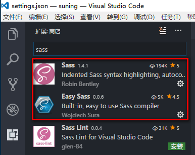
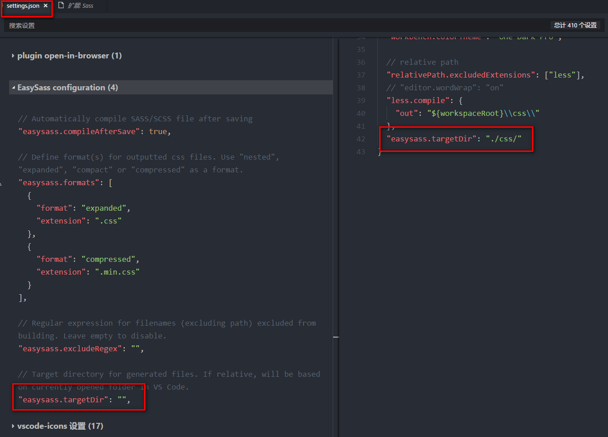
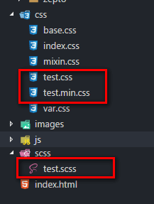

sass
===

安装
---

1. 安装[Ruby][http://rubyinstaller.org/downloads]
  安装成功后测试:
  ```cmd
  ruby -v
  // 安装成功后会输出
  ruby 2.4.1p111 (2017-03-22 revision 58053) [x64-mingw32]
  ```
2. 安装`Sass`
  ```
  gem install sass
  // 下载安装执行, 有输出
  // 测试
  sass -v
  ```
3. 安装 `Compass`
  ```
  gem install compass
  // 下载安装执行, 有输出
  // 测试
  compass -v
  ```

编译
---
1. vscode安装插件 `Sass` , `easy sass`.
  
2. 插件配置
  
  `easysass.targetDir` 提供 CSS 输出路径的设置，值可以是绝对路径或相对路径。例如：设置 easysass.targetDir 为 "./css/"，此时保存修改完毕的 Sass 文件，VSCode 会自动编译并在当前 Sass 文件的上级文件夹 css 目录下输出生成 CSS 文件（见下图）。
  
3. 插件使用
+ 自动编译
+ 命令行
  ```
  // Ctrl + shift + p
  Compile all SCSS/SASS files in the project 
  ```

语法
---

> sass有两种后缀名文件：一种后缀名为sass，不使用大括号和分号；另一种就是我们这里使用的scss文件，这种和我们平时写的css文件格式差不多，使用大括号和分号。

#### 1.变量

sass允许使用变量, 以$开头
```scss
$color: #1875e7;

div{
  color: $color;
}
```
变量如果包含在字符串中, 要写在`#{}`之中.
```scss
$side : left;

.rounded {
　border-#{$side}-radius: 5px;
}
```
#### 2.计算
```scss
body {
　margin: (14px/2);
　top: 50px + 100px;
　right: $var * 10%;
}
```
#### 3.嵌套
在css中的代码:
```css
div h1 {
　color : red;
}
```
在Sass中可以写成:
```scss
div {
　h1 {
　  color:red;
　}
}
```
注意: 属性也可以嵌套, 属性名后必须**加冒号**.
```scss
p {
　border: {
　　color: red;
　}
}
```
在嵌套的代码块内, 可以用&引用父元素. 比如:
```scss
a {
　&:hover { color: #ffb3ff; }
}
```

#### 注释
+ 单行注释
  `// comment` 只保留在sass源文件中, 编译后被忽略
+ css注释
  `/* comment*/` 会保留到编译后的css文件
+ 重要注释
  `/*! comment*/` 会保留到**压缩模式**编译后的css文件

### 代码的重用
#### 继承 `@extend`
```scss
.class1 {
  border: 1px solid #ddd;
}
.class2 {
  @extend .class1;
  font-size: 120%;
}
```
#### Mixin
```scss
@mixin left{ // 使用 @mixin 定义一个代码块
  float: left;
  margin-left: 10px;
}
div{
  @include left; // 使用 @include 调用代码块
}
```
Mixin可以指定参数和默认值
```scss
@mixin left($value: 10px){
  float: left;
  margin-left: $value;
}
div{
  @include left(20px);
}
```
demo:向元素的左上角添加圆角边框
```scss
@mixin rounded($vert, $horz, $radius: 10px){
  border-#{$vert}-#{$horz}-radius: $radius;
  -moz-border-#{$vert}-#{$horz}-radius: $radius;
  -webkit-border-#{$vert}-#{$horz}-radius: $radius;
}
// 调用
#navbar li {
  @include rounded(top, left);
}
#footer{
  @include rounded(top, left, 5px);
}
```

#### 颜色函数
```scss
lighten(#cc3, 10%) // #d6d65c
darken(#cc3, 10%) // #a3a329
grayscale(#cc3) // #808080
complement(#cc3) // #33c
```

#### 导入文件  `@import`
```scss
@import "path/filename.scss";
@import "foo.css";
```

### 高级语法
#### 条件语句
`@if`:
```scss
p {
  @if 1 + 1 == 2 {
    border: 1px solid;
  }
  @if 5 < 3 {
    border: 2px dotted;
  }
}
```
`@if...@else...`
```scss
@if lightness($color) > 30% {
  background: #000;
} @else {
  background: #fff;
}
```

#### 循环语句
1. for循环
```scss
@for $i from 1 to 100 {
  .border-#{$i} {
    border: #{$i}px solid blue;
  }
}
```
2. while循环
```scss
$i: 6;
@while $i > 0{
  .item-#{$i} {
    width: 2em * $i;
  }
}
```
3. each
```scss
@each $number in a, b, c, d {
  .#{$number} {
    background-image: url(image/#($number).jpg);
  }
}
```

#### 自定义函数
```scss
@function double($n) {
　@return $n * 2;
}
#sidebar {
　width: double(5px);
}
```