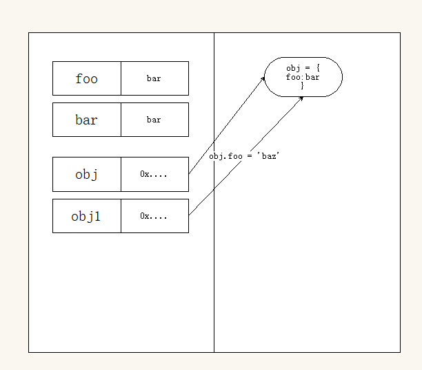
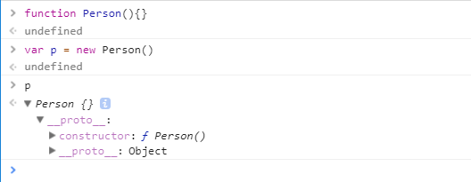
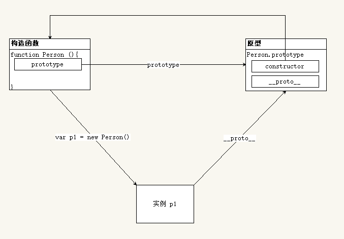

# 面向对象

## JavaScript 中的数据类型

### 值类型和引用类型复制

```javascript
var foo = 'bar'  // 存的是值
var bar = foo

var obj = {  // obj 存的是地址
  foo: bar
}

var obj1 = obj // obj1 中存储的是和 obj 一样的地址

obj.foo = 'baz' // 地址一样, 指向的内用一样, 所以修改的是同一个对象
console.log(obj, obj1)
```



+ 基本类型数据: `undefined` `null` `Boolean` `Number` `String` 直接按值存放
  基本类型在内存中占据固定大小的空间, 被保存在**栈**内存中
  从一个变量向另一个变量复制基本类型的值 -- 复制的是值的副本

+ 引用类型数据: 变量保存的是**一个指针**, 这个指针地址指向堆内存中的数据.
  引用类型的值是对象, 保存在**堆**内存
  保存引用类型的变量保存的并**不是对象本身**, 而是一个指向该对象的指针
  从一个变量向另一个变量复制引用类型的值的时候, 复制的是**引用指针**, 因此两个变量指向的是同一个对象.

### 值类型和引用类型参数传递

```javascript
var a = 123
var b = {
  foo: 'bar'
}

function f(a, b) {
  a = 456  // var 形参a = 实参a 复制值
  b.foo = 'baz'  // var 形参b = 实参b 复制引用
  b = {   // b 中的地址指向新的对象 与 之前的对象断开连接
    foo: 'bbb'
  }
}

f(a, b)
console.log(a, b)  // 123, Object{foo: 'bbb'}
```

+ 基本类型数据: 按值传递
+ 引用类型数据: 按引用传递

### 深拷贝与浅拷贝

+ 浅拷贝

  当拷贝对象时, 如果属性时对象或者数组, 这时候传递的也只是一个地址. 两者的属性值指向同一内存空间.

  ```javascript
  var a = {
      key1:"11111"
  }
  function copy(p) {
      var c = {}
      for (var i in p) {
      　　c[i] = p[i]
      }
      return c
  }
  a.key2 = ['小辉','小辉']
  var b = copy(a)
  b.key3 = '33333'
  alert(b.key1)     //11111
  alert(b.key3)    //33333
  alert(a.key3)    //undefined
  alert(a.key2)    // ['小辉','小辉']
  alert(b.key2)    // ['小辉','小辉']
  b.key2.push("大辉")
  alert(b.key2)    //小辉，小辉，大辉
  alert(a.key2)    //小辉，小辉，大辉
  ```

+ 深拷贝

  不希望拷贝前后的对象之间有关联, 那么这个时候就会用到**深拷贝**.

  ```javascript
  function isObject(obj) {
    return Object.prototype.toString.call(obj) === '[object Object]'
  }

  function isArray(obj) {
    return Object.prototype.toString.call(obj) === '[object Array]'
  }

  // 利用递归实现深拷贝对象复制
  function extend(target, source) {
    for(var key in source) {
      // 判断如果当前遍历项 source[key] 是一个数组，则先让 target[key] = 数组
      // 然后遍历 source[key] 将其中的每一项都复制到 target[key] 中
      if (isArray(source[key])) {
        target[key] = []
        // 遍历 source[key] 复制到 target[key] 中
        extend(target[key], source[key])
      } else if (isObject(source[key])) {
        target[key] = {}
        extend(target[key], source[key])
      } else {
        target[key] = source[key]
      }
    }
  }
  ```
  ​

### 类型检测

+ `typeof`
+ `instanceof` -- 引用类型推荐使用
+ `Object.prototype.toString.call()` 

## javascript执行过程

+ 预解析

  + 全局预解析
    + 所有变量个函数声明都会提前
    + 同名的函数和变量*函数*的优先级高

  + 函数内部预解析
    + 所有的*变量*, *函数* 和 *形参* 都会参与预解析

+ 执行

## 面向对象 - 创建对象

### 简单方式

####  直接通过 `new Object()` 创建

  ```javascript
  var person = new Object()
    person.name = 'Jack'
    person.age = 18

    person.sayHello = function(){
      console.log('Hello ' + this.name)
  }
  ```
####  字面量的方式创建

对象字面量是置于一对花括号中的, 由逗号分隔的名-值对列表.

对象字面量可以拥有属性(变量)和方法(函数).

  ```javascript
  var person = {
    name: 'jack'
    age: 18
    sayHello: function(){
      console.log('Hello ' + this.name)
    }
  }
  ```
  存在的问题: 生成多个 `person` 的实例对象, 代码过于冗余, 重复性太高

### 工厂函数

  ```javascript
  function createPerson (name, age) {
    return {
      name: name
      age: age
      sayHello: function(){
        console.log('Hello ' + this.name)
      }
    }
  }

  var p1 = createPerson('xiaoqiang', 28)
  var p2 = createPerson('xiaogang', 18)
  ```
  通过工厂模式解决了创建多个相似对象代码冗余的问题, 但是也带来了新的问题 -- *使用工厂模式无法判断对象的类型*, 与字面量没什么不同, 都是 `Object`

### 构造函数

```javascript
function Person (name, age) {
  this.name = name
  this.age = age
  this.sayHello = function(){
    console.log('Hello ' + this.name)
  }
}

var p1 = new Person('xiaoqiang', 18)
p1.sayHello()

var p2 = new Person('xiaogang', 28)
p2.sayHello()
```

构造函数 `Person()` 与 工厂函数 `createPerson()` 的不同:

+ 没有显示的创建对象
+ 直接将属性和方法赋给了 `this` 对象
+ 没有 `return` 语句
+ 函数名是大写的 `Person`

构造函数与普通函数的不同

+ 构造函数与普通函数类似, 不同的是约定 -- 构造函数采用 `Pascal` 命名 (首字母大写)
+ 调用构造函数采用 `new 构造函数名()`
+ 调用构造函数返回的就是新创建的对象, 不需要写 `return`
  + `return 简单类型` 仍返回新创建的对象
  + `return 引用类型` 返回引用
  ```javascript
  function Person(name, age){
    this.name = name
    this.age = age
    // return
    // return 0
    // return '123'
    // return true
    // return false
    // return [1,2,3]
    // return {}
  }

  var  p = new Person()
  console.log(p)

  // 没有 return -- 返回 new Person
  // return -- 返回 new Person
  // return 0 -- 返回 new Person
  // return '123' -- 返回 new Person
  // return true -- 返回 new Person
  // return false -- 返回 new Person
  // return [1,2,3] -- 返回 [1,2,3]
  // return {} -- 返回 {}
  ```
+ 在构造函数内部使用 `this` 来表示新创建的对象, 使用方式 `this.XXX = XXX`

创建 `Person` 的实例, 需要使用 `new` 操作符. 这种方式调用构造函数会经历以下4个阶段:

1.创建一个新对象
2.将构造函数的作用域赋给新对象 -- this 指向新对象
3.执行构造函数中的代码
4.返回新对象

```javascript
// 构造函数就是普通函数
// 好处：
//  1. 创建对象的代码更优雅了
//  2. 可以判断类型了，可以很方便的判断实例和构造函数之间的关系
function Person(name, age) {
  // 如果使用 new 操作符调用该函数，则：
  //    1. 先创建一个对象 var instance = {}
  //    2. 然后将内部的 this 指向 instance   this = instance
  //    3. 用户通过操作 this 从而操作 instance
  //    4. 在方法代码的最后将 this 或者 instance 作为返回值默认返回
  this.name = name
  this.age = age
  this.sayHello = function () {
    console.log('helloi ' + this.name)
  }

  // 在函数的结尾处会将 this 返回，也就是 instance
  // return this
}

function Car() { }

// 普通函数调用，内部 this 指向 window
// Person('小明', 15)

// 使用 new 操作符调用函数就叫做构造函数调用
var p1 = new Person('小明', 18)
var p2 = new Person('小刚', 15)
p1.sayHello()
p2.sayHello()

console.log(p1.constructor === Car)
console.log(p2.constructor === Person)

// instanceof 操作符也可以用来判断实例与构造函数的关系
// constructor 和 instanceof 都可以用来判断实例与构造函数的关系
// 但是更建议使用 instanceof
console.log(p1 instanceof Person)
```

#### 构造函数和实例对象的关系

**每一个实例对象中都有一个 `constructor` 属性, 改属性指向创建该实例的构造函数.**

```javascript
console.log(p1.constructor === Person)    //true
console.log(p2.constructor === Person)    //true
console.log(p1.constructor === p2.constructor)    //true
```

```javascript
p1 instanceof Peson // true
p2 instanceof Peson // true
```

+ 构造函数是根据具体事物抽象出来的模板
+ 实例对象时根据抽象出来的构造函数模板得到的具体函数
+ 每一个实例对象都有一个 `constructor` 属性, 改属性指向创建该实例的构造函数
+ 可以通过实例的 `constructor` 属性来判断实例与构造函数之间的关系

#### 构造函数的问题

```javascript
function Person(name, age) {
  this.name = name
  this.age = age
  this.type = type
  this.sayHello = function () {
    console.log('helloi ' + this.name)
  }
}

var p1 = new Person('xiaoqiang', 16)
var p2 = new Person('xiaogang', 18)
```

每实例化一个对象, `type` 和 `sayHello` 都是一样的内容, 每生成一个实例, 都会多占用一些内存,

```javascript
p1.sayHello === p2.sayHello // false
```

对于这种问题, 需要将共享的函数定义到构造函数外部:

```javascript
function Person(name, age) {
  this.name = name
  this.age = age
  this.type = type
  this.sayHello = sayHello
}
function sayHello = function () {
  console.log('helloi ' + this.name)
}
```

```javascript
p1.sayHello === p2.sayHello // true
```

虽然解决了内存问题, 但是有多个共享函数又会造成命名冲突的问题.
解决办法: 将多个函数放入一个对象中来避免全局命名冲突:

```javascript
var fns = {
  sayHello: function () { },
  showAge: function () { }
}
function Person(name, age) {
  this.name = name
  this.age = age
  this.sayHello = fns.sayHello
  this.showAge = fns.showAge
}
var p1 = new Person('lpz', 18)
var p2 = new Person('Jack', 16)

console.log(p1.sayHello === p2.sayHello) // => true
console.log(p1.sayAge === p2.sayAge) // => true
```

### 原型

#### 更好的解决办法 `prototype`

javascript规定: 每一个构造函数内部都有一个 `prototype` 属性, 该属性指向另一个对象. 这个对象的**所有属性和方法, 都会被构造函数的实例继承**.

我们可以把所有对象实例需要共享的属和方法直接定义在 `prototype` 对象上.

```javascript
function Person (name, age) {
  this.name = name
  this.age = age
}

console.log(Person.prototype)

Person.prototype.type = 'human'

Person.prototype.sayHello = function(){
  console.log('hello ' + this.name)
}

var p1 = new Person(...)
var p2 = new Person(...)

console.log(p1.sayHello === p2.sayHello)  // true
```

所有实例的 `type` 属性和 `sayHello` 方法, 指向的都是同一内存地址 -- `prototype` 对象

#### 构造函数、实例、原型三者之间的关系

每创建一个函数, 系统就会为这个函数自动分配一个 prototype 指针, 指向他的原型对象. 这个原型对象包含两个部分( `constructor` 和 `__proto__` ) 其中 `constructor` 指向函数自身

```javascript
function Person(){ }
console.log(Person.prototype.constructor === Person)  // true
```

通过构造函数得到的实例对象中只有 `__proto__` 属性, 所有的实例都指向自己构造函数的原型.

```javascript
p.__proto__ === Person.prototype  // true
```

`__proto__` 属性里面有构造器 `constructor` 和 `__proto__`
`constructor` 指向原型所属的构造函数
`__proto__` 指向Object的原型




## 面向对象 - 基本特性

+ 抽象性
  -- 只有在具体的环境中对象才可以表示具体的事物
  -- 而在程序设计中实际只考虑对象的目标数据
+ 封装性
  -- 将具体的操作步骤打包起来
  -- 使用时无需关心具体的实现过程, 知道怎样使用即可
+ 继承性
  -- 继承在 `OOP` 中的表现就是扩展. 在原有的对象的基础上, 添加一些新的东西得到新的对象, 这个新的对象就继承自原有的对象.
+ 多态性
  -- 调用同一个方法, 根据传入的参数不同, 得到不同的结果

## 面向对象 - Error 对象

### 异常的概念

在代码运行的过程中, 得到与预期不同的结果

### 处理异常

语法

```javascript
try {
  // 需要判断的代码
} catch (e) {
  // 异常的处理
}
```

### 异常对象的传递

代码出现异常, 那么异常后面的代码不再执行, 将错误传递给调用该函数的函数, 直至传到最顶层.

如果有 `try - catch` 那么出现异常后会执行 `catch` 中异常处理的代码

### 异常对象

在出现异常的时候, 异常出现的位置以及异常的类型, 内容等数据都会被封装起来, 以一个对象的形式传递给 `catch` 语句中的参数 `e` ,用户可以使用 `throw 异常对象` 抛出异常, 或者 `new Error(e)`得到异常信息.

```javascript
try {
  // 需要判断的代码
} catch (e) {
  console.log(new Error(e))
  throw e
}
```

## 面向对象 - DOM对象

HTML中所有的节点都是对象

```html
<body>
  你好, 今天<i>天气很好</i>.
<body>
```

其中:
"你好, 今天" 是一个对象
i 标签也是一个对象
"添加很好" 也是一个对象

## 面向对象 - 继承

### 原型继承

对象 `p` 中没有 `sayHello` 方法, 因为构造函数 `Person` 中什么都没有
但是 `p` 连接到*原型*中了, 因此 `p` 就可以调用 `sayHello` 方法
这就是原型继承, `p` 没有, 但是 `p` 继承自原型对象, 所以 `p` 有了

+ 一般的方法

  所有的方法写在原型中

  ```javascript
  function Person ( name, age, gender ) {
    this.name = name
    this.age = age
    this.gender = gender
  }
  Person.prototype.sayHello = function () {
    console.log( '你好, 我是 ' + this.name )
  }
  ```

+ 替换原型

  ```javascript
  function Person ( name, age, gender ) {
    this.name = name
    this.age = age
    this.gender = gender
  }
  Person.prototype = {
    constructor: Person // 最好手动添加 constructor 的指向
    sayHello: function () { },
    walk:function () { }
  }
  var p = new Person()
  p.sayHello()
  ```

+ 不推荐的写法

  ```javascript
  function Person (name, age, gender) {
    this.name = name
    this.age = age
    this.gender = gender
  }
  Person.prototype.sayHello = function () {
    console.log( '你好, 我是 ' + this.name )
  }
  function Teacher (name, age, gender){
    Person.call(this, name, age, gender)
  }
  Teacher.prototype = Person.prototype // 不推荐 修改 Teacher.prototype 会修改所有继承自 Person 的对象的原型方法
  ```

+ 推荐的写法

  ```javascript
  Teacher.prototype = new Person()
  // TODO: 执行修改 Teacher.prototype 操作
  ```

+ `Object.create()` 方法

  Object.create(proto [, propertiesObject ]) 是ES5中提出的一种新的对象创建方式，第一个参数是要继承的原型，如果不是一个子函数，可以传一个null，第二个参数是对象的属性描述符，这个参数是可选的。

  ```javascript
  function Car (desc) {
      this.desc = desc
      this.color = "red"
  }
  Car.prototype = {
      getInfo: function() {
        return 'A ' + this.color + ' ' + this.desc + '.'
      }
  }
  //instantiate object using the constructor function
  var car =  Object.create(Car.prototype)
  car.color = "blue"
  alert(car.getInfo()) // A blue undefined.
  ```

  `propertiesObject` 参数的详细解释：（默认都为false）
  + `writable`: 是否可任意写
  + `configurable`：是否能够删除，是否能够被修改
  + `enumerable`：是否能用 for in 枚举
  + `value：值` 访问属性
  + `get()`: 访问
  + `set()`: 设置

  ```html
  <!DOCTYPE html>
  <html>
  <head>
    <meta charset="utf-8" />
  </head>
  <body>
    <script type="text/javascript">
      var obj = {
        a: function () { console.log(100) },
        b: function () { console.log(200) },
        c: function () { console.log(300) }
      }
      var newObj = {}
      newObj = Object.create(obj, {
        t1: {
          value: 'yupeng',
          writable: true
        },
        bar: {
          configurable: false,
          get: function () { return bar },
          set: function (value) { bar = value }
        }
      })

      console.log(newObj.a())   // 100
      console.log(newObj.t1)    // yupeng
      newObj.t1 = 'yupeng1'
      console.log(newObj.t1)    // yupeng1
      newObj.bar = 201
      console.log(newObj.bar)   // 201

      function Parent() { }
      var parent = new Parent()
      var child = Object.create(parent, {
        dataDescriptor: {
          value: "This property uses this string as its value.",
          writable: true,
          enumerable: true
        },
        accessorDescriptor: {
          get: function () { return "I am returning: " + accessorDescriptor },
          set: function (val) { accessorDescriptor = val },
          configurable: true
        }
      })

      child.accessorDescriptor = 'YUPENG'
      console.log(child.accessorDescriptor)   // I am returning: YUPENG

      var Car2 = function () {
        this.name = 'aaaaaa'
      } //this is an empty object, like {}
      Car2.prototype = {
        getInfo: function () {
          return 'A ' + this.color + ' ' + this.desc + '.'
        }
      }

      var newCar = new Car2()

      var car2 = Object.create(newCar, {
        //value properties
        color: { writable: true, configurable: true, value: 'red' },
        //concrete desc value
        rawDesc: { writable: true, configurable: true, value: 'Porsche boxter' },
        // data properties (assigned using getters and setters)
        desc: {
          configurable: true,
          get: function () { return this.rawDesc.toUpperCase() },
          set: function (value) { this.rawDesc = value.toLowerCase() }
        }
      })
      car2.color = 'blue'
      console.log(car2.getInfo())   // A blue PORSCHE BOXTER.
      car2.desc = "XXXXXXXX"
      console.log(car2.getInfo())   // A blue XXXXXXXX.
      console.log(car2.name)        // aaaaaa
    </script>
  </body>
  </html>
  ```

### 混合继承

将原型链和借用构造函数混合使用

```javascript
function SuperType (name) {
  this.name = name
  this.colors = ['red', 'blue', 'green']
}
SuperType.prototype.sayName = function () {
  window.alert(this.name)
}
function SubType (name, age) {
  SuperType.call(this, name)
  this.age = age
}

// 继承方法
SubType.prototype = new SuperType()
SubType.prototype.sayAge = function () {
  window.alert(this.age)
}

var instance1 = new SubType('Nicholas', 29)
instance1.colors.push('black')
window.alert(instance1.colors) // red,blue,green,black
instance1.sayName() // Nicholas
instance1.sayAge() // 29

var instance2 = new SubType('Greg', 27)
window.alert(instance2.colors) // red,blue,green
instance2.sayName() // Greg
instance2.sayAge() // 27
```

[更多继承说明](http://www.cnblogs.com/yangjinjin/archive/2013/02/01/2889563.html)

## 函数

函数也是对象, 所有的函数都是 `Function` 的实例.

所有函数的 `__proto__` 都指向 `Function.prototype`, 包括 `Function`, 即:

```javascript
function fn () {}

fn.__proto__ === Function.prototype  // true
Function.__proto__ === Function.prototypr /// true

```

> Function.prototype.\_\_proto__ === Object.prototype

### 函数的参数

#### length 属性

在javascript中, 创建了一个函数就是创建了一个对象. 函数与一般数据一样使用 -- 赋值, 调用
函数作为对象有一个 length 属性, 改属性**用于描述创建函数时参数的个数**.

#### arguments 对象

在调用函数的时候, 会给函数参数, 但在函数定义的时候, 有时候不确定要传入多少参数, 所有在调用时传入的参数都会被 arguments 获取到, 也就是说 -- arguments 中存储的是参数的集合

```javascript
function a () {
  console.log(arguments.length)
}
a()           // 0
a(1)          // 1
a(1,2,3,'4')  // 4
```

> 如何判断调用时的参数个数与函数定义时的参数个数一样?
> `函数名.length === arguments.length`

##### 将伪数组转为数组

+ 声明一个空数组，通过遍历伪数组把它们重新添加到新的数组中

  ```javascript
  var list = document.querySelectorAll('li')
  var res = []
  list.forEach(function(item, i){
    res.push(item)
  })
  ```
  > 伪数组 `NodeList` 没有 `forEach` 方法, 但是通过 `document.querySelectorAll()` 返回的伪数组有这个方法

+ 使用数组的slice()方法 它返回的是数组，使用call或者apply指向伪数组

  ```javascript
  var res = Array.prototype.slice.call(list)
  ```
  ```javascript
  // 模拟 slice 的实现
  Array.prototype.mySlice = function () {
    // 参数为 0 个, 则从 0 截到最后
    // 参数为 1 个, 则从 第一个参数开始的索引 截到最后
    // 参数为 2 个, 则从 第一个参数开始的索引 截到第二个参数截止的索引
    var start = 0
    var end = this.length

    arguments.length === 1 && (start = arguments[0])
    arguments.length === 2 && (start = arguments[0], end = arguments[1])

    var tmp = []
    for(var i = start; i < end; i++) {
      tmp.push(this[i])
    }
    return tmp
  }
  ```

+ 使用原型继承

  ```javascript
  list.__proto__ = Array.prototype
  ```

+ ES6中数组的新方法 from()

  ```javascript
  var res = Array.from(list)
  ```

+ jq的makeArray()，toArray()方法 它们也可以实现伪数组转数组的功能，但是实现的原理并不太一样

  ```javascript
  // core_deletedIds = []
  // core_slice = core_deletedIds.slice
  // core_push = core_deletedIds.push

  // makeArray: 使用了数组的slice方法
  toArray: function () {
    return core_slice.call(this)
  }

  // makeArray:使用了push方法
  makeArray: function (arr, result) {
    var ret = result || []

    if (arr != null) {
      if (isArraylike(object(arr))) {
        jQuery.merge(ret,
          typeof arr === 'string' ? [arr] : arr
        )
      } else {
        core_push.call(ret, arr)
      }
    }
    return ret
  }
  ```

##### callee 属性

+ `callee` 返回正在执行的函数本身的引用, 他是 **arguments 的一个属性**

  ```javascript
  arguments.callee === fn  // true
  ```

+ `callee` 有一个 length 属性, 可以获得形参的个数. 因此可以用来比较形参与实参个数是否一致.

  ```javascript
  arguments.length === arguments.callee.length
  ```

+ 可以用来递归匿名函数

  ```javascript
  var sum = function(n){
    if (n <= 1) return 1
    else return n + arguments.callee(n - 1)
  }
  ```

#### caller

caller 返回一个函数的引用, 这个函数调用了当前的函数

使用这个属性要注意:

+ 这个属性只有在函数执行时才有作用
+ 如果在 javascript 程序中, 函数是顶层调用的, 返回 null

```javascript
var a = function() {
  alert(a.caller)
}
var b = function() {
  a()
}
b()
```

代码中, `b` 调用了 `a`, 所以 `a.caller` 返回的是 `b` 的引用, 结果如下:

```javascript
var b = function() {
  a()
}
```

如果直接调用 `a()` , 输出结果为: `null`

### 函数的预解析

在javascript预解析的时候, 同名的函数与变量以函数为准.
已经预解析过得函数, 在代码执行过程中会*略过*

```javascript
console.log(typeof fn) // function

// 在执行阶段，这里对 fn 重新赋值为 123 了
var fn = 123

// 函数声明最大的特性就是：具有函数提升
function fn() {
  console.log('hello')
}

console.log(typeof fn) // function number

```

### 函数的表达式

函数的表达式类似于变量赋值, 只有变量提升, **没有函数提升**, 必须**先声明, 再使用**

```javascript
fn()    // 报错 VM277:1 Uncaught ReferenceError: fn is not defined
console.log(typeof fn) // undefined 函数表达式只有变量提升

var fn = function () {
  console.log('hello')
}

fn()    // hello
```

### new Function

执行效率低, 很少用.

```javascript
var add = new Function('x', 'y', 'return x + y')
var ret = add(10, 30)

console.log(ret)

```

## 作用域

### 块级作用域

所谓的块, 就是代码的逻辑机构, 其中使用 `{}` 包含的就是语句块. 例如:

```javascript
if (true) {
  // 语句1
  // 语句2
  // 语句3
}
```

这里的 `{}`就是语句块

块级作用域是指: 从变量定义开始, 到变量所在的语句块结束, 在这样一个范围内可以被使用.

在块级作用域内 本块级的变量可以访问父级块内的变量, 反之不行.

如果子块和父块变量重名, 那么会在定义该变量时隐藏父块中的变量.在子块中定义的变量的改变, 不会影响父块中的变量, 离开子块后, 父块中的变量可以继续使用.

但是, **在javascript中没有块级作用域**, 所有声明的变量的作用据就是当前函数范围内, 或者全局.

### 词法作用域

词法作用域, 指的是变量的访问规则按照词法定义的规则进行使用, 也就是**只有函数才可以限定作用域**.

访问变量从当前作用域开始往上进行查找 -- 不是代码的书写顺序

### 问题

```javascript
var condition = true
if (condition) {
  // var foo = 'bar'
  function fn() {
    console.log('hello')
  }
} else {
  function fn() {
    console.log('world')
  }
}
fn()
// 因为在javascript中, 没有块级作用域, 所以 {} 内声明的都是全局
// 低版本(IE10以下)浏览器会先进性函数提升 -- 执行结果是 world
```

```javascript
// 对于上面的方式，建议使用函数表达式来处理就可以了
// 因为函数表达式没有函数提升
var condition = true
var fn
if (condition) {
  // var foo = 'bar'
  fn = function () {
    console.log('hello')
  }
} else {
  fn = function () {
    console.log('world')
  }
}

fn()

```

### 变量的访问规则

**函数的作用域链以定义时所处的作用域为准, 而不是调用时.**

### javascript的执行原理

### 作用域链

## this

`this` 的指向, 在**调用的时候才能确定**.

| 调用方式   | 非严格模式   | 备注                |
| ------ | ------- | ----------------- |
| 普通函数调用 | window  | 严格模式下是 undefined  |
| 构造函数调用 | 实例对象    | 原型方法中 this 也是实例对象 |
| 对象方法调用 | 该方法所属对象 | 紧挨着的对象            |
| 事件绑定方法 | 绑定事件对象  |                   |
| 定时器函数  | window  |                   |

### 普通函数调用

```javascript
function a(){
  var user = "追梦子"
  console.log(this.user) //undefined
  console.log(this) //Window
}
a()
```

`a()` 相当于 `window.a()`, 在非严格下指向 `window`

可以理解为 `window` 对象调用

### 对象方法调用

```javascript
var o = {
  user:"追梦子",
  fn:function(){
    console.log(this.user)  //追梦子
  }
}
o.fn()
```

`this` 的指向是在调用的时候确定的, 这里的 `this` 指向对象 `o`

```javascript
var o = {
  user:"追梦子",
  fn:function(){
    console.log(this.user) //追梦子
  }
}
window.o.fn()

```

这里的 `this` 指向对象 `o`, 因为 `o` 相当于全局对象 `window` 的一个属性.

如果一个函数中有this，这个函数中包含多个对象，尽管这个函数是被最外层的对象所调用，**this指向的也只是它上一级的对象**, 最终要看是哪个对象"点"出来的

```javascript
var o = {
  a:10,
  b:{
    a:12,
    fn:function(){
      console.log(this.a) //undefined
      console.log(this) //window
    }
  }
}
var j = o.b.fn
j()

```

这里的 `this` 指向并不是 `b` 对象, 虽然函数 `fn` 是被对象 `b` 引用, 但是在将 `fn` 赋值给 `j` 的时候并没有执行, 所以在 `j` 执行的时候, `this` 的最终指向是 `window`

### 构造函数调用

```javascript
function Fn(){
  this.user = "追梦子"
}
var a = new Fn()
console.log(a.user) //追梦子

```

构造函数内的 `this` 指向构造方法的实例 -- `a`

创建实例时 `new` 改变了 `this` 的指向

    使用 new 操作符. 这种方式调用构造函数会经历以下4个阶段:

    1.创建一个新对象
    2.将构造函数的作用域赋给新对象 -- this 指向新对象
    3.执行构造函数中的代码
    4.返回新对象

当构造函数内有 `return` 时:

+ return 的值是值类型 不影响 this 指向
+ return 的值是引用类型:

  ```javascript
  function fn() {
    this.user = '追梦子'
    return {}  // return 空对象
  }
  var a = new fn
  console.log(a.user)  //undefined
  ```

  ```javascript
  function fn() {
      this.user = '追梦子'
      return function(){}  // 函数
  }
  var a = new fn
  console.log(a.user) //undefined
  ```

  **如果返回值是一个对象，那么this指向的就是那个返回的对象，如果返回值不是一个对象那么this还是指向函数的实例**

### 事件绑定方法

```javascript
document.getElementById('btn').onclick = function(){
  console.log('btn 被点击了')
}
```

事件处理函数不是用户来调用的，而是由系统来调用

事件处理函数内部的 this 指向 **DOM 对象**

### 定时器函数

```javascript
setTimeout(function(){
  console.log('时间 +1s')
}, 1000)

```

当时间到达，系统会去帮你调用这个函数, 所以，这个**定时器处理函数中的 this 指向的是 window**

### demo

```javascript
function Foo(){
  getName = function(){
    alert(1)
  }
  return this
}

Foo.getName = function (){alert(2)}
Foo.prototype.getName=function () {alert(3)}
var getName = function (){ alert(4)}
function getName(){alert(5)}

// 写出下面的结果

// 1 Foo.getName()
// 2 getName()
// 3 Foo().getName()
// 4 new Foo.getName()
// 5 new Foo().getName()
// 6 new new Foo().getName()
```

> 点运算符、new运算符、函数执行这三者之间的优先级:
> new A.B();  的逻辑是这样的：new  A.B ();
> 点运算符优先于new运算符，看起来似乎仅仅如此。
> new A().B();  的逻辑却是这样的：(new A()).B(); 而不是 new (A().B) ();
> 区别在于A后面多了一对小括号，这个影响到了优先级顺序。

```javascript
//这两种写法是等价的
var d = new A
var d = new A()

//但是下面这两种是不同的，不能混淆了：
var d = new A.B(); //new A.B
var d = new A().B(); //new A().B

```

### call & apply

`apply` 和 `call` 的方法作用是一模一样的，都是用来改变方法的 `this` 关键字，并且把方法执行；而且在严格模式下和非严格模式，对于第一个参数时null/undefined，这样的情况下，也是一样的。

```javascript
// call在给fn传递参数的时候，是一个一个传递值的 call在给fn传递参数的时候，是一个一个传递值的
fn.call(obj, 100, 200)

// 而apply不是一个个的传递，而是把要给fn传递的参数值统一的放在一个数组中进行操作
// 但是也相当于一个一个的给fn的参数赋值
fn.apply(obj, [100, 200])

```

```javascript
var a = {
  user:"追梦子",
  fn:function(){
      console.log(this.user) //追梦子
  }
}
var b = a.fn
b.call(a)
```

通过在call方法，给第一个参数添加要把b添加到哪个环境中，简单来说，this就会指向那个对象。

call方法除了第一个参数以外还可以添加多个参数，如下：

```javascript
var a = {
  user:"追梦子",
  fn:function(e,ee){
    console.log(this.user) //追梦子
    console.log(e+ee) //3
  }
}
var b = a.fn
b.call(a,1,2)

```

> 注意如果call和apply的第一个参数写的是null，那么this指向的是window对象

```javascript
var a = {
  user:"追梦子",
  fn:function(){
    console.log(this) //Window {external: Object, chrome: Object, document: document, a: Object, speechSynthesis: SpeechSynthesis…}
  }
}
var b = a.fn
b.apply(null)

```

```javascript
var keith = {
  rascal: 123
}

var rascal = 456

function a() {
  console.log(this.rascal)
}

a() //456
a.call() //456
a.call(null) //456
a.call(undefined) //456
a.call(this) //456
a.call(keith) //123
```

**`call` 和 `apply` 可以用来借用其他函数的方法**

```javascript
var myMath = {
  max: function () {
    var max = arguments[0]
    for (var i = 0; i < arguments.length; i++) {
      if (arguments[i] > max) {
        max = arguments[i]
      }
    }
    return max
  }
}

var arr = [32, 1, 32, 13, 2, 4321, 13, 21, 3]

// 第一个参数用来指定内部 this 的指向
// apply 会把传递的数组或伪数组展开, 一个一个传递到方法内部
var max = myMath.max.apply(null, arr)
console.log(max)

```

### bind

`call`, `apply`, 和 `bind` 的区别:

+ `call`, `apply`, 和 `bind` 都可以改变很熟内部的指向
+ `call`, `函数apply` 在改变 `this` 指向的同时调用函数
  + `call` 通过 `,` 作为分隔进行传参
  + `apply` 通过传递一个数组或者伪数组传递参数
+ `bind` 改变函数内部 `this` 的指向, 但是他不调用, 而是**返回了一个指定了 `this` 环境的新函数**

#### 绑定函数

bind() 最简单的用法是创建一个函数, 使这个函数不论怎么调用都有同样的 `this` 值.

常见的错误:

```javascript
var altwrite = document.write
altwrite("hello")
//1.以上代码有什么问题
//2.正确操作是怎样的
//3.bind()方法怎么实现
```

`altwrite` 改变了 `this` 的指向 `global` 或 `window` 对象, 导致执行时提示非法调用异常 `Uncaught TypeError: Illegal invocation`, 正确的使用方法:

```javascript
altwrite.bind(document)("hello")
```

或者

```javascript
altwrite.call(document, "hello")
```

常见的错误就像上面的例子一样, 讲方法从对象中拿出来, 然后调用, 并且希望 this 指向原来的对象. 如果不做特殊处理, 一般对象会丢失. 使用 bind() 方法可以很漂亮的解决这个问题.

```javascript
this.number = 9
var module = {
  num: 81,
  getNum: function () {
    return this.num
  }
}

module.getNum()     // 81

var getNum = module.getNum
getNum()    // 9

var boundGetNum = getNum.bind(module)
boundGetNum()     // 81
```

#### 偏函数

<!-- TODO -->

#### 与 setTimeout 一起使用

一般情况下,  setTimeout 的 this 会指向 global 或 window 对象. 当时用类的方法需要 this 指向实例, 就可以用 bind() 将 this 绑定到回调函数来管理实例.

```javascript
function Bloomer () {
  this.petalCount = Math.ceil(Math.random() * 12) + 1
}

Bloomer.prototype.bloom = function () {
  window.setTimeout(this.declare.bind(this), 1000)
}

Bloomer.prototype.declare = function () {
  console.log(`我有 ${this.petalCount} 朵花瓣`)
}

```

#### 绑定函数作为构造函数

```javascript
function Point(x, y) {
  this.x = x
  this.y = y
}

Point.prototype.toString = function() {
  return this.x + ',' + this.y
}

var p = new Point(1, 2)
p.toString() // '1,2'


var emptyObj = {}
var YAxisPoint = Point.bind(emptyObj, 0/*x*/)
// 实现中的例子不支持,
// 原生bind支持:
var YAxisPoint = Point.bind(null, 0/*x*/)

var axisPoint = new YAxisPoint(5)
axisPoint.toString() // '0,5'

axisPoint instanceof Point // true
axisPoint instanceof YAxisPoint // true
new Point(17, 42) instanceof YAxisPoint // true

```

上面例子中Point和YAxisPoint共享原型，因此使用instanceof运算符判断时为true。

#### 捷径

bind()也可以为需要特定this值的函数创造捷径。

例如要讲一个类数组对象转换为真正的数组, 可能会写:

```javascript
var slice = Array.prototype.slice
// ...
slice.call(arguments)
```

使用 bind() 的话:

```javascript
var unboundSlice = Array.prototype.slice
var slice = Function.prototype.call.bind(unboundSlice)
// ...
slice(arguments)
```

#### 参数

bind() 可以传参数, 但是不调用
bind() 以后得到的新函数也可以传参, 但在实际使用的时候, 会把在 bind() 时传递的参数和调用新函数传的参数进行合并, 然后作为函数的参数

## 高阶函数

高阶函数就是指:

+ 函数可以当做参数进行传递
+ 函数可以当做返回值进行返回

### 作为参数传递

**`ajax`**

```javascript
// callback为待传入的回调函数
var getUserInfo = function(userId, callback) {
  $.ajax("http://xxx.com/getUserInfo?" + userId, function(data) {
    if (typeof callback === "function") {
      callback(data)
    }
  })
}

getUserInfo(13157, function(data) {
  alert (data.userName)
})
```

**`Array.prototype.sort`**
`Array.prototype.sort` 接收一个函数作为参数, 这个函数封装了数组元素的排序规则.

```javascript
//从小到大排列
[1, 4, 3].sort(function(a, b) {
    return a - b
});
// 输出: [1, 3, 4]

//从大到小排列
[1, 4, 3].sort(function(a, b) {
    return b - a
});
// 输出: [4, 3, 1]
```

### 作为返回值返回

判断数据类型

```javascript
// 以前的代码
function isArray (obj) {
  return Object.prototype.toString.call(obj) === '[object Array]'
}

function isObject (obj) {
  return Object.prototype.toString.call(obj) === '[object Object]'
}
// ...

```

```javascript
// 函数作为返回值的写法
var isArray = generateCheckTypeFn('[object Array]')
var isObject = generateCheckTypeFn('[object Object]')
var isString = generateCheckTypeFn('[object String]')
var isNumber = generateCheckTypeFn('[object Number]')

function generateCheckTypeFn (type) {
  return function (obj) {
    return Object.propotype.toString.call(obj) === type
  }
}

isArray([])     // true
isNumber(NaN)     // true
```

[高阶函数的其他说明](http://www.cnblogs.com/laixiangran/p/5468567.html)

## 闭包

闭包就是能够读取其它函数内部变量的函数

由于在 javascript 中, 只有函数内部的子函数才能读取局部变量, incident可以把闭包简单理解为 "定义在函数内部的函数"

在本质上, 闭包就是将函数内部和函数外部连接起来的一座桥梁.

如果一个函数内部返回了一个函数或者多个函数, 而返回的函数中具有对自己的外层作用域中的成员的读取或者修改, 那么这个函数就成为**闭包函数**.

如何访问闭包中的数据:

+ 利用返回值
+ 利用一个对象返回函数
+ 返回对象

```javascript
function fn () {
  var foo = 'bar'

  var getFoo = function () {
    return foo
  }

  var setFoo = function (val) {
    foo = val
  }

  return {
    getFoo: getFoo,
    setFoo: setFoo
  }
}

var obj = fn()

console.log(obj.getFoo())

```

示例代码:

```javascript
var arr = [10, 20, 30]

for(var i = 0; i < arr.length; i++) {
  arr[i] = (function (i) {
    return function () {
      console.log(i)
    }
  })(i)
}

arr.forEach(function (item, index) {
  item()
})
```

示例代码:

```javascript
console.log(111)

for(var i = 0; i < 3; i++) {
  // 定时器永远在普通代码的最后执行
  // 哪怕时间是 0
  setTimeout((function (i) {
    return function () {
      console.log(i)
    }
  })(i),0)
}

console.log(222)
```

### 沙箱模式

利用匿名函数自执行保护内部成员不被外部修改或者访问

```javascript
;(function () {
  var age = 3

  function F () {
  }

  F.prototype.getAge = function () {
    return age
  }

  F.prototype.setAge = function (val) {
    if (val < 18) {
      return console.log('age 不能小于18岁')
    }
    age = val
  }

  window.F = F
})()

var f = new F()
console.log(f.getAge())
```

### 思考题1

```javascript
var name = 'The Window'

var object = {
  name: "My Object",
  getNameFunc: function () {
    return function () {
      return this.name
    }
  }
}

console.log(object.getNameFunc()())

```

### 思考题2

```javascript
var name = 'The Window'

var object = {
  name: "My Object",
  getNameFunc: function () {
    var that = this
    return function () {
      return that.name
    }
  }
}

console.log(object.getNameFunc()())
```

## 递归

### 深拷贝

```javascript

// 判断类型
function getType(type) {
  return function (obj) {
    return Object.prototype.toString.call(obj) === `[object ${type}]`
  }
}

function isArray(obj) {
  return getType('Array')(obj)
}

function isObject(obj) {
  return getType('Object')(obj)
}
// 循环拷贝
function deepCopy(target, source) {
  for (var key in source) {
    if (source.hasOwnProperty(key)) {
      var element = source[key];
      if (isArray(element)) {
        target[key] = []
        deepCopy(target[key], element)
      } else if (isObject(element)) {
        target[key] = {}
        deepCopy(target[key], element)
      } else {
        target[key] = element
      }
    }
  }
}
```

### 阶乘

```javascript
function factorial(number) {
  if (number < 0) {
    return
  } else if (number < 2) {
    return 1
  } else {
    return number * factorial(number - 1)
  }
}
```

以下代码会导致错误

```javascript
var fact = factorial
fact = null
fact(5)
```

解决办法: 使用 `callee`

```javascript
function factorial(number) {
  if (number < 0) {
    return
  } else if (number < 2) {
    return 1
  } else {
    return number * arguments.callee(number - 1)
  }
}
var fact = factorial
factorial = null
console.log(fact)
fact(5)
```

    `callee` 返回正在执行的函数本身的引用, `arguments.callee === fn  // true`

