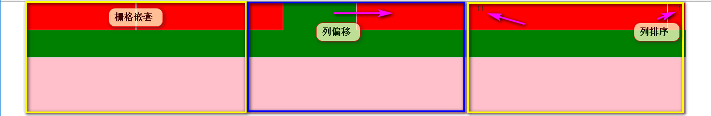
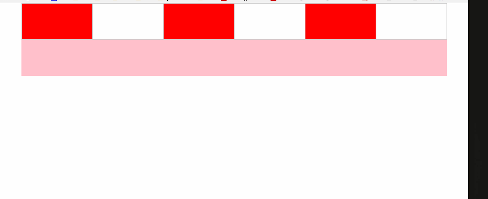

流式布局
===
按照百分比自适应的布局, 通过盒子的宽度设置成百分比来根据屏幕的宽度进行伸缩, 不受固定像素的限制, 内容向两侧填充. 

viewport
---
   移动端用来承载网页的**虚拟**区域
#### 要求
> + 网页内容和设备保持一致
> + 默认的缩放比例和PC端保持一致 1:1
> + 不能让用户自行缩放

#### 参数
+ **`width`**: `device-width`需要让视口和设备一样宽
+ **`initial-scale`**: `1.0` 缩放比例和PC端保持一致
+ **`user-scalable`**: `0|1`或者`no|yes` 注意:不能写false|true
+ `height`:
+ `minimum-scale`:
+ `maximum-scale`:
```html
<head>
<meta charset="utf-8">
<!--放在charset之下, 优先解析视口, 告诉浏览器这是一个标准的视口-->
<!--快捷方式 meta:vp -->
<meta name="viewport" 
  content="width=device-width, initial-scale=1.0, user-scalable=0">
</head>
```
> 非主流的`viewport`设置: [淘宝移动端](m.taobao.com) -- 防止图片失真
> + iPhone6Plus: `<meta name="viewport" content="initial-scale=0.3333333333333333, maximum-scale=0.3333333333333333, minimum-scale=0.3333333333333333, user-scalable=no">`
> + iPhone4: `<meta name="viewport" content="initial-scale=0.5, maximum-scale=0.5, minimum-scale=0.5, user-scalable=no">`

+ 视网膜屏幕 Retina屏幕
  + 2x 4, 4s, 5, 5s, se, 6
  + 3x 6plus以后

tips:
> + `<input type='search'>` :在移动端调用虚拟键盘的时候, 显示搜索按钮; 在pc端 显示一个小×
> + `-webkit-tab-highlight-color：transparent；` 取消鼠标点击高亮
> + `box-sizing：border-box；`保证盒子大小不变
> + `-webkit-appearance：none;` input默认样式清除
> + `sans-serif`移动端默认字体

私有前缀
---
#### PC端
  厂商为了支持最新CSS3特性, 约定加私有前缀. 现在很多CSS3的属性, 新版浏览器已经完全支持.
  添加私有属性时为了兼容旧版浏览器
  + 谷歌 Safari `-webkit`
  + 火狐 `-moz`
  + IE `-ms`
  + 欧朋 `-o`

#### 移动端
  几乎所有的浏览器都是基于webkit, 所以只需加上`-webkit`, 做到主流浏览器兼容即可.

touch事件
---
+ touch是一组事件
  + `touchstart` 触摸开始事件, 当屏幕被触摸的时候触发
  + `touchmove` 触摸滑动事件, 在屏幕上滑动的时候触发, 手指不松开
  + `touchend` 触摸结束事件, 手指离开屏幕的时候触发
  + `touchcancel` 触摸取消事件, 触摸事件被迫终止时触发(如电话进入)
+ 绑定touch事件
  js原生绑定事件的方法: `onclick`, `addEventListener(谷歌)`, `attachEvent(IE)`
  在移动端都是webkit, 所以采用 `addEventListener`
  ```javascript
  div.addEventListener('touchstart', fucntion(){ });
  div.addEventListener('touchmove', fucntion(){ });
  div.addEventListener('touchend', fucntion(){ });
  ```
  ```
  过渡结束事件 `transitionend` 
  动画结束事件 `animationend`
  ```
  + function回调函数获取的是触摸点的集合
  ```javascript
  div.addEventListener('touchstart', fucntion(e){
    e.touches; // 通过touches[0] 获取第一个触摸点的操作
    console.log(e); // 事件对象 TouchEvent
  });
  ```
  + 触摸点 -- 和屏幕接触的点的集合
    + TouchEvent:
      + changedTouches: 页面上改变了的(有->无, 无->有, 位置变化)触摸点集合 全程记录
      + targetTouches: 目标元素上的触摸点集合 触摸移开不会记录
      + touches: 页面上所有的触摸点的集合 触摸移开不会记录

    + 坐标  
      + 基于视口的坐标
      ```javascript
      clientX
      clientY
      ```
      + 基于屏幕的坐标 -- 包含手机通知栏 浏览器工具栏等等
      ```javascript
      screenX
      screenY
      ```
      + 基于页面的坐标
      ```javascript
      pageX
      pageY
      ```
      + 在滑动当中, 使用什么坐标没有关系, 记录的是坐标之间的相对距离

tap和swipe
---
  tap和swipe这两个事件在原生JS中是不支持的, 都是touch事件衍生出来的.
  + tap事件
    + tap比click事件响应更快--150ms以内, click有300ms的延迟.
    + `zepto.js`等第三方库提供tap相关事件(tap, singleTap, doubleTap, longTap等)
    + `fastclick.js`等移动端插件, 可以解决click响应速度问题
      模拟tap:
    ```javascript
    window.onload = function () {
        var div = document.querySelector('div');

        var startTime = 0;
        var isMove = false;
        /*绑定touch事件*/
        div.addEventListener('touchstart',function (e) {
            console.log('touchstart');
            /*记录开始触摸的时候*/
            startTime = Date.now();
        });
        div.addEventListener('touchmove',function (e) {
            console.log('touchmove');
            isMove = true;
        });
        div.addEventListener('touchend',function (e) {
            console.log('touchend');
            /*获取当前的事件去比较之前的时间  150ms*/
            console.log(Date.now()-startTime);
            if(!isMove && (Date.now()-startTime) < 150){
                /*tap*/
                console.log('tap事件')
            }
        });
        div.addEventListener('click',function (e) {
            console.log('click');
        });
    }

    ```

  + swipe事件(滑动手势)
    ```javascript
    swapLeft
    swapRight
    swapUp
    swapDown
    ```
    + `zepto.js`库可以直接使用
    ```javascript
    window.onload = function () {
        var div = document.querySelector('div');

        var isMove = false;
        var startY = 0;
        var distance = 0;
        div.addEventListener('touchstart',function (e) {
            startY = e.touches[0].clientY;
        });
        div.addEventListener('touchmove',function (e) {
            isMove = true;
            var moveY = e.touches[0].clientY;
            distance = moveY - startY;
        });
        div.addEventListener('touchend',function (e) {
            if(isMove){
                if(Math.abs(distance) > 50){
                    /*滑动手势*/
                    /*上滑手势*/
                    if(distance < 0){
                        console.log('swipeUp');
                    }
                    /*下滑手势*/
                    else {
                        console.log('swipeDown');
                    }
                }
            }

            isMove = false;
            startY = 0;
            distance = 0;
        });
    }
    ```


全屏容器
---


浮动的特性
---
bfc

影响页面布局

overflow:hidden  把自己变成绝缘的盒子 -- 不影响其他盒子, 也不受其他盒子影响


响应式布局
===
  + 老项目 推出的时候手机端还没有这么流行, 数据量大 -- 重新开发移动版
  + 新项目 直接开发响应式站点
    + 响应式 --一套页面适配多个终端

响应式原理
---
CSS3中的Media Query(媒体查询) 
根据前端框架bootstrap区分的
> + 超小屏幕(移动设备)  768px以下
> + 小屏幕  992px以下
> + 中屏幕  1200px以下
> + 大屏幕  

媒体查询
---
+ 使用关键字 `@media` 条件用 `and` 连接
```html
<!DOCTYPE html>
<html lang="en">
<head>
    <meta charset="UTF-8">
    <title>Title</title>
    <style>
    * {
        margin: 0;
        padding: 0;
    }
    .container {
        width: 1200px;
        height: 1200px;
        background: hotpink;
        margin: 0 auto;
    }
    /*媒体查询的使用*/
    /*
        1.使用关键字  @media
        2.查询屏幕 窗口的宽度
        3. and 接条件
        */
    @media screen and (max-width: 768px) {
        /*4.写样式*/
        .container {
            width: 100%;
            background: pink;
        }
        /*5.满足条件 代码生效*/
    }
    @media screen and (max-width: 992px) and (min-width: 768px) {
        .container {
            width: 750px;
            background: red;
        }
    }
    @media screen and (max-width: 1200px) and (min-width: 992px) {
        .container {
            width: 970px;
            background: green;
        }
    }
    @media screen and (min-width: 1200px) {
        .container {
            width: 1170px;
            background: blue;
        }
    }
    </style>
</head>
<body>
<!--
1. 在超小屏设备       -768px     容器 宽度百分百   背景颜色  粉色
2. 在小屏设备    768px-992px     容器 750px       背景颜色  红色
3. 在中屏设备    992px-1200px    容器 970px       背景颜色  绿色
4. 在大屏设备    1200px-         容器 1170px      背景颜色  蓝色
-->
    <div class="container"></div>
</body>
</html>
```
```css
*{
    margin: 0;
    padding: 0;
}
.container{
    width: 100%;
    height: 1200px;
    background: pink;
    margin: 0 auto;
}
/*默认查询的是就是  screen */
@media (min-width: 768px) {
    .container{
        width: 750px;
        background: red;
    }
}
@media (min-width: 992px) {
    .container{
        width: 970px;
        background: green;
    }
}
@media (min-width: 1200px) {
    .container{
        width: 1170px;
        background: blue;
    }
}
```

前端框架
===
bootstrap
---

#### 版本
  + 2.x 早期版本
  + 3.x 主流版本 移动优先、扁平化设计
  + 4.x 测试版

#### 模板
```html
<!--h5文档申明-->
<!DOCTYPE html>
<!--语言中文简体-->
<html lang="zh-CN">
<head>
  <!--设置字符编码-->
  <meta charset="utf-8">
  <!--让IE浏览器用最新的渲染引擎去解析页面 -->
  <meta http-equiv="X-UA-Compatible" content="IE=edge">
  <!-- 视口   标准化设置 -->
  <meta name="viewport" content="width=device-width, initial-scale=1,user-scalable=0">
  <!-- 上述3个meta标签*必须*放在最前面，任何其他内容都*必须*跟随其后！ -->
  <!--优先解析 -->
  <title>template</title>
  <!-- Bootstrap css-->
  <link href="../lib/bootstrap/css/bootstrap.min.css" rel="stylesheet">
  <!--
        html5shiv  IE8 支持语义化标签
        respond    IE8 支持媒体查询
    -->
  <!-- HTML5 shim and Respond.js for IE8 support of HTML5 elements and media queries -->
  <!-- 警告：你不能使用file://这个种形式打开网页   http:// -->
  <!-- WARNING: Respond.js doesn't work if you view the page via file:// -->
  <!--条件注释  在IE9以下  加载-->
  <!--[if lt IE 9]>
  <script src="../lib/html5shiv/html5shiv.min.js"></script>
  <script src="../lib/respond/respond.min.js"></script>
  <![endif]-->
</head>
<body>
  <!--TODO-->

  <!-- 基于jquery -->
  <script src="../lib/jquery/jquery.min.js"></script>
  <script src="../lib/bootstrap/js/bootstrap.min.js"></script>
</body>
</html>
```

#### normalize.css
  **Normalize.css 和 reset.css 有什么异同？**
  ```
  共同点: 让浏览器表现一致
  不同点: 
    reset.css 无论浏览器对样式的解释是否相同, 全部根据项目的需求重置
    normalize.css 忽略浏览器样式解释一致的标签, 只针对浏览器解释不同的让其表现一致
    normalize.css 是一个css库
  ```

#### container
  `container` 响应式布局
  `container-fluid` 流式布局

#### 栅格系统
  ```html
    <div class="container">
        <!-- container 默认两边有15px的间距 -->
        <!-- row: 可以清楚父容器的15px两边间距 -->
        <div class="row">
            <!-- 
            col-参数1-参数2 
            参数1: 在什么屏幕下生效
                lg: 大屏幕以上
                md: 中等屏幕以上
                sm: 小屏幕以上
                xs: 超小屏幕以上
            参数2: 占几份 bootstrap默认分成12份
            -->
            <div class="col-xs-4"></div>
            <div class="col-xs-4"></div>
            <div class="col-xs-4"></div>
        </div>
    </div>
  ```
  **栅格可以嵌套**
  ```html
    <div class="container">
        <div class="row">
            <div class="col-xs-4">
                <!--栅格嵌套-->
                <div class="row">
                    <div class="col-xs-6"></div>
                    <div class="col-xs-6"></div>
                </div>
            </div>
            <div class="col-xs-4"></div>
            <div class="col-xs-4"></div>
        </div>
    </div>
  ```
  **栅格偏移**
  ```html
    <div class="col-xs-4">
        <div class="row">
            <div class="col-xs-2"></div>
            <!--
            col-参数1-offset-参数2
            参数1: 在什么屏幕下生效
            参数2: 偏移几格 bootstrap默认分成12份
            -->
            <div class="col-xs-6 col-xs-offset-4"></div>
        </div>
    </div>
  ```
  **栅格排序**
  ```html
    <div class="col-xs-4">
        <div class="row">
            <!--
            col-参数1-push-参数2
            参数1: 在什么屏幕下生效
            参数2: 往前拉几份
            -->
            <div class="col-xs-1 col-xs-push-11">1</div>
            <!--
            col-参数1-push-参数2
            参数1: 在什么屏幕下生效
            参数2: 往后推几份
            -->
            <div class="col-xs-11 col-xs-pull-1">11</div>
        </div>
    </div>
  ```
  效果如图:
  

#### 响应式栅格系统
```html
<div class="container">
    <div class="row">
        <!--
        一共6个容器
        1.在大屏  6等份
        2.在中屏  4等份
        3.在小屏  3等份
        4.在超小屏  2等份
        -->
        <div class="col-lg-2 col-md-3 col-sm-4 col-xs-6"></div>
        <div class="col-lg-2 col-md-3 col-sm-4 col-xs-6"></div>
        <div class="col-lg-2 col-md-3 col-sm-4 col-xs-6"></div>
        <div class="col-lg-2 col-md-3 col-sm-4 col-xs-6"></div>
        <div class="col-lg-2 col-md-3 col-sm-4 col-xs-6"></div>
        <div class="col-lg-2 col-md-3 col-sm-4 col-xs-6"></div>
    </div>
</div>
```
效果如图所示:
;

#### 响应式工具类
```html
<!--
visible-*: 针对某个大小的屏幕显示, 其他的隐藏   --3.2.0 以后不推荐
hidden-*:  准对某个大小的屏幕隐藏, 其他的显示
-->
<div class="tools hidden-md hidden-xs">
    <p>1.在大屏  tools 显示</p>
    <p>2.在中屏  tools 隐藏</p>
    <p>3.在小屏  tools 显示</p>
    <p>4.在超小屏  tools 隐藏</p>
</div>
```
#### 其他类
+ 浮动
  + `pull-left`
  + `pull-right`
+ 文本对齐
  + `text-left`
  + `text-right`
  + `text-center`