# Canvas

## canvas 介绍

HTML5添加了非常受欢迎的功能就是 `<canvas>` 元素。这个元素负责在页面中设定一个区域，然后就可以通过JavaScript动态的在这个区域绘制图形。

画布是一个矩形区域, 您可以控制每一像素.
canvas 拥有多种绘制**路径**, **矩形**, **圆形**, **字符**以及**添加图片**的方法.

### 基本概念

#### 路径

#### 路径的绘制

+ 描边 strokeStyle
+ 填充 fillStyle

这两个属性的值可以是字符串，渐变对象，默认颜色是 #000000 ，但是支持使用css中指定的颜色值得任何形式

#### 路径闭合

+ 手动闭合 -- 如果线的宽度比较大, 会有明显缺角
+ 自动闭合 -- 可以省略最后一条线

#### 填充规则

#### 开启新的路径

再次绘制的时候, 会使用之前设置的样式. 所以要开启新的路径.

```javascript
ctx.beginPath()
```

#### 设置样式

+ lineWidth 线宽，默认1px
+ lineCap 线末端类型：(butt默认)、round、square
+ lineJoin 相交线的拐点 miter(默认)、round、bevel
+ strokeStyle 线的颜色
+ fileStyle 填充颜色
+ setLineDash() 设置虚线
+ getLineDash() 获取虚线宽度集合
+ lineDashOffset 设置虚线偏移量（负值向右偏移）

#### save 和 restore

+ save可以保存多个状态（用栈的方式存储：后进先出）
+ restore可以恢复上次保存的状态

##### 画笔的状态

## 创建 Canvas

### 在 HTML 中添加 `canvas` 标签

```html
<canvas id="canvas" width="600" height="300">您的浏览器版本不支持canvas，建议您升级浏览器</canvas>
```

与其他 DOM 元素一样, canvas 元素的 DOM 元素对象也有基本属性 width, height, 可以随意修改, 也可以通过 css 为该元素添加样式. 如果不添加任何样式, 在页面中是看不到该元素的. canvas 元素的默认样式是: `width=300px; height=150px;`

### 用 javascript 绘制

#### 2d 上下文

要在这块画布上画图, 需要取得绘图上下文. 即调用 getContext() 方法, 并传入上下文的名字. 传入 `'2d'` 就可以取得 2d 上下文对象.

```javascript
var ctx = canvas.getContext('2d')
```

在使用 canvas 元素之前, 最好先检测 getContext() 方法是否存在

```javascript
if (canvas.getContext) {
  var ctx = canvas.getContext('2d')
}
```

2d 上下文的坐标开始于 canvas 元素的左上角, 原点坐标是 (0, 0), 所有坐标值都基于这个原点计算. width 和 height 表示水平和垂直两个方向上可用的像素数目.

```javascript
var width = ctx.canvas.width
var height = ctx.canvas.height
```

#### 绘制直线

```javascript
// 1. 获取 canvas 元素
var canvas = document.querySelector('canvas')
// 2. 获取绘制环境
var ctx = canvas.getContext('2d')
// 3. 做事情
// 宽度
ctx.lineWidth = 10
// 设置起始位置
ctx.moveTo(100, 100)
// 绘制路径
ctx.lineTo(200, 100)
// 颜色
ctx.strokeStyle = 'red'
// 4. 描边 显示
ctx.stroke()

```

##### 直线两端的样式

`ctx.lineCap = ""` 属性设置直线两端的样式.

```javascript
ctx.strokeStyle = 'red'
ctx.lineCap = 'butt'

ctx.strokeStyle = 'green'
ctx.lineCap = 'round'

ctx.strokeStyle = 'pink'
ctx.lineCap = 'square'
```

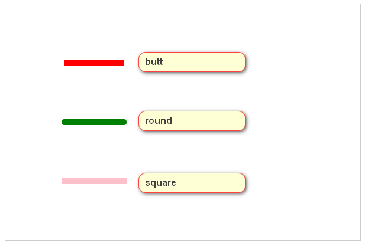

##### 线拐点的样式

```javascript
ctx.lineWidth = 10
ctx.moveTo(100,100)
ctx.lineTo(150,150)
ctx.lineTo(200,100)
ctx.strokeStyle = 'red'
ctx.lineJoin = 'miter'  // 默认
ctx.stroke()

ctx.strokeStyle = 'green'
ctx.lineJoin = 'round'  // 圆的

ctx.strokeStyle = 'pink'
ctx.lineJoin = 'bevel'  // 削平

```

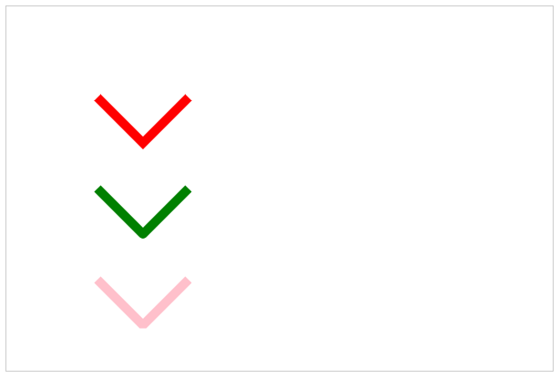

#### 绘制渐变的线

原理: 利用循环, 每次绘制长度 1px 的线, 绘制多次

```html
<canvas width="600" height="400"></canvas>

<script>
  var canvas = document.querySelector('canvas')
  var ctx = canvas.getContext('2d')

  for (var i = 0; i < 255; i++) {
    ctx.beginPath()
    ctx.moveTo(100 + i, 100)
    ctx.lineTo(100 + i + 1, 100)
    ctx.lineWidth = 10
    ctx.strokeStyle = `rgb(255, ${255 - i},${255 - i})`
    ctx.stroke()
  }
</script>

```

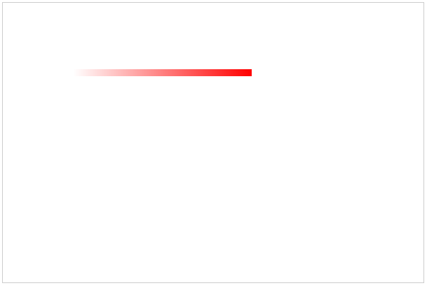

#### 绘制虚线

原理: 利用 `ctx.setLineDash(数组);` 数组中是虚线的长度, 比如 [5,10,15], 按照 5, 10, 15 的长度循环显示

```javascript
var canvas = document.querySelector('canvas')

var ctx = canvas.getContext('2d')

ctx.beginPath()
ctx.moveTo(100, 200)
ctx.lineWidth = 10
ctx.lineTo(500, 200)
ctx.setLineDash([5, 10, 20]) // 数组的长度是单数
ctx.strokeStyle = 'red'
ctx.stroke()

```

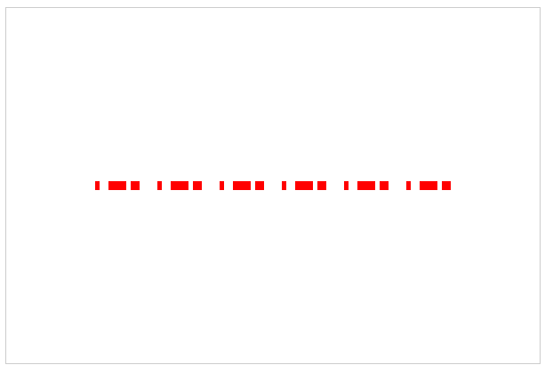

数组长度的问题: *长度-间距-长度-间距*

#### 绘制三角形

```javascript
var canvas = document.querySelector('canvas')
var ctx = canvas.getContext('2d')
ctx.beginPath()
ctx.moveTo(200, 200)
ctx.lineTo(200, 100)
ctx.lineTo(300, 150)
// 回到起始点
ctx.lineTo(200, 200)
ctx.strokeStyle = 'green'
ctx.stroke()
```

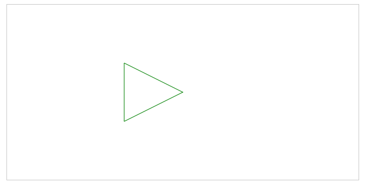

#### 绘制实心三角形

```javascript
var canvas = document.querySelector('canvas')
var ctx = canvas.getContext('2d')
ctx.beginPath()
ctx.moveTo(200, 200)
ctx.lineTo(200, 100)
ctx.lineTo(300, 150)
// 回到起始点
ctx.lineTo(200, 200)
ctx.strokeStyle = 'green'
ctx.stroke()
ctx.fill()
```

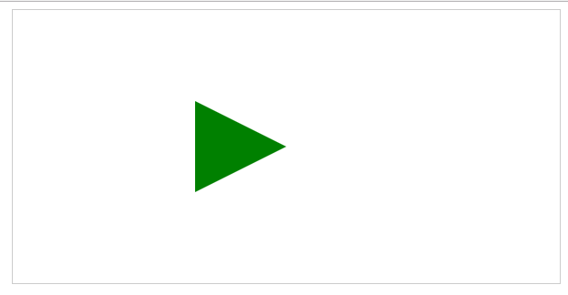

#### 绘制镂空的正方形

```html
<canvas width="600" height="400"></canvas>
<script>
  var canvas = document.querySelector('canvas')
  var ctx = canvas.getContext('2d')

  var width = ctx.canvas.width
  var height = ctx.canvas.height

  // 大的正方形边长200
  // 小的正方形边长100
  // 确定起始点坐标
  ctx.beginPath()
  var xb = width / 2 - 100
  var yb = height / 2 - 100
  // 顺时针
  ctx.moveTo(xb, yb)
  ctx.lineTo(xb + 200, yb)
  ctx.lineTo(xb + 200, yb + 200)
  ctx.lineTo(xb, yb + 200)
  ctx.lineTo(xb, yb)

  var xs = width / 2 - 50
  var ys = height / 2 - 50
  // 逆时针
  ctx.moveTo(xs, ys)
  ctx.lineTo(xs, ys + 100)
  ctx.lineTo(xs + 100, ys + 100)
  ctx.lineTo(xs + 100, ys)
  ctx.lineTo(xs, ys)
  ctx.stroke()

  ctx.fill()
</script>

```

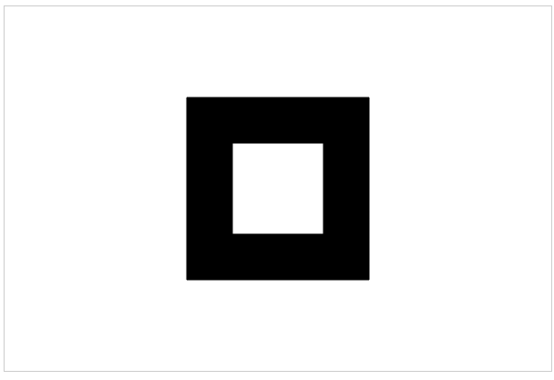

#### 绘制折线图

```html
<canvas width="600" height="500"></canvas>
```

```javascript
; (function (window) {
  // 坐标构造函数
  function Axis(width, height, canvas) {
    this.canvas = canvas  // 画布
    this.width = width    // 坐标系 x 轴长度
    this.height = height  // 坐标系 y 轴长度
    this.space = 20       //距离画布左边 下边的距离
    this.axisX = this.space // 原点 x
    this.axisY = this.canvas.height - this.space    // 原点 y
    this.arrawSize = 10   // 箭头大小
  }
  Axis.prototype.init = function () {
    var ctx = this.canvas.getContext('2d')
    ctx.beginPath()
    ctx.moveTo(this.axisX, this.axisY)
    ctx.lineTo(this.width, this.axisY)
    ctx.lineTo(this.width - this.arrawSize, this.axisY - this.arrawSize / 2)
    ctx.lineTo(this.width - this.arrawSize, this.axisY + this.arrawSize / 2)
    ctx.lineTo(this.width, this.axisY)
    ctx.stroke()
    ctx.fill()

    ctx.beginPath()
    ctx.moveTo(this.axisX, this.axisY)
    ctx.lineTo(this.axisX, this.space)
    ctx.lineTo(this.axisX - this.arrawSize / 2, this.space + this.arrawSize)
    ctx.lineTo(this.axisX + this.arrawSize / 2, this.space + this.arrawSize)
    ctx.lineTo(this.axisX, this.space)
    ctx.stroke()
    ctx.fill()
  }

  window.Axis = Axis
})(window)

```

```javascript
; (function (window) {
  /**
   * 点
   * @param {object} dotted 点对象 { x:x, y:y}
   * @param {Axis} axis 坐标
   * @param {Canvas} canvas 画布
   */
  function Dotted (dotted, axis, canvas) {
    this.width = dotted.x
    this.height = dotted.y
    this.sideLength = 10
    this.canvas = canvas
    this.axis = axis
  }
  // 将坐标格式化至点中心
  Dotted.prototype.format = function () {
    var ctx = this.canvas.getContext('2d')
    var h = ctx.canvas.height
    return {
      x: this.width + this.axis.space - this.sideLength / 2,
      y: h - this.height - this.axis.space + this.sideLength / 2
    }
  }
  Dotted.prototype.init = function () {
    var ctx = this.canvas.getContext('2d')
    var dot = this.format()
    ctx.beginPath()
    ctx.moveTo(dot.x, dot.y)
    ctx.lineTo(dot.x - this.sideLength / 2, dot.y - this.sideLength / 2)
    ctx.lineTo(dot.x + this.sideLength / 2, dot.y - this.sideLength / 2)
    ctx.lineTo(dot.x + this.sideLength / 2, dot.y + this.sideLength / 2)
    ctx.lineTo(dot.x - this.sideLength / 2, dot.y + this.sideLength / 2)
    ctx.lineTo(dot.x - this.sideLength / 2, dot.y - this.sideLength / 2)
    ctx.stroke()
    ctx.fill()

    return dot
  }
  this.Dotted = Dotted
})(window)
```

```javascript
; (function (window, Axis, Dotted) {
  function LineChart () {
    this.canvas = document.querySelector('canvas')
    this.axis = new Axis(550, 450, this.canvas)
    this.axis.init()
    this.dottedArray = []
  }
  LineChart.prototype.init = function (data) {
    // var that = this
    // data.forEach(function (dotted) {
    //   var dot = new Dotted(dotted, that.axis, that.canvas).init()
    //   that.dottedArray.push(dot)
    // })
    data.forEach(function (dotted) {
      var dot = new Dotted(dotted, this.axis, this.canvas).init()
      this.dottedArray.push(dot)
    }, this) // forEach 第二个参数 改变 this 的指向
    this.line()
  }
  LineChart.prototype.line = function () {

    var ctx = this.canvas.getContext('2d')
    var x = this.axis.axisX
    var y = this.axis.axisY
    this.dottedArray.forEach(function (dotted) {
      ctx.moveTo(x, y)
      ctx.lineTo(dotted.x, dotted.y)
      ctx.stroke()
      x = dotted.x
      y = dotted.y
    })
  }
  window.LineChart = LineChart
})(window, Axis, Dotted)
```

测试代码

```javascript
var data = [
  { x: 100, y: 80 },
  { x: 200, y: 120 },
  { x: 300, y: 250 },
  { x: 400, y: 340 },
  { x: 500, y: 230 }
]

new LineChart().init(data)
```

效果图:
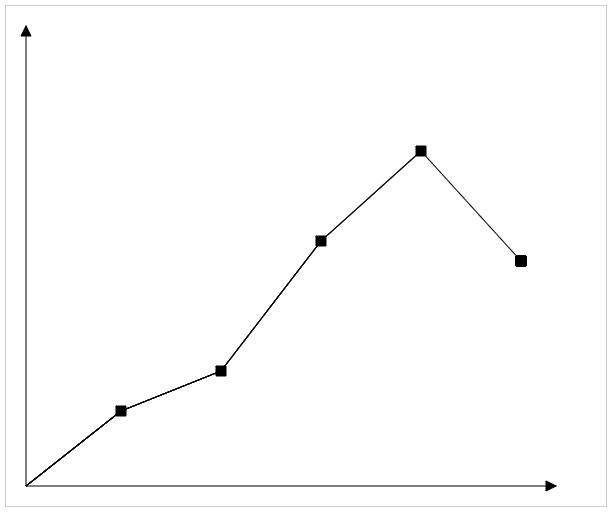

#### 绘制矩形

+ ctx.fillRect(起始点坐标x, 起始点坐标y, 宽, 高)

  ```javascript
  var canvas = document.querySelector('canvas')
  var ctx = canvas.getContext('2d')

  ctx.fillStyle = 'red'
  ctx.fillRect(100, 100, 200, 100)

  ```

+ ctx.strockRect(起始点坐标x, 起始点坐标y, 宽, 高)

  ```javascript
  var canvas = document.querySelector('canvas')
  var ctx = canvas.getContext('2d')

  ctx.strokeStyle = 'red'
  ctx.strokeRect(100, 250, 200, 100)

  ```

  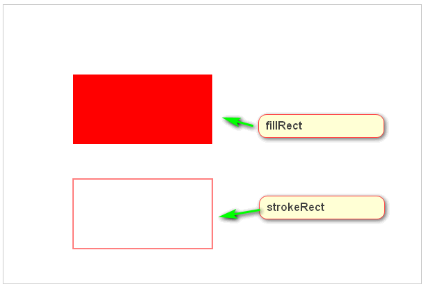

#### 绘制渐变

```javascript
// ctx.createLinearGradient(起始x, 起始y, 终止x, 终止y)
var linerGrandient = ctx.createLinearGradient(100, 150, 300, 150)
linerGrandient.addColorStop(0, 'red')
linerGrandient.addColorStop(0.5, 'blue')
linerGrandient.addColorStop(1, 'yellow')

// fillStyle = 颜色
// fillStyle = 渐变方案
ctx.fillStyle = linerGrandient
ctx.fillRect(100, 100, 200, 100)
```

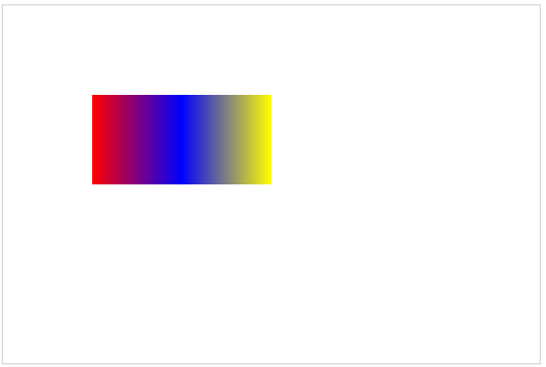

#### 绘制曲线

```javascript
var xx = yy = 0
for (var x = 0; x < 600; x++) {
  var y = Math.sin(x / 30) * 50 + 300
  ctx.beginPath()
  ctx.moveTo(xx, yy)
  ctx.lineTo(x, y)
  ctx.stroke()
  xx = x
  yy = y
}

```

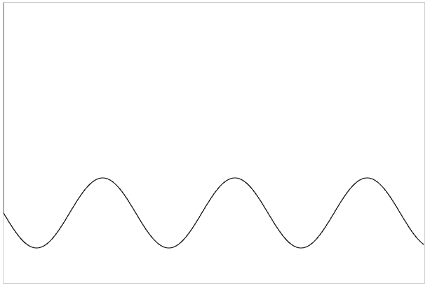

异常: 每次没有更新moveTo

```javascript
for (var x = 0; x < 600; x++) {
  var y = Math.sin(x / 30) * 50 + 300
  ctx.beginPath()
  ctx.moveTo(0, 0)
  ctx.lineTo(x,y)
  ctx.stroke()
}
```

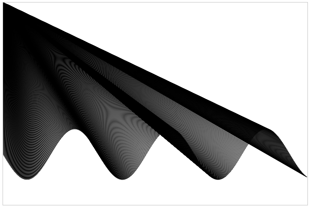

#### 绘制圆弧

基本概念:

+ 圆心:
+ 弧度: 两条射线从圆心向圆周射出，形成一个夹角和夹角正对的一段弧。当这段弧长正好等于圆的半径时，两条射线的夹角的弧度为1。
+ 周长: 2π 弧度
+ 弧长: 弧长=nπr/180，在这里n就是角度数，即圆心角n所对应的弧长。

```javascript
ctx.arc(圆心x, 圆心y, 半径, 起始弧度, 终止弧度, 顺逆时针) // 默认值是false 顺时针    true 逆时针
```

```javascript
// 指定圆心
var xx = ctx.canvas.width / 2
var yy = ctx.canvas.height / 2

ctx.arc(xx, yy, 150, 0, Math.PI / 2)
ctx.stroke()
```


此时, 如果闭合, 显示的图像类似于 月牙, 不是扇形的原因是起始点不在圆心.

```javascript
var xx = ctx.canvas.width / 2
var yy = ctx.canvas.height / 2

ctx.arc(xx, yy, 150, 0, Math.PI / 2)
ctx.closePath()
ctx.stroke()
```


```javascript
var xx = ctx.canvas.width / 2
var yy = ctx.canvas.height / 2

ctx.moveTo(xx, yy)
ctx.arc(xx, yy, 150, 0, Math.PI / 2)
ctx.closePath()
ctx.stroke()
```


#### demo: 绘制一个4等份不同颜色的圆

```javascript
var canvas = document.querySelector('canvas')
var ctx = canvas.getContext('2d')

var xx = ctx.canvas.width / 2
var yy = ctx.canvas.height / 2

var start = 0
for (var i = 0; i < 4; i++) {
  ctx.beginPath()
  ctx.moveTo(xx, yy)
  ctx.arc(xx, yy, 150, start, start + Math.PI / 2)
  start = start + Math.PI / 2
  ctx.fillStyle = getRandomColor()
  ctx.fill()
}

function getRandom(min, max) {
  return Math.floor(Math.random() * (max - min) + min)
}
function getRandomColor() {
  return `rgb(${getRandom(0, 256)},${getRandom(0, 256)},${getRandom(0, 256)})`
}
```

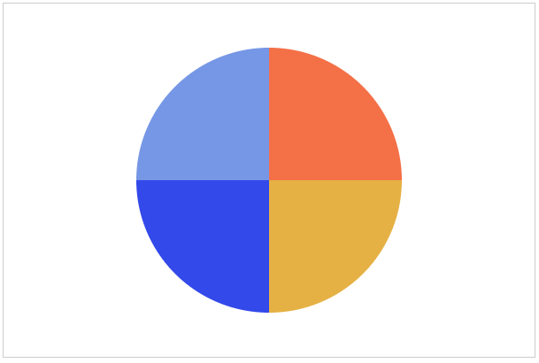

#### 绘制文本

+ `ctx.font = '40px 微软雅黑'` -- 设置字体
+ `strokeText()`
+ `fillText(text, x, y, maxWidth)` -- 当 maxWidth 小于文本宽度, 横向压缩文本; maxWidth 大于文本宽度, 正常显示
+ `ctx.textAlign = left | right | center | start(默认) | end | direction` -- 对齐方式
  direction属性 css(rtl ltr) start 和 end 于此相关
  + 如果是ltr,start和left表现一致
  + 如果是rtl,start和right表现一致
+ `ctx.textBaseline = top | middle | bottom | hanging | alphabetic | ideographic` -- 基线
+ `measureText()` -- 获取文本宽度obj.width

#### demo2: 绘制饼图

需求: 用饼图表示年龄分布.

20岁以下: 10人
20-25岁: 23人
25-30岁: 18人
30-40岁: 6人
40-50岁: 2人
50岁以上: 1人

```javascript
var data = [10, 23, 18, 6, 2, 1]
// 获得总人数
var total = data.reduce(function (prev, curr) {
  return prev + curr
})

var canvas = document.querySelector('canvas')
var ctx = canvas.getContext('2d')
// 圆心
var xx = ctx.canvas.width * 4 / 7
var yy = ctx.canvas.height / 2

var start = 0
var end = 0
data.forEach(function (item, i) {
  end = item / total * 2 * Math.PI
  ctx.beginPath()
  ctx.moveTo(xx, yy)
  ctx.arc(xx, yy, 150, start, start + end)
  ctx.fillStyle = getRandomColor()
  start += end
  ctx.fill()
  console.log(end)
})

function getRandom(min, max) {
  return Math.floor(Math.random() * (max - min) + min)
}
function getRandomColor() {
  return `rgb(${getRandom(0, 256)},${getRandom(0, 256)},${getRandom(0, 256)})`
}

```

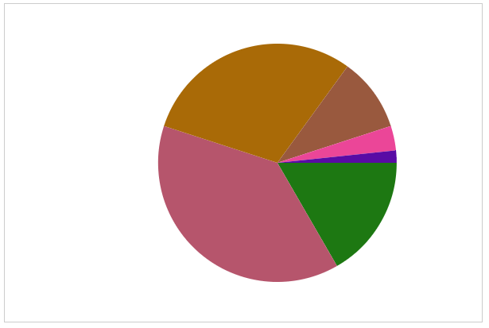

##### 用面向对象完成其他功能

```javascript
; (function (window) {
  // 获得总人数
  var total = data.reduce(function (prev, curr) {
    return prev + curr.count
  }, 0)

  function Pie() {
    this.ctx = document.querySelector('canvas').getContext('2d')
    this.xx = this.ctx.canvas.width * 4 / 7
    this.yy = this.ctx.canvas.height / 2
    this.start = 0
    this.end = 0
    this.radius = 150
  }

  Pie.prototype.render = function (data) {
    data.forEach(function (item, i) {
      this.end = item.count / total * 2 * Math.PI
      this.ctx.beginPath()
      this.ctx.moveTo(this.xx, this.yy)
      this.ctx.arc(this.xx, this.yy, this.radius, this.start, this.start + this.end)
      var color = this.ctx.fillStyle = getRandomColor()
      this.ctx.fill()
      this.drawLine(item, this.start, this.end, color)
      this.drawDesc(item, color, i)
      this.start += this.end
    }, this)
  }

  Pie.prototype.drawLine = function (item, start, end, color) {

    var lineLen = this.radius + 30
    var x = lineLen * Math.cos(start + end / 2) + this.xx
    var y = lineLen * Math.sin(start + end / 2) + this.yy
    // console.log(x, y)
    // this.ctx.beginPath()
    this.ctx.moveTo(this.xx, this.yy)
    this.ctx.lineTo(x, y)
    this.ctx.strokeStyle = color
    this.ctx.stroke()

    this.drawTitleLine(x, y, color, item.count)
  }

  Pie.prototype.drawTitleLine = function (x, y, color, count) {
    this.ctx.moveTo(x, y)
    if (x > this.xx) {
      this.ctx.lineTo(x + this.ctx.measureText(count2percent(count)).width, y)
    } else {
      this.ctx.lineTo(x - this.ctx.measureText(count2percent(count)).width, y)
    }
    this.ctx.strokeStyle = color
    this.ctx.stroke()

    this.drawTitle(x, y, color, count2percent(count))
  }

  // textAlign 布尔值, 是否需要判断文字对齐方向
  Pie.prototype.drawTitle = function (x, y, color, text, textAlign) {
    this.ctx.moveTo(x, y)
    this.ctx.fillStyle = color
    this.ctx.textBaseline = 'bottom'

    if (textAlign) {
      if (x > this.xx) {
        this.ctx.textAlign = 'left'
      } else {
        this.ctx.textAlign = 'right'
      }
    } else {
      this.ctx.textAlign = 'left'
    }

    this.ctx.fillText(text, x, y)
    this.ctx.strokeStyle = color
    this.ctx.stroke()
  }
  Pie.prototype.drawDesc = function (item, color, i) {
    var spaceTop = spaceLeft = 20
    var space = 10
    var x = 30
    var y = 20

    this.ctx.beginPath()
    this.ctx.fillStyle = color
    this.ctx.fillRect(spaceTop, spaceLeft + i * (space + y), x, y)

    this.drawTitle(spaceTop + x + space, spaceLeft + i * (space + y) + y, color, item.title, false)
    // this.ctx.moveTo(spaceTop + x + space, spaceLeft + i * (space + y))
    // this.ctx.fillStyle = color
    // this.ctx.textBaseline = 'top'
    // this.ctx.textAlign = 'left'
    // this.ctx.fillText(item.title, spaceTop + x + space, spaceLeft + i * (space + y))
    // this.ctx.strokeStyle = color
    // this.ctx.stroke()
  }

  function getRandom(min, max) {
    return Math.floor(Math.random() * (max - min) + min)
  }
  function getRandomColor() {
    return `rgb(${getRandom(0, 256)},${getRandom(0, 256)},${getRandom(0, 256)})`
  }
  function count2percent(count) {
    return (count / total * 100).toFixed(2) + '%'
  }

  window.Pie = Pie
})(window)
```

测试代码

```javascript
var data = [
  { title: '20岁以下', count: 10 },
  { title: '20-25岁', count: 23 },
  { title: '25-30岁', count: 18 },
  { title: '30-40岁', count: 6 },
  { title: '40-50岁', count: 2 },
  { title: '50岁以上', count: 1 }
]

new Pie().render(data)
```

运行结果:
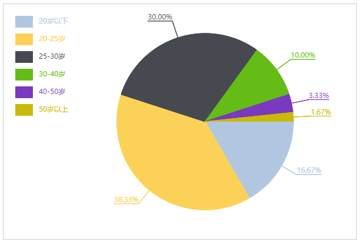

#### 在 canvas 中使用图片

+ js 创建图片

```javascript
// 注意书写顺序 -- 解决兼容问题
// ie 在先设置 src 的情况下不能绑定 onload 事件
var img = document.createElement('img')
img.onload = function () {
  console.log('加载完成')
}
img.src = ''


var img1 = new Image()
img1.onload = function () {
  console.log('加载完成')
}
img1.src = ''
```

+ canvas 中绘制图片方法一

```javascript
var img = new Image()
img.onload = function () {
  // 参数1: 图片对象
  // 参数2: 绘制的坐标 x 轴
  // 参数3: 绘制的坐标 y 轴
  ctx.drawImage(img, 100, 100)
}
img.src = 'images/01.jpg'
```

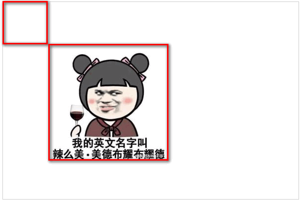

+ canvas 中绘制图片方法二

```javascript
var img = new Image()
img.onload = function () {
  // 参数1: 图片对象
  // 参数2: 绘制的坐标 x 轴
  // 参数3: 绘制的坐标 y 轴
  // 参数4: 绘制图片的宽度
  // 参数5: 绘制图片的高度
  ctx.drawImage(img, 100, 100, 50, 50)
}
img.src = 'images/01.jpg'

```

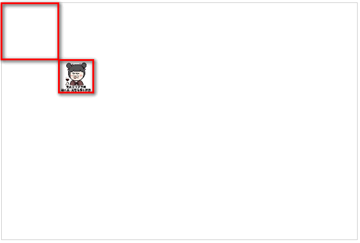

+ canvas 中绘制图片方法三

```javascript
var img = new Image()
img.onload = function () {
  // 参数1: 图片对象
  // 参数2: 图片定位 x 轴
  // 参数3: 图片定位 y 轴
  // 参数4: 截取图片的宽度
  // 参数5: 截取图片的高度
  // 参数6: 绘制的坐标 x 轴
  // 参数7: 绘制的坐标 y 轴
  // 参数8: 绘制图片的宽度
  // 参数9: 绘制图片的高度
  ctx.drawImage(img, 500, 500, 500, 500, 100, 100, 200, 200)
}
img.src = 'images/02.jpg'

```

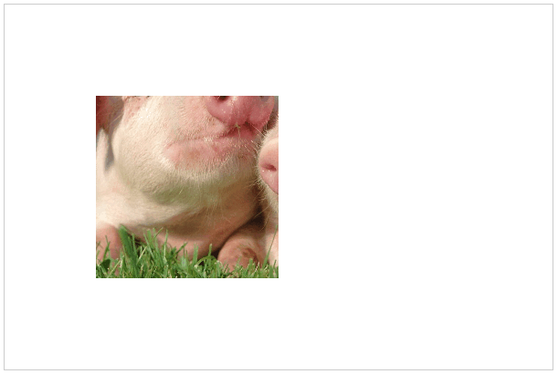
图片原图:


#### 在 canvas 中使用精灵图

```javascript
var img = new Image()
img.onload = function () {
  var width = ctx.canvas.width
  var height = ctx.canvas.height
  var startX = width / 2 - 20
  var startY = height / 2 - 32.5
  // 图片对象
  // 图片的定位X轴 Y轴
  // 截取图片宽度 高度
  // 绘制的坐标X轴 Y轴
  // 绘制的图片宽度 高度
  ctx.drawImage(img, 40, 195, 40, 65, startX, startY, 40, 65)
}
img.src = 'images/03.png'
```

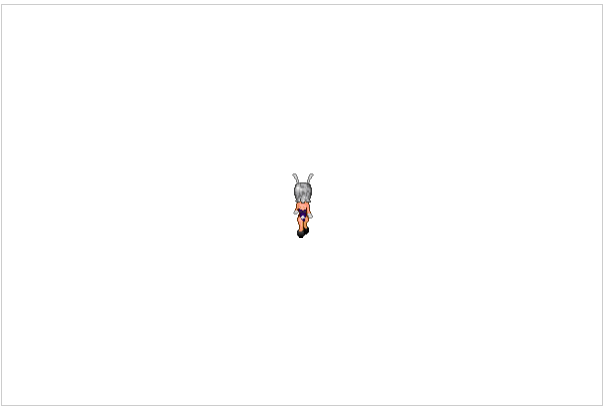

#### 帧动画

```javascript
var canvas = document.querySelector('canvas')
var ctx = canvas.getContext('2d')
var img = new Image()
img.onload = function () {
  // 画布大小
  var width = ctx.canvas.width
  var height = ctx.canvas.height

  // 图片定位
  var x = y = 0

  // 截取图片的宽度
  var perWidth = img.width / 4
  var perHeight = img.height / 4

  // 绘制的起点
  var startX = width / 2 - perWidth / 2
  var startY = height / 2 - perHeight / 2

  // 图片对象
  // 图片的定位X轴 Y轴
  // 截取图片宽度 高度
  // 绘制的坐标X轴 Y轴
  // 绘制的图片宽度 高度
  ctx.drawImage(img, x, y, perWidth, perHeight, startX, startY, perWidth, perHeight)

  var index = 0
  setInterval(function () {
    index++
    if (index > 3) index = 0
    ctx.clearRect(startX, startY, perWidth, perHeight)
    x = index * perWidth
    y = img.height * 3 / 4
    ctx.drawImage(img, x, y, perWidth, perHeight, startX, startY, perWidth, perHeight)
  }, 200)
}
img.src = 'images/03.png'
```

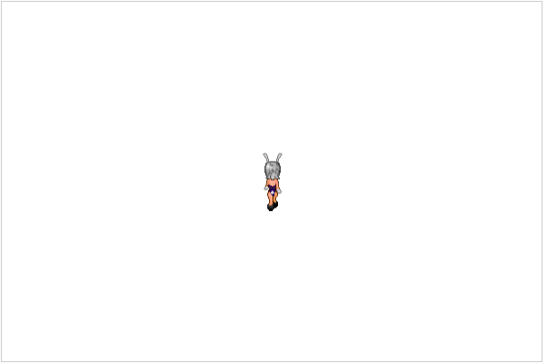

#### 移动位置的动画

```javascript
var canvas = document.querySelector('canvas')
var ctx = canvas.getContext('2d')
var img = new Image()
img.onload = function () {
  var width = ctx.canvas.width
  var height = ctx.canvas.height
  var perWidth = img.width / 4
  var perHeight = img.height / 4
  var startX = width / 2 - perWidth / 2
  var startY = height / 2 - perHeight / 2
  var step = 0
  var stepSize = 10
  var direction = 'left'

  var index = 0
  ctx.drawImage(
    img,
    0, 65,
    perWidth, perHeight,
    startX, startY,
    perWidth, perHeight
  )

  setInterval(function () {
    index++
    index > 3 && (index = 0)

    ctx.clearRect(0, 0, width, height)
    if (direction === 'left') {
      step--
      if ((startX + step * stepSize) < 0) {
        direction = 'right'
      }
    } else {
      step++
      if ((startX + step * stepSize) > (width - perWidth)) {
        direction = 'left'
      }

    }
    ctx.drawImage(img,
      index * perWidth, direction === 'left' ? 65 : 130,
      perWidth, perHeight,
      startX + step * stepSize, startY,
      perWidth, perHeight)
  }, 200)
}
img.src = 'images/03.png'
```

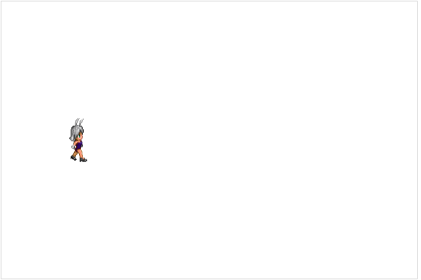

#### 实例一

```javascript
function Per() {
  var self = this
  // 图片对象
  // 图片的定位X轴 Y轴
  this.canvas = document.querySelector('canvas')
  this.ctx = this.canvas.getContext('2d')
  // 画布的宽高
  this.width = this.ctx.canvas.width
  this.height = this.ctx.canvas.height
  // 步长
  this.stepSize = 10
  // 步数图片索引
  this.index = 0

  this.loadImg(function (img) {
    // 截取图片宽度 高度
    // 绘制的图片宽度 高度
    self.perWidth = img.width / 4
    self.perHeight = img.height / 4
    // 绘制的坐标X轴 Y轴
    self.startX = self.width / 2 - self.perWidth / 2
    self.startY = self.height / 2 - self.perHeight / 2

    self.drawImg(img, 0, 0, 0)
    self.bindEvent(img)
  })
}

Per.prototype.loadImg = function (callback) {
  var img = new Image()
  img.onload = function () {
    callback && callback(img)
  }
  img.src = 'images/04.png'
}

Per.prototype.drawImg = function (img, stepX, stepY, direction) {

  this.ctx.clearRect(0, 0, this.width, this.height)
  if (this.index > 3) { this.index = 0 }
  this.ctx.drawImage(
    // 图片对象
    img,
    // 图片的定位X轴 Y轴
    this.perWidth * this.index, this.perHeight * direction,
    // 截取图片宽度 高度
    this.perWidth, this.perHeight,
    // 绘制的坐标X轴 Y轴
    this.startX + stepX * this.stepSize, this.startY + stepY * this.stepSize,
    // 绘制的图片宽度 高度
    this.perWidth, this.perHeight
  )
}

Per.prototype.bindEvent = function (img) {
  var self = this
  var direction = 0
  var stepX = stepY = 0
  document.addEventListener('keydown', function (e) {
    console.log(e.keyCode)
    switch (e.keyCode) {
      case 37:// zuo
        stepX--
        if (self.startX + stepX * self.stepSize < 0) {
          stepX++
        }
        direction = 1
        break
      case 38:// shang
        stepY--
        if (self.startY + stepY * self.stepSize < 0) {
          stepY++
        }
        direction = 3
        break
      case 39:// you
        stepX++
        if ((self.startX + stepX * self.stepSize) > (self.width - self.perWidth)) {
          stepX--
        }
        direction = 2
        break
      case 40:// xia
        stepY++
        if ((self.startY + stepY * self.stepSize) > (self.height - self.perHeight)) {
          stepY--
        }
        direction = 0
        break
    }
    self.index++
    self.drawImg(img, stepX, stepY, direction)
  })
}

// 测试代码
new Per()
```

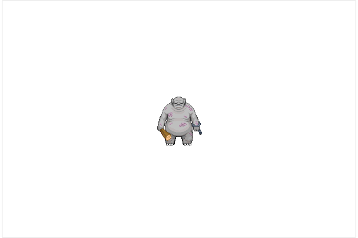

#### 实例二: 刮刮乐

```javascript
var canvas = document.querySelector('canvas')
var ctx = canvas.getContext('2d')

var img = new Image()
img.onload = function () {
 /*
  * createPattern() 方法在指定的方向内重复指定的元素
  * image 规定要使用的图片、画布或视频元素。
  * repeat 默认。该模式在水平和垂直方向重复。
  * repeat-x 该模式只在水平方向重复。
  * repeat-y 该模式只在垂直方向重复。
  * no-repeat 该模式只显示一次（不重复）。
  */
  var pat = ctx.createPattern(img, 'no-repeat')
  ctx.strokeStyle = pat
  ctx.lineWidth = 25
  ctx.lineCap = 'round'
  ctx.lineJoin = 'round'

  var isDown = false

  ctx.canvas.addEventListener('mousedown', function (e) {
    ctx.moveTo(e.clientX, e.clientY)
    isDown = true
  })

  ctx.canvas.addEventListener('mousemove', function (e) {
    if (isDown) {
      ctx.lineTo(e.clientX, e.clientY)
      ctx.stroke()
    }
  })

  ctx.canvas.addEventListener('mouseup', function () {
    isDown = false
  })

  ctx.canvas.addEventListener('mouseleave', function () {
    isDown = false
  })
}
img.src = 'images/05.jpg'

```

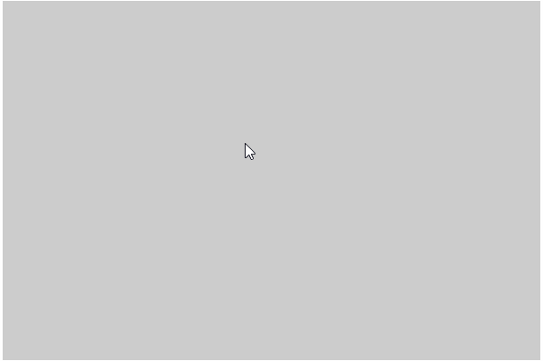

#### 变换

+ rotate（angle）：围绕原点旋转图像angle弧度

+ scale（scaleX，scaleY）：缩放图像，在x轴方向乘以scaleX，在y轴方向乘以scaleY，scaleX和scaleY的默认值都是1.0

+ translate（x，y）：将坐标原点移动到（x，y）。执行这个操作后，坐标（0,0）会变成之前由（x，y）表示的点。

#### 阴影

shadowColor：用css颜色格式表示的阴影颜色，默认为黑色。
shadowOffsetX：形状或路径x轴方向的阴影偏移量，默认为0。
shadowOffsetY:形状或路径y轴方向的阴影偏移量，默认为0。
shadowBlur：模糊的像素数，默认0，即不模糊。

```javascript
var canvas = document.querySelector("#canvas");
var ctx = canvas.getContext("2d");
ctx.shadowOffsetX = 5;
ctx.shadowOffsetY = 5;
ctx.shadowBlur = 4;
ctx.shadowColor = "rgba(2,0,0,0.5)";
ctx.fillStyle = "yellowgreen"
ctx.fillRect(100,100,200,200);
```

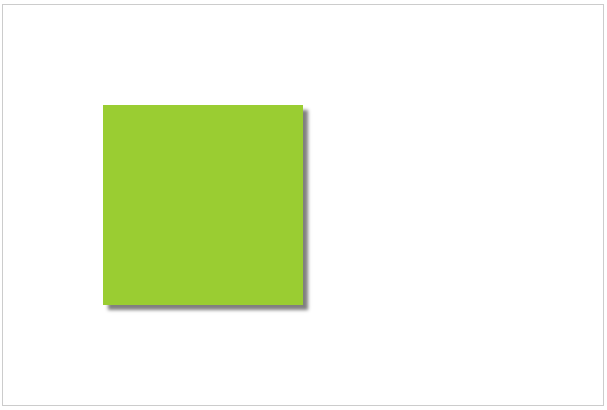

## 实例 FlappyBird

使用 seajs 模块化模式:

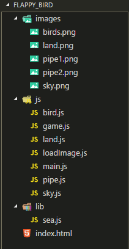

```html
<!--index.html-->
<style>
  canvas {
    display: block;
    border: 1px solid #ccc;
    margin: 0 auto;
  }
</style>

<body>
  <canvas width="800" height="600"></canvas>
  <script src="./lib/sea.js"></script>
  <script>
    seajs.use('./js/main')
  </script>
</body>
```

```javascript
// main.js
define(function (require, exports, module) {
  var Game = require('./game')
  new Game().loading()
})
```

```javascript
// game.js
define(function (require, exports, module) {
  // 引入所需文件
  var LoadImage = require('./loadImage')
  var Sky = require('./sky')
  var Pipe = require('./pipe')
  var Bird = require('./bird')

  function Game () {
    this.ctx = document.querySelector('canvas').getContext('2d')
    // 游戏状态
    this.running = true
  }

  Game.prototype.loading = function () {
    var that = this

    var loadImage = new LoadImage()
    loadImage.load(function (imgList) {
      // 所有素材实例数组
      var loadObjList = []
      // 天空
      loadObjList.push(new Sky(that.ctx, imgList['sky'], 0, 0))
      loadObjList.push(new Sky(that.ctx, imgList['sky'], that.ctx.canvas.width, 0))
      // 管道图片
      var topImg = imgList['pipe2']
      var bottomImg = imgList['pipe1']
      // 管道
      for (var i = 0; i < 6; i++) {
        loadObjList.push(new Pipe(that.ctx, topImg, bottomImg, i * 3 * topImg.width))
      }
      // 地面
      var Land = require('./land')
      var landImg = imgList['land']
      for (i = 0; i < 4; i++) {
        loadObjList.push(new Land(that.ctx, landImg, i * landImg.width))
      }
      // 小鸟
      var bird = new Bird(that.ctx, imgList['birds'])
      loadObjList.push(bird)

      // 运动函数
      var animation = function () {
        that.ctx.clearRect(0, 0, that.ctx.canvas.width, that.ctx.canvas.height)
        that.ctx.beginPath()
        loadObjList.forEach(function (item) {
          item.draw()
        })

        // 碰到地面
        if (bird.y > that.ctx.canvas.height - landImg.height) {
          that.running = false
        }

        // 碰到天花板
        if (bird.y < 0) {
          that.running = false
        }

        // 碰到管子
        if (that.ctx.isPointInPath(bird.x, bird.y)) {
          that.running = false
        }

        if (that.running) {
          requestAnimationFrame(animation)
        }
      }
      animation()
    })
  }

  module.exports = Game
})
```

```javascript
// loadImage.js
define(function (require, exports, module) {
  /**
   * 加载所有图片
   */
  function LoadImage () {

  }

  LoadImage.prototype.load = function (callback) {
    // 所有的图片资源
    var imageList = ['birds', 'land', 'pipe1', 'pipe2', 'sky']
    // 所有的图片资源对象
    var imgObjs = {}
    // 图片资源加载的计数器
    var index = 0

    imageList.forEach(function (image) {
      var img = new Image()
      // onload 事件是异步的, 所以不能用 索引 判断是否加载完成
      img.onload = function () {
        index++
        imgObjs[image] = img
        // 判断是否所有的图片资源都已经加载成功
        if (index === imageList.length) {
          callback && callback(imgObjs)
        }
      }
      // 先写事件, 后写 src 避免 ie 低版本的兼容问题
      // 先写 src ie 低版本 onload 事件绑定不上
      img.src = `images/${image}.png`
    })
  }

  module.exports = LoadImage
})

```

```javascript
// sky.js
define(function (require, exports, module) {

  /**
   * 天空
   *
   * @param {canvas.getContext} ctx 上下文对象
   * @param {Object} skyImg 图片
   * @param {Number} x 绘制的位置x
   * @param {Number} y 绘制的位置y
   */
  function Sky (ctx, skyImg, x, y) {
    this.ctx = ctx
    this.img = skyImg
    this.x = x
    this.y = y
    // 速度
    this.speed = 3
  }

  Sky.prototype.draw = function () {
    this.ctx.drawImage(this.img, 0, 0)
    this.x -= this.speed
    if (this.x <= -this.ctx.canvas.width) {
      this.x += this.ctx.canvas.width * 2
    }
  }

  module.exports = Sky
})
```

```javascript
// land.js
define(function (require, exports, module) {

  /**
   * 地面
   *
   * @param {any} ctx
   * @param {any} landImg
   * @param {any} x
   */
  function Land (ctx, landImg, x) {
    this.ctx = ctx
    this.img = landImg
    this.x = x
    this.y = this.ctx.canvas.height - this.img.height
    this.speed = 3
  }

  Land.prototype.draw = function () {
    this.ctx.drawImage(this.img, this.x, this.y)
    this.x -= this.speed
    if (this.x <= -this.img.width) {
      this.x += 4 * this.img.width
    }
  }

  module.exports = Land
})

```

```javascript
// 管道
define(function (require, exports, module) {

  function Pipe (ctx, topImg, bottomImg, x) {
    this.ctx = ctx
    this.topImg = topImg
    this.bottomImg = bottomImg
    this.x = x + 300
    this.speed = 3
    this.space = 150
    this.imageHeight = this.topImg.height
    this.imageWidth = this.topImg.width
    this.calHeight()
  }

  Pipe.prototype.calHeight = function () {
    var random = Math.random() * 150
    var minH = 100
    var h = random + minH
    this.topY = -this.imageHeight + h
    this.bottomY = h + this.space
  }

  Pipe.prototype.draw = function () {
    // 绘制图片
    this.ctx.drawImage(this.topImg, this.x, this.topY)
    this.ctx.drawImage(this.bottomImg, this.x, this.bottomY)

    // 绘制图片路径
    this.ctx.rect(this.x, this.topY, this.imageWidth, this.imageHeight)
    this.ctx.rect(this.x, this.bottomY, this.imageWidth, this.imageHeight)

    this.x -= this.speed
    if (this.x <= -this.topImg.width) {
      this.x += this.topImg.width * 3 * 6
    }
  }

  module.exports = Pipe
})

```

```javascript
// 小鸟
define(function (require, exports, module) {

  function Bird (ctx, img) {
    this.ctx = ctx
    this.img = img
    this.x = 100
    this.y = 100
    this.birdWidth = this.img.width / 3
    this.birdheight = this.img.height
    // 翅膀图片索引
    this.index = 0

    // 初始速度
    this.v0 = 0
    // 加速度
    this.acc = 0.001
    // 起始事件
    this.startTime = Date.now()
    // 允许的最大速度
    this.maxSpeed = 0.3
    // 允许旋转的最大弧度
    this.maxAngle = Math.PI / 4

    this.click()
  }

  /**
   * 点击 canvas 小鸟上升
   */
  Bird.prototype.click = function () {
    var that = this
    this.ctx.canvas.onclick = function () {
      that.v0 = -0.3
    }
  }

  Bird.prototype.draw = function () {
    // 保存初始的状态
    this.ctx.save()
    // 移动坐标原点
    this.ctx.translate(this.x, this.y)
    // 当前时间
    var currentTime = Date.now()
    var deltaTime = currentTime - this.startTime
    // 更新起始事件
    this.startTime = currentTime
    // 计算下落的高度 h = v*t+a*t*t/2
    var h = this.v0 * deltaTime + this.acc * deltaTime * deltaTime / 2
    this.y += h
    // 加速后的速度
    this.v0 += this.acc * deltaTime
    // 角度
    var angle = this.v0 / this.maxSpeed * this.maxAngle
    if (angle > this.maxAngle) {
      angle = this.maxAngle
    }
    // 小鸟下落时旋转
    this.ctx.rotate(angle)

    this.ctx.drawImage(
      this.img,
      this.index * this.birdWidth,
      0,
      this.birdWidth,
      this.birdheight,
      -this.birdWidth / 2,
      -this.birdheight / 2,
      this.birdWidth,
      this.birdheight
    )
    this.index++
    if (this.index > 2) {
      this.index = 0
    }

    // 恢复更改坐标轴之前的状态
    this.ctx.restore()
  }

  module.exports = Bird
})
```
源代码: [点击下载](images/canvas/flappybird/flappy_bird.zip)

