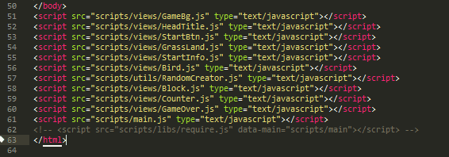
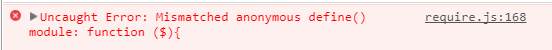

# 模块化开发

- 一个模块就是实现特定功能的js文件
- 模块化开发解决的问题
  - 命名冲突
  - 文件依赖 - 加载文件
  - 模块的复用
  - 统一规范和开发模式

## js 实现模块化的规范

- AMD - 浏览器端
  - require.js
- CommonJS - Node.js
  - 加载模块 `require()`
  - 导出模块 `module.exports = { }` / `exports = { }`
- ES6
  - 加载模块 `import`
  - 导出模块 `export`
- CMD
  - sea.js
- UMD 通用模块化规范

## AMD - require.js

> Asynchronous Module Definition：异步模块定义，浏览器端模块开发的规范 代表：require.js 特点：模块被异步加载，模块加载不影响后面语句的运行

### 使用模块化开发的目的

- 管理模块之间的依赖性, 便于代码的开发与维护
  - 使用模块化开发之前, 我们要引入大量的 js 模块, 还要注意引入这些模块的顺序.
    
  - require.js 使用了不同于传统的 `<script>` 标签的脚本加载步骤.
- 实现 js 文件的异步加载, 避免网页失去响应

### 下载 require.js

[官网下载](http://requirejs.org/)
[GitHub下载](https://github.com/requirejs/requirejs)

### require.js 的使用

```html
<!-- 引入 require.js 文件 -->
<script src="require.js"></script>
<!-- 引入网页程序主模块 主模块: 网站的入口 -->
<script src="require.js" data-main="app"></script>
```

### 定义模块

```javascript
// 语法:define(name, dependencies?, factory);
// name表示：当前模块的名称，是一个字符串 可有可无
// dependencies表示：当前模块的依赖项，是一个数组无论依赖一项还是多项 无则不写
// factory表示：当前模块要完成的一些功能，是一个函数

// 定义对象模块
define({})
// 定义方法模块
define(function(){
  var Person = {}
  return Person
})
// 定义带有依赖项的模块
define(['Person'],function(Person){
  var Man = {}
  return Man
})
```

### 加载模块

```javascript
require(['module1', 'module2'], function(module1, module2){ 
  // to do something ...
})
```

参数1: 数组 -- 依赖的模块
参数2: 回调函数 -- 所有模块加载成功后执行

### 路径查找配置

配置 require.config() 对模块加载行为自定义， require.js 默认使用 baseUrl + paths 的路径解析方式
require.config() 参数: 对象, 可以设置: baseUrl、path 、shim、map、config 等等.

```javascript
require.config({
  baseUrl: '/public',
  paths: {
    jquery: 'assets/jquery/jquery.min',
    cookie: 'assets/jquery-cookie/jquery.cookie',
    template: 'assets/artTemplate/template-web',
    common: 'js/common',
    login: 'js/login',
    list: 'js/teacher-list'
  }
})
```

require.js 加载的模块, 必须是按照 AMD 规范, 使用 define 定义的模块.
当所需加载的模块不符合 AMD 规范时, 需要配置 shim 参数

```javascript
require.config({
  shim: {
    'underscore': {
      exports: '_' // underscore 模块，外部调用时使用 _ 指代该模块
    },
    'backbone': {
      deps: ['underscore', 'jquery'], // 这个模块依赖于 underscore , jquery 模块
      exports: 'Backbone' // backbone模块，外部调用时使用 Backbone 指代该模块
    }
  }
});
```

### require.js 常见错误

#### 

错误原因: js 中重复引用define定义的 js