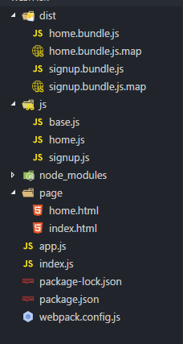

# webpack

## webpack 是什么

    webpack 是前端资源模块化管理和打包工具.
    webpack 可以将许多松散的模块按照依赖和规则打包成符合生产环境部署的前端资源。
    webpack 可以将按需加载的模块进行代码分隔，等到实际需要的时候再异步加载。
    webpack 通过 loader 的转换，任何形式的资源都可以视作模块，比如 CommonJs 模块、 AMD 模块、 ES6 模块、CSS、图片、 JSON、Coffeescript、 LESS、 SASS 等

## webpack 的特点

- 丰富的插件(plugins)
- 大量的加载器(loader), 便于处理和加载各种静态资源
- 将按需加载的模块进行代码分离, 等到实际需要的时候按需加载

## webpack 的优势

- webpack 以 CommonJS 的形式书写, 但对 AMD/CMD/ES6 的模块支持也很全面, 方便旧项目的迁移
- **所有的资源**都能模块化
- 开发便捷, 能代替部分 Grunt/Gulp 的工作, 比如打包 压缩混淆 图片转base64 Sass解析等
- 扩展性强, 插件机制完善, 特别是支持模块热替换.

## webpack 与 Grunt/Gulp

## 使用 webpack

### 安装 webpack

```bash
npm init -y # 初始化 package.json
npm install webpack [-g|-D]
```

### webpack-dev-server 配置

#### package.json配置方式

```json
// 参数解释  注意参数是无序的 有值的参数空格隔开
// --open 自动打开浏览器
// --contentBase ./  指定浏览器 默认打开的页面路径中的 index.html 文件
// --open 自动打开浏览器
// --port 8080 端口号
// --hot 热更新，只加载修改的文件(按需加载修改的内容)，而非全部加载
"scripts": {
  "dev": "webpack-dev-server --open --contentBase ./ --port 8080 --hot"
}
```

此时在运行 `npm run dev` 即可.

#### webpack.config.js

```javascript
// webpack.config.js
// var path = require('path')
module.exports = {
  // 单文件
  entry: './index', // 入口文件 path.join(__dirname, 'src/js/index.js')
  output: {
    filename: 'app.js', // 出口文件 输出文件的路径 path.join(__dirname, 'dist')
    path: __dirname // 输出文件的名称
  }
}

module.exports = {
  // 多文件
  entry: {
    home: './js/home.js',
    signup: './js/signup.js',
  },
  output: {
    filename: '[name].bundle.js',
    path: __dirname + '/dist'
  }
}

const webpack = require('webpack')

devServer: {
  // 服务器的根目录 Tell the server where to serve content from
  // https://webpack.js.org/configuration/dev-server/#devserver-contentbase
  contentBase: path.join(__dirname, './'),
  // 自动打开浏览器
  open: true,
  // 端口号
  port: 8888,

  // --------------- 1 热更新 -----------------
  hot: true
},

plugins: [
  // ---------------- 2 启用热更新插件 ----------------
  new webpack.HotModuleReplacementPlugin()
]

const htmlWebpackPlugin = require('html-webpack-plugin')
plugins: [
  new htmlWebpackPlugin({
    // 模板页面路径
    template: path.join(__dirname, './index.html'),
    // 在内存中生成页面路径，默认值为：index.html
    filename: 'index.html'
  })
]
```

html-webpack-plugin 插件

- 安装：npm i -D html-webpack-plugin
- 作用：根据模板，自动生成html页面
- 优势：页面存储在内存中，自动引入bundle.js、css等文件

### 利用 webpack 生成 source map

source map --  信息文件: 储存着位置信息.
也就是说, 转换后的代码每一个位置所对应的转换前的位置, 有了他, 出错的时候, 工具将直接显示原始代码.

配置 devtool 的四个选项:

- source-map 在一个单独的文件中产生一个完整且功能完全的文件, 这个文件具有最方便调试的 Source Maps, 但是这个文件会比较大,会减慢打包文件的构建速度.
- cheap-module-source-map 在一个单独的文件中生成一个不带列映射的 Source Maps，不带列映射能够提高项目构建速度，但这也使得浏览器开发者工具只能对应到具体的行，不能对应到具体的列，会对调试造成不便.
- eval-source-map 在同一个文件中生成干净的完整的 Source Maps。这个选项可以在不影响构建速度的前提下生成完整的 Source Maps，但是对打包后输出的 js 文件的执行具有性能和安全的隐患。不过在开发阶段这是一个非常好的选项，但是在生产阶段一定不要用这个选项.
- cheap-module-eval-source-map 这是在打包文件时最快的生成 Source Maps 的方法，生成的Source Map 会和打包后的 js 文件同行显示，没有列映射，和 eval-source-map 选项具有相似的缺点,文件的执行具有性能和安全的隐患.

上述选项由上到下打包速度越来越快，不过同时也具有越来越多的负面作用，较快的构建速度的后果就是对打包的文件执行有一定影响。在学习阶段以及在小到中型的项目上，eval-source-map是一个很好的选项，不过记得只在开发阶段使用它.

编辑 webpack-demo 文件夹下的 webpack.config.js 文件配置 devtool 选项,生成 Source Maps 文件.配置 devtool 后的 webpack.config.js 文件如下:

```javascript
module.exports = {
  devtool: "source-map",
  entry: {
    home: './js/home.js',
    signup: './js/signup.js',
  },
  output: {
    filename: '[name].bundle.js',
    path: __dirname + '/dist'
  }
}
```

执行 npm run pack 后文件列表如下:


## Loaders

webpack 只能处理 JavaScript 资源
webpack 可以通过 loaders 处理非 JavaScript 静态资源
Loaders 需要单独安装, 并且要在 webpack.config.js 下的 modules 关键字下进行配置

```javascript
module.exports = {
  module: {
    // 配置匹配规则
    rules :[
      {
        // 用来配置匹配文件规则 - 正则
        test: /\.css$/,
        // use：是一个数组，其中的模块顺序不能颠倒，加载顺序从右向左
        use: ['style-loader', 'css-loader']
      },
      {
        test: /\.(scss|sass)$/,
        use: ['style-loader', 'css-loader', 'sass-loader']
      },
      // 打包 图片文件
      {
        test: /\.(jpg|png|gif|jpeg)$/,
        use: 'url-loader'
      },
      // 打包 字体文件
      {
        test: /\.(woff|woff2|eot|ttf|otf)$/,
        use: 'file-loader'
      }
    ]
  }
}
```

### 图片打包细节

- 参数 limit
  - 当图片资源大小**小于**指定的limit时，会转化成base64
  - 当图片资源大小**大于**指定的limit时，会被重命名以url路径的形式加载(需要`file-loader`)

```javascript
module: {
  rules: [
    // {test: /\.(jpg|png|gif|jpeg)$/, use: 'url-loader?limit=100'},
    {
      test: /\.(jpg|png|gif|jpeg)$/,
      use: [
        {
          loader: 'url-loader',
          options: {
            limit: 8192
          }
        }
      ]
    }
  ]
}
```