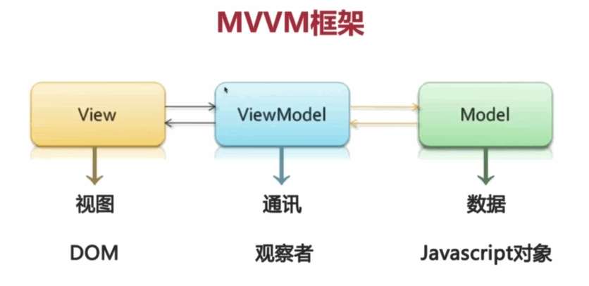

# Vue

## 库和框架的区别

### 库 Library

> 库，本质上是一些函数的集合。每一次调用函数，实现一个特定的功能，接着把**控制权**交给使用者。

- 代表：jQuery
- jQuery这个库的核心：DOM操作，即：封装DOM操作，简化DOM操作

### 框架 Framework

> 框架，是一套完整的解决方案，使用框架的会后，需要你把代码放到框架合适的地方，框架会在合适的时机调用你的代码。

- 框架规定了自己的编程方式，是一套完整的解决方案。
- 使用框架的时候，由框架控制一切，我们只要按照指定的规则书写代码。

### 主要区别

- You call Library, Framework calls you
- 核心点：谁起到主导作用（控制反转）
  - 框架中控制整个流程的是框架
  - 使用库，由开发人员决定如何调用库中提供的方法（辅助）
- 好莱坞原则：Don't call us, we'll call you.
- 框架的侵入性很高（从头到尾）

## MVVM

- MVVM，一种更好的UI模式解决方案
- [从 Script 到 Code Blocks、Code Behind到 MVC、MVP、MVVM - 科普](http://www.cnblogs.com/indream/p/3602348.html)

### MVC 组成

- M：Model 数据模型 - 专门用来操作数据，数据的CRUD
- V：View 视图 - 对于前端来讲，就是页面
- C：Controller 控制器 - 是视图和数据模型的沟通的桥梁，用于处理业务逻辑

### MVVM 组成



- M：Model 数据 - 负责数据存储 对应前端就是 javascript对象
- V：View 视图 - 负责页面展示 对应前端就是 DOM 对象
- VM：ViewModel 视图模型 - 连接视图和数据的中间件

### 优势的对比

- MVC 模式中，将应用程序分成了三个部分，实现了责任分离
- 在前端中经常要通过js代码来进行一些逻辑操作，最终要把这些逻辑呈现在页面中，也就是DOM操作
- MVVM通过**双向数据绑定**让数据自动的同步
  - V 修改 -> M
  - M 修改 -> V
  - 数据是核心
- Vue 这种 MVVM 模式的框架，不推荐开发人员手动操作DOM

#### Vue 中的 MVVM

在 MVVM 下, 数据和视图是不能直接通讯的, 需要通过 ViewModel 进行通讯, ViewModel 通常要实现一个 observe 观察者, 当 数据 发生变化, observe 能观察到这种变化, 然后通知到对应的 视图 做出更新; 当用户操作视图, observe 也能观察到相应的变化, 然后通知数据做改动 -- 这就是数据的**双向绑定**

- 双向数据绑定：将 DOM 于 Vue 实例的 data 数据绑定到一起，彼此互相影响
  - 数据的改变会影响DOM的改变
  - DOM的改变会引起数据的变化
- [剖析Vue原理&实现双向绑定MVVM](https://segmentfault.com/a/1190000006599500)

## Vue 起步

### Vue 的兼容问题

`Vue.js` 不支持 `IE8` 及以下版本，因为 `Vue.js` 使用了 `IE8` 不能模拟的 `ECMAScript5` 特性。
`Vue.js` 使用了 `Object.definedProperty` 中的 `setter` 和 `getter` 代理数据，监控对数据的操作。

### Vue 的特点

- 1.易用
- 2.灵活的渐进式框架
    *vue采用的是渐进式框架，什么是渐进式框架？无论是单页面的应用程序还是多页面的应用，首先都需要渲染页面每一个字段。*
    *关于组件系统，其实就是把公共的地方抽离出来作为一个组件。*
    *单页面就需要路由。项目比较复杂庞大，就需要引进 vuex ，来实现集中管理状态，整个项目构建完成之后还需要构建工具优化build我们的系统，来提升效率，形成一个完整的项目，这就是一个渐进式的过程，也就是说构建一个项目，从简单到复杂，随着业务度的提升，不断的加入和引用其他的插件，比如如果需要和后台交互，就需要引入一个vue-resource插件，做单页面应用，就可以引用一个vue-router，当我们的项目足够复杂，就引用 vuex ，最后通过built工具来构建我们的系统。也就是说做项目得过程中缺什么，补什么，这就是一个渐进式的过程。*
- 3.高效
- 4.虚拟DOM
    *在前端的工作中，操作DOM节点也是不可避免的、但是更新DOM时产生的计算非常昂贵、而且一些琐碎和频繁的更新会使页面缓慢，但是这也是不可避免的，所以 vue 以一个JavaScript 对象替代 DOM 节点，即采用的虚拟DOM，更新虚拟DOM，并不昂贵，因为这只是操作JavaScript对象，然后把更改的部分更新到真正的DOM。*
- 5.数据驱动
  - 1.页面 每个独立的可视/可交互的区域视为一个组件；
  - 2.每个组件对应一个工程目录，组件所需要的各种资源在这个目录下就近维护
  - 3.页面不过是组件的容器，组件可以嵌套自由组合形完整的页面

### 生命周期


- beforeCreated()
  - 实例初始化之后，数据观察(data observe) 和 event/watcher 事件配置前被调用
  - 此时组件的选项还未挂载，**无法获取 data 中的数据，methods 中的方法**
  - 可以加入一些 loading...
- created()
  - 实例已经创建完成之后被调用
  - **可以调用 methods 中的方法，改变 data 中的数据**
  - 挂载阶段还未开始，$el属性目前不可见
  - 结束loading...做一些初始化，可以进行页面请求
- beforeMount()
  - 相关的 render 函数首次被调用
  - 模板已经编译好了，尚未挂在到页面，此时页面还是旧的
- mounted()
  - el 被新创建的 vm.$el 替换，并挂载到实例上去之后调用改钩子，可以**进行DOM操作**
  - 在这个周期内，对data的改变可以生效。但是要进下一轮的dom更新，dom上的数据才会更新
  - beforeRouteEnter 的 next 的勾子比mounted触发还要靠后
  - 指令的生效在mounted周期之前
- beforeUpdate()
  - 此处获取的数据是更新后的数据，但是获取页面中的DOM元素是更新之前的
- updated()
  - 当这个钩子被调用时，组件 DOM 已经更新
- beforeDestroy()
  - 实例销毁之前调用。在这一步，实例仍然完全可用
  - 这一步还可以用this来获取实例
  - 一般在这一步做一些重置的操作。比如清除掉组件中的 定时器 和 监听的dom事件
- destroyed()
  - Vue 实例销毁后调用。调用后，Vue 实例指示的所有东西都会解绑定，所有的事件监听器会被移除，所有的子实例也会被销毁

### Hello Vue

```bash
// 安装
npm install -S vue
```

```html
<!-- 指定vue管理内容区域，需要通过vue展示的内容都要放到找个元素中  通常我们也把它叫做边界 数据只在边界内部解析-->
<div id="app">{{ msg }}</div>

<!-- 引入 vue.js -->
<script src="vue.js"></script>

<!-- 使用 vue -->
<script>
  // Vue实例
  // 注意1：在data中声明数据以后才能使用数据
  // 注意2：可以通过 vm.$data 或者 vm.msg 访问到 data 中的所有属性
  var vm = new Vue({
    // el：类型：字符串或者是 元素
    // 提供一个在页面上已存在的 DOM 元素作为 Vue 实例的挂载目标, 可以是CSS 选择器，也可以是一个 HTMLElement实例。
    // 在实例挂载之后,元素会通过 vue实例.$el访问。
    el: '#app',
    // Vue 实例的数据对象，用于给 View 提供数据
    // data：vue的核心属性，vue会自动监测，data里的数据的变化，自动更新在 HTML 标签上。
    // data的类型是对象或者函数，如果是在组件对象中，data必须是函数类型。
    data: {
      msg: 'Hello Vue',
      number: 6
    },
    // { 键：函数} { [key: string]: Function | { get: Function, set: Function } }
    // 是 Vue 的计算属性，在 vue的实例方法里面，this 都指向 vue 的实例(但是在某一个函数的内部，作用域改变，this 就不能指向 vue 的实例了)，所以在计算属性中定义的函数里面可以直接使用指向 vue 实例的 this
    computed: {
      xxx: function(){
        return this.number * 2
      }
    },
    // 事件的绑定都需要在 method 中定义与绑定，可以用 vue 实例直访问这些方法，方法中的 this 自动绑定为 Vue 实例。
    // 注意：不应该使用箭头函数来定义 method 函数 (例如 plus: () => this.a++)。理由是箭头函数绑定了父级作用域的上下文，所以 this 将不会按照期望指向 Vue 实例，this.a 将是 undefined。
    methods:{},
    // watch的类型{ [key: string]: string | Function | Object }
    // 键是需要观察的表达式，值是对应回调函数
    // 监测变量的变化，并执行对应的回调函数
    // 注意，不应该使用箭头函数来定义 watcher 函数 (例如 searchQuery: newValue => this.updateAutocomplete(newValue))。理由是箭头函数绑定了父级作用域的上下文，所以 this 将不会按照期望指向 Vue 实例，this.updateAutocomplete 将是 undefined。
    watch:{
      // 监控a变量变化的时候，自动执行此函数
      a: function (val, oldVal) {
        console.log('new: %s, old: %s', val, oldVal)
      },
      // 深度 watcher
      c: {
        handler: function (val, oldVal) { /* ... */ },
        deep: true
      },
      // 只监视user对象中的age属性的变化
      'user.age': function (val, oldVal) { }
    },
  })
</script>
```

#### 监视数据变化 - watch

- watch 是一个对象，键是需要观察的表达式，值是回调函数
- 当表达式的值发生变化后，会调用对应的回调函数完成相应的监视操作
- [vue文档](https://cn.vuejs.org/v2/api/#vm-watch)

#### 计算属性

用于通过其他的数据计算出新数据，只有在他的依赖发生改变时才会重新求值

好处: 缓存了计算出的结果, 优先调用缓存数据 -- 提高程序的性能

与 `methods` 的区别: `methods` 每次都会重新计算

注意：

- `{{}}` 中不要放太多的逻辑，会让模板过重，难以维护和理解
- `computed` 中的属性不能与 `data` 中的属性重名，会报错
- [computed属性原理](http://www.cnblogs.com/kidney/p/7384835.html?utm_source=debugrun&utm_medium=referral)

## 指令

- 解释：指令 (Directives) 是带有 v- 前缀的特殊属性
- 作用：当表达式的值改变时，将其产生的连带影响，响应式地作用于 DOM

### `{{ }}` 插值表达式

- 差值表达式从data中获取数据
- 当数据对象的属性值发生变化，差值处的内容也会更新
- `{{}}` 中不能出现js语句，可以是js表达式，比如运算，三元
- `{{}}` 不能是HTML标签的属性，如 `<h1 title="{{err}}">错误示例</h1>`

```html
<div id="app">
  <div>
    <input type="text" v-model="name">
    <span>你的名字叫: {{ name }}</span>
  </div>
  <div>
    <input type="text" v-model="age">
    <span>你的年龄是: {{ age - 1 }}周岁</span>
  </div>
  <div>
    <input type="text" v-model="sex">
    <span v-show="sex">你的性别是: {{ sex }}</span>
    <!-- 
    v-show  和  v-if 的区别 
    如果 sex 的值不存在, 都可以达到显示的作用
    v-show : 相当于 display:none DOM中元素仍然存在
    v-if : DOM删除     
    -->
  </div>
</div>
```

```javascript
var app = new Vue({
  el: '#app',  // 装载的位置 css选择器
  data: {  // 数据 可以 app.name 访问
    name: 'AAA',
    age: 18,
    sex: null
  }
})
```

在控制台修改 `app.name` 实例也随之更新

`{{ }}` 中支持简单的 `javascript` 表达式:

- `{{ number + 1 }}`
- `{{ true ? 'yes' : 'no' }}`
- `{{ message.split('').reverse().join('') }}`

`{{ }}` 中不支持:

- `{{ var a = 1 }}`
- `{{ if (true) { return true }}}`

### v-text / v-html

解决网速特别慢时, 表达式闪烁

不能单独使用, 必须配合某一个标签元素

```html
<div id="app">
  <span v-text="name"></span>
  <div v-html="name"></div>
</div>
<script>
  new Vue({
    el: '#app',
    data: {
      name: 'zhangsan'
    }
  })
</script>
```

区别: 能否解析标签, 使用 `v-html` 渲染数据可能会导致 XSS（跨站脚本） 攻击

### v-bind

可以给 HTML 元素或者动态组件**动态**地绑定一个或多个特性, 如动态绑定 style 和 class，使用方式：`v-bind:class="expression"` or `:class="expression"`，表达式的类型：字符串、数组、对象（重点）

用法: `v-bind:属性名="属性值"`

tips: `v-bind:` 可以简写成 `:`

```html
<div id="app">
  <!-- <a v-bind:class="klass" v-bind:href="url"> -->
  <!-- {active:isActive} {类名:参数} 这里是 { } 单花括号-->
  <!-- {active:isActive} 表示 当 isActive 是 true 的时候激活-->
  <a :class="{active:isActive}" :href="url">
    
  </a>
  <!-- 
    注意: url 没有被 {{ }} 包裹
    浏览器解析后不会显示 v-bind
    -->
  <div v-bind:style="{ color: activeColor, 'font-size': fontSize + 'px' }"></div>
  <!-- baseStyles 和 overridingStyles 都是data中定义的对象 -->
  <div v-bind:style="[baseStyles, overridingStyles]"></div>
</div>
```

```javascript
var app = new Vue({
  el: '#app',
  data: {
    url: 'http://www.baidu.com',
    img: 'https://ss2.baidu.com/6ONYsjip0QIZ8tyhnq/it/u=3610571309,474794913&fm=58&u_exp_0=3043537694,141489503&fm_exp_0=86&bpow=500&bpoh=454',
    klass: 'btn btn-default',
    isActive: true
  }
})
```

### v-cloak

v-cloak 指令保持在元素上直到关联实例结束编译后自动移除，v-cloak  和 CSS 规则如 [v-cloak] { display: none } 一起用时，这个指令可以隐藏未编译的 Mustache 标签直到实例准备完毕。

通常用来防止 `{{ }}` 表达式闪烁问题

```html
<style>
  [v-cloak] { display: none }
</style>
<span v-cloak>{{msg}}</span>
<script>
  new Vue({
    data:{
        msg:'hello ivan'
      }
  })
</script>
```

### v-on

绑定事件监听，表达式可以是一个方法的名字或一个内联语句，如果没有修饰符也可以省略，用在普通的html元素上时，只能监听 原生 DOM 事件。用在自定义元素组件上时，也可以监听子组件触发的自定义事件。

用法:

- `v-on="{事件名:事件函数,事件名2:事件函数2}"`
- `v-on:事件名="事件函数"`
- `v-on` 可以简写为 `@`
- 事件函数要写在 methods 参数选项中

常用事件:

- v-on:click
- v-on:keydown
- v-on:keyup
- v-on:mousedown
- v-on:mouseover
- v-on:submit
- ....

v-on 提供了很多事件修饰符来辅助实现一些功能:

- `.stop` - 调用 event.stopPropagation()。
- `.prevent` - 调用 event.preventDefault()。
- `.capture` - 添加事件侦听器时使用 capture捕获 模式。
- `.self` - 只当事件是从侦听器绑定的元素本身触发时才触发回调。
- `.once` - 事件只触发一次
- `.{keyCode | keyAlias}` - 只当事件是从侦听器绑定的元素本身触发时才触发回调。
- `.native` - 监听组件根元素的原生事件。

```html
<div id="app">
  <!-- 注意: 在 js 中 onClick 的位置 method中-->
  <!-- 可以传对象 -->
  <button v-on="{mouseenter:onEnter,mouseleave:onOut}" v-on:click="onClick">点我</button>
  <!-- <form v-on:submit="onSubmit($event)">
    <input type="text">
    <button type="submit">提交</button>
  </form> -->

  <!-- vue 封装了 preventDefault(); -->
  <!-- vue 封装了 stopPropagation(); 
    v-on:submit.stop
    停止冒泡事件
  -->
  <!-- 
    键盘事件: 封装了keycode事件
    v-on:keyup.enter="onEnter"
    // 通过全局 config.keyCodes 对象自定义键值修饰符别名
    Vue.config.keyCodes.f2 = 113
    // 使用自定义键值修饰符
    @keyup.enter.f2="add"
    -->
    <!-- v-on 可以简写为 @ : @keyup.enter-->
  <form v-on:submit.prevent="onSubmit2">
    <input type="text">
    <button type="submit">提交</button>
  </form>
</div>
```

```javascript
var app = new Vue({
  el: '#app',
  methods: {
    onClick: function () {
      console.log('clicked')
    },
    onEnter: function () {
      console.log('mouse enter')
    },
    onOut: function () {
      console.log('mouse leave')
    },
    onSubmit: function (e) {
      e.preventDefault()
      console.log('submitted')
    },
    onSubmit2: function () {
      console.log('submitted')
    }
  }
})
```

### v-for

用法: `v-for="item in arr" :key="唯一值"` 新版本需要绑定 key

```html
<div id="app">
  <ul>
    <li v-for="food in foodList">
      {{ food.name }}:&yen;{{ food.discount ? food.price * food.discount : food.price}}
    </li>
  </ul>
  <!-- 
    v-for 也是动态的 一直在监控 app.foodList数据
    当在 console 中执行: 
    app.foodList.push({ name: '黄瓜',  price: 2, discount: 0.6}) 的时候, 
    页面的展示也会刷新
    -->
</div>
```

```javascript
var app = new Vue({
  el: '#app',
  data: {
    // foodList: ['香蕉', '橘子', '苹果', '月饼'],
    foodList: [
      { name: '香蕉', price: 10, discount: 0.8 },
      { name: '橘子', price: 20, discount: 1 },
      { name: '苹果', price: 3, discount: 0.5 },
      { name: '月饼', price: 128 }
    ]
  }
})
```

需要索引写法:

```html
<div v-for="(item, index) in items"></div>
<div v-for="(val, key) in user"></div>
<div v-for="(val, key, index) in user"></div>
```

### v-model 双向数据绑定

```javascript
var app = new Vue({
  el: '#app',
  data: {
    sex: 'female',
    hobby: [], // 可以设置默认值
    article: 'Lorem ipsum dolor sit amet consectetur adipisicing elit. Aspernatur sed laboriosam beatae eveniet quisquam ad fugiat enim, pariatur labore quas? ',
    from: 1,
    to: []
  }
})
```

#### v-model 在 `input[text]` 中的使用(修饰符)

- `v-model.lazy`: 懒加载, 在 `input` 失去焦点时更新
- `v-model.trim`: 去掉前后的空格, 注意在 `password` 类型的 `input` 的使用
- `v-model.number`: `Number` 类型数据, 避免获取的 `input` 数据是字符串带来的运算问题

```html
<div id="app">
  <input type="text" v-model="name"><br>
  <input type="text" v-model.lazy="name"><br>
  <input type="text" v-model.trim="name"><br>
  <input type="text" v-model.number="price"><br>
  <!-- 
  多空格在 HTML 中只显示一个空格, 但是在数据库中会远洋存储
  <pre> 按原格式显示
   -->
  <pre>{{ name }}</pre>
</div>
```

```javascript
var app = new Vue({
  el: '#app',
  data: {
    name: 'whh',
    price: 10
  }
})
```

#### v-model 在 `input[radio]` 中的使用

在使用 `<input type="radio" value="male" name="sex">` 时, 同一组的多个 `radioButton` 要放在同一个 `name` 下, 在 Vue 中, 放在同一个 `v-model` 下

```html
<div id="app">
  <label for="">
    男:
    <input type="radio" value="male" v-model="sex">
  </label>
  <label for="">
    女:
    <input type="radio" value="female" v-model="sex">
  </label>
  <br>
  {{sex}}
</div>
```

#### v-model 在 `input[CheckBox]` 中的使用

```html
<div id="app">
  <label for="">
    男:
    <input type="checkbox" value="male" v-model="hobby">
  </label>
  <label for="">
    女:
    <input type="checkbox" value="female" v-model="hobby">
  </label>
  <br>
  {{hobby}}
</div>
```

#### v-model 在 textarea 中的使用

```html
<div id="app">
  <textarea v-model="article" name="" id="" cols="30" rows="10"></textarea>
</div>
```

#### v-model 在 select 中的使用

```html
<div id="app">
<div>你来自哪里?</div>
  <select v-model="from">
    <option value="1">hkong</option>
    <option value="2">dlu</option>
  </select> {{ from }}
  <hr>
  <div>你要去哪里?</div>
  <select v-model="to" multiple>
    <option value="1">hkong</option>
    <option value="2">dlu</option>
  </select> {{ to }}
</div>
```

### v-if

作用：根据表达式的值的真假条件来决定是否渲染元素.
如果条件为false不渲染（达到隐藏元素的目的），为true则渲染。
在切换时元素及它的数据绑定被销毁并重建

```html
<div id="app">
  <div v-if="role === 'admin' || role === 'super_admin'">
    管理员你好
  </div>
  <div v-else-if="role === 'hr'">
    hr你好
  </div>
  <div v-else>
    你没有权限访问此页面
  </div>
</div>
```

```javascript
var app = new Vue({
  el: '#app',
  data: {
    role: 'hr'
  }
})
```

### v-show

根据表达式的真假值，切换元素的 display CSS 属性，如果为 false ，则在元素上添加 display:none 来隐藏元素，否则移除 display:none 实现显示元素

```html
<h1 v-show="isShow">Yes</h1>

new Vue({
  data:{
    isShow:true
  }
});

```

v-if 和 v-show 的区别：

  v-if 和 v-show 都能够实现对一个元素的隐藏和显示操作,

  但是 v-if是将这个元素添加或者移除到dom中，
  而v-show 是在这个元素上添加 style="display:none"和移除它来控制元素的显示和隐藏的

### 提升性能： v-pre

vue会跳过这个元素和他的子元素编译过程，可以用来显示原始 Mustache 标签。跳过大量没有指令的节点会加快编译。

```html
<span v-pre>{{this will not be compiled}}</span>
```

### 提升性能： v-once

vue只渲染元素和组件一次。随后的重新渲染，元素/组件及其所有的子节点将被视为静态内容并跳过。这可以用于优化更新性能。

```html
<span v-once>This will never change: {{msg}}</span>
```

## 过度&动画

将需要动画的组件放入 'transition' 组件内部

在进入/离开的过渡中，会有 6 个 class 切换。
v-enter：定义进入过渡的开始状态。在元素被插入时生效，在下一个帧移除。
v-enter-active：定义过渡的状态。在元素整个过渡过程中作用，在元素被插入时生效，在 transition/animation 完成之后移除。这个类可以被用来定义过渡的过程时间，延迟和曲线函数。
v-enter-to: 2.1.8版及以上 定义进入过渡的结束状态。在元素被插入一帧后生效 (于此同时 v-enter 被删除)，在 transition/animation 完成之后移除。
v-leave: 定义离开过渡的开始状态。在离开过渡被触发时生效，在下一个帧移除。
v-leave-active：定义过渡的状态。在元素整个过渡过程中作用，在离开过渡被触发后立即生效，在 transition/animation 完成之后移除。这个类可以被用来定义过渡的过程时间，延迟和曲线函数。
v-leave-to: 2.1.8版及以上 定义离开过渡的结束状态。在离开过渡被触发一帧后生效 (于此同时 v-leave 被删除)，在 transition/animation 完成之后移除。

// TODO

## vue-router 路由

> vue-router 是vue中的一个核心插件。

### 安装

```bash
npm i vue-router
```

### 使用

```javascript
import VueRouter from 'vue-router'
Vue.use(VueRouter)
```

#### 1.渲染标签

- router-view 渲染路径匹配到的视图组件，还可以内嵌自己的 `<router-view>` ，根据嵌套路径渲染嵌套组件
- router-link 路由中的应用导航

#### 2.跳转

使用router-link组件来进行导航，通过传入 `to` 属性指定链接
`<router-link to="/home">Go to Home</router-link>`
但是同样，我们需要在js中配置路由的跳转

```js
// 定义好路由组件

// index.js  配置路由跳转
export default new Router({routes})
var routes = [
  {
    path: '/home',
    name: 'Home',
    component: Home
  }
]
```

#### 3.传值

页面跳转时经常要携带参数，所以路由跳转是可以携带参数的。

```js
//动态路径传参，以冒号开头
var routes = [
  {
    path: '/detail/:id',
    name: 'Detail',
    component: Detail
  }
]
```

当然在路由中也需要配置一下：

```html
<router-link :to='{name:"Detail",params:{id:x.name}}'>
    ...
</router-link>
```

#### 4.参数的接收

一个『路径参数』使用冒号 : 标记。当匹配到一个路由时，参数值会被设置到 this.$route.params，可以在每个组件内使用。

```html
<template lang='html'>
    <div>
        <h1>水果详情页</h1>
        <h1>{{$route.params.id}}</h1>
    </div>
</template>
```

#### 5.渲染

默认情况下，`<router-link>` 会被渲染成 `a` 标签输出，而有时候，为了页面的规范和美观，我们可以将其替换成其他标签，比如 `<router-link
to:"/home" tag="div">` 最终，`<router-link>` 就会以div的形式显示在页面上

#### 6.路由的嵌套

```js
//此时，我们在market组件下，配置2个子路由
var routes = [
  {
    path: '/market',
    name: 'Market',
    component: Market,
    children: [
      {
        path: '/',
        component: require('../pages/market/price')
      },
      {
        path: 'price',
        component: require('../pages/market/price')
      },
      {
        path: 'rank',
        component: require('../pages/market/rank')
      }
    ]
  }
]
export default new Router({routes})
```

```html
<template lang='html'>
    <div>
        <ul class="nav">
          <router-link to='/market/price' tag="li">天天特价</router-link>
          <router-link to='/market/rank' tag="li">热销榜</router-link>
        </ul>
        <router-view class='view'></router-view>
    </div>
</template>
```

这样我们对应的子路由就配置好了。

#### 7.编程式导航

`router.push({ name: 'user', params: { userId: 123 }})`
`router.replace(location)`
跟 `router.push` 很像，唯一的不同就是，它不会向 `history` 添加新记录，而是跟它的方法名一样 —— 替换掉当前的 `history` 记录
`router.replace({ name: 'Start'});`
`router.go(n)`
这个方法的参数是一个整数，意思是在 `history` 记录中向前或者后退多少步，类似 `window.history.go(n)`。

## SPA 单页面应用程序

> SPA：Single Page Application，单页面 web 应用，就是加载单个 HTML 页面，并在用户与应用程序交互式动态更新该页面的 web 应用程序。

- 单页面应用程序
  - 只有第一次会加载页面，以后的每次请求，仅仅是获取必要的数据，由页面中的js解析展示在页面
- 传统多页面应用程序
  - 每次青后服务器返回的都是一个完整的页面

SPA 的优势：

- 减少了请求的体积，加快页面的响应速度，降低了对服务器的压力
- 更好的用户体验，流畅

实现的思路与技术点：

- ajax
- 锚点 - `window.location.hash` #
- hashchange 事件 - `window.addEventListener('hashchange', function(){})`
- 监听锚点值事件的变化，根据不同的锚点值，请求相应的数据
- 原本用作页面内部进行跳转，定位并展示相应的内容

### 路由

- 路由(前端路由)：浏览器中hash值与展示视图内容template之间的对应规则

```html
<div id="app">
  <!-- 5 路由入口 指定跳转到只定入口 -->
  <router-link to="/home">首页</router-link>
  <router-link to="/login">登录</router-link>

  <!-- 7 路由出口：用来展示匹配路由视图内容 -->
  <router-view></router-view>
</div>

<!-- 1 导入 vue.js -->
<script src="./vue.js"></script>
<!-- 2 导入 路由文件 -->
<script src="./node_modules/vue-router/dist/vue-router.js"></script>
<script>
  // 3 创建两个组件
  const Home = Vue.component('home', {
    template: '<h1>这是 Home 组件</h1>'
  })
  const Login = Vue.component('login', {
    template: '<h1>这是 Login 组件</h1>'
  })

  // 4 创建路由对象
  const router = new VueRouter({
    routes: [
      // 路径和组件一一对应
      { path: '/home', component: Home },
      { path: '/login', component: Login }
    ]
  })

  var vm = new Vue({
    el: '#app',
    // 6 将路由实例挂载到vue实例
    router
  })
</script>
```

### 重定向

```javascript
//  将path 重定向到 redirect
{ path: '/', redirect: '/home' }
```

### 路由其他配置

- 路由导航高亮
  - 说明：当前匹配的导航链接，会自动添加router-link-exact-active router-link-active类
  - 配置：linkActiveClass
- 匹配路由模式
  - 配置：mode

```javascript
new Router({
  routers:[],
  mode: "hash", //默认hash | history 可以达到隐藏地址栏hash值 | abstract，如果发现没有浏览器的 API 则强制进入
  linkActiveClass : "now" //当前匹配的导航链接将被自动添加now类
})
```

### 路由参数

- `/user/:id`
- 当匹配到一个路由时，参数值会被设置到 `this.$route.parmas`
- 可以通过 $route.query 获取到 URL 中的查询参数

```html
<!-- 方式一 -->
<router-link to="/user/1001">如果你需要在模版中使用路由参数 可以这样 {{$router.params.id}}</router-link>
<!-- 方式二 -->
<router-link :to="{path:'/user',query:{name:'jack',age:18}}">用户 Rose</router-link>

<script>
// 路由
var router = new Router({
  routers : [
    // 方式一 注意 只有/user/1001这种形式能被匹配 /user | /user/ | /user/1001/ 都不能被匹配
    // 将来通过$router.params获取参数返回 {id:1001}
    { path: '/user/:id', component: User },
    // 方式二
    { path: "user" , component: User}
  ]
})

// User组件：
const User = {
  template: `<div>User {{ $route.params.id }}</div>`
}
</script>
<!-- 如果要子啊vue实例中获取路由参数 则使用this.$router.params 获取路由参数对象 -->
<!--  {{$router.query}} 获取路由中的查询字符串 返回对象 -->
```

### 嵌套路由 - 子路由

- 父组件中使用 router-view，在路由规则中使用 children 配置

```javascript
// 父组件：
const User = Vue.component('user', {
  template: `
    <div class="user">
      <h2>User Center</h2>
      <router-link to="/user/profile">个人资料</router-link>
      <router-link to="/user/posts">岗位</router-link>
      <!-- 子路由展示在此处 -->
      <router-view></router-view>
    </div>
    `
})

// 子组件[简写]
const UserProfile = {
  template: '<h3>个人资料：张三</h3>'
}
const UserPosts = {
  template: '<h3>岗位：FE</h3>'
}

// 路由
var router =new Router({
  routers : [
    {
      path: '/user',
      component: User,
      // 子路由配置：
      children: [
        {
          // 当 /user/profile 匹配成功，
          // UserProfile 会被渲染在 User 的 <router-view> 中
          path: 'profile',
          component: UserProfile
        },
        {
          // 当 /user/posts 匹配成功
          // UserPosts 会被渲染在 User 的 <router-view> 中
          path: 'posts',
          component: UserPosts
        }
      ]
    }
  ]
})
```

## 组件

    vue中的组件其实就是页面组成的一部分，好比是电脑中的每一个元件（如硬盘，键盘，鼠标），它就是一个具有独立逻辑或界面，同时又能根据规定的接口规则进行相互融合，变成一个完整的应用。

    页面就是由一个个类似这样的部分组成的，比如导航，列表，弹窗，下拉列表等。页面只不过是这些组件的容器，组件自由组合形成功能完整的界面，当不需要某个组件，或者想要替换某个组件时，可以随时进行替换和删除，而不影响整个应用的运行。

    前端组件化的核心思路就是将一个巨大复杂的东西拆分成颗粒度合理的小东西。

### 使用组件的好处

1、提高开发效率
2、方便重复使用
3、简化调试步骤
4、提升整个项目的可维护性
5、便于协同开发

### vue中的组件

vue 中的组件是一个自定义标签，vue.js的编译器为它添加特殊功能
vue 中的组件也可以扩展原生的 html 元素，封装可重用的代码

组件的基本组成：样式结构，行为逻辑，数据

### 全局定义组件

`Vue.component(标签名, 内容)` 在 HTML 中 Vue 接管的范围内都可以使用

```javascript
// 1.注册全局组件
Vue.component('alert', {
  // template：有且只能有一个根元素，template可以使模板字符串，也可以是一个模板的id
  template: '<button @click="on_click">弹弹弹</button>',
  // data：必须是函数，并且有返回值，是对象
  data () {
    return { }
  },
  methods: {
    on_click: function () {
      alert('Yo.')
    }
  }
})
```

```html
<!-- 2.使用自定义组件 -->
<div id="example">
  <alert></alert>
</div>
```

extend：使用基础的Vue构造器，创建一个“子类”。参数是一个包含组件选项的对象

```javascript
// 注册组件，传入一个扩展过的构造器
Vue.component('my-component', Vue.extend({ /* ... */ }))

// 注册组件，传入一个选项对象 (自动调用 Vue.extend)
Vue.component('my-component', { /* ... */ })

var Home = Vue.extend({
  template: '',
  data() {}
})
Vue.component('home', Home)
```

### 局部定义组件

在某一个具体的vue实例中定义的，只能在这个vue实例中使用

```javascript
new Vue({
  el: '#seg1',
  components: {
    'my-component': {
      template: '<button @click="on_click">弹弹弹</button>',
      methods: {
        on_click: function () {
          alert('Yo.')
        }
      }
    }
  }
})
```

### demo

```html
<div id="app">
  <like></like>
</div>

<template id="like-component-tpl">
  <button :class="{liked:liked}" @click="toggle_like">
  👍  {{ likeCount }}
  </button>
</template>
```

```javascript
Vue.component('like', {
  // template: '<button :class="{liked:liked}" @click="toggle_like">👍  {{ likeCount }}</button>',
  // template 内容过长可以使用 es6 模板字符串
  // 也可以定义在 HTML 中模板 这里传选择器
  template: '#like-component-tpl',
  data: function () {  // 使用function return 避免引用赋值
    return {
      likeCount: 10,
      liked: false
    }
  },
  methods: {
    toggle_like: function () {
      if (!this.liked) {
        this.likeCount++
      } else {
        this.likeCount--
      }
      this.liked = !this.liked
    }
  }
})

new Vue({
  el: '#app'
})
```

### is特性

在某些特定的标签中只能存在指定的标签，如 ul>li，如果要浏览器正确识别则需要使用 is

```html
<!-- 案例 -->
<ul id="app">
  <!-- 不能识别 -->
  <my-li></my-li>
  <!-- 正常识别 -->
  <li is="my-li"></li>
</ul>

<script>
  var vm = new Vue({
    el: "#app",
    components : {
      myLi : {
        template : `<li>内容</li>`
      }
    }
  })
</script>
```

## 组件通讯

### 父->子组件通讯

- 通过子组件 props 属性来传递数据，props是一个数组
- 传递过来的 props 的用法与 data 相同

```html
<div id="app">
  <alert msg="怎么弹出这个信息" a="弹出这个" b="还有这个"></alert>
  <user username="whh"></user>
  <user username="lhh"></user>
</div>
```

```javascript
Vue.component('alert', {
  template: '<button @click="onClick">弹弹弹</button>',
  props: ['msg', 'a', 'b'], // 注意这个属性
  methods: {
    onClick: function () {
      alert(`msg:${this.msg}  a:${this.a}  b:${this.b}`)
    }
  }
})
Vue.component('user', {
  template: '<a :href="\'/user/\' + username" >{{ username }}</a>',
  props: ['username'],
  methods: {

  }
})

new Vue({
  el: '#app'
})
```

### 子->父组件通讯

- 父组件给子组件传递一个函数，由子组件调用这个函数(父组件用`$on`监听自定义事件，`$emit`触发父组件所关心的自定义事件)
- 借助 vue 中的自定义事件 (v-on:customFn="fn")

```html
<div id="app">
  <balance></balance>
</div>
```

```javascript
Vue.component('balance', {
  // 2. 在子组件中绑定 v-on:自定义事件名="父组件中的方法" ==> @pfn="parentFn"
  template: `
  <div>
    <show @show-balance="show_balance"></show>
    <div v-if="show">
      您的余额: 00.00
    </div>
  </div>
  `,
  methods: {
    // 1. 在父组件中定义方法 show-balance
    show_balance: function (data) {
      this.show = true
      console.log('data',data);
    }
  },
  data: function () {
    return {
      show: false
    }
  }
})

Vue.component('show', {
  template: `
  <button @click="onClick()">显示余额</button>
  `,
  methods: {
    onClick() {
      // 3. 子组件中通过 $emit 触发当前实例上的事件 (事件名, 参数)
      this.$emit('show-balance', {a: 1, b: 2})
    }
  }
})

var app = new Vue({
  el: '#app'
})
```

### 兄弟组件通讯

```html
<div id="app">
  <huahua></huahua>
  <shuandan></shuandan>
</div>
```

```javascript
// 利用一个空的 Vue 实例作为事件总线
var Event = new Vue()

Vue.component('huahua', {
  template: `<div>我说: <input @keyup="on_change" v-model="i_said"></div>`,
  methods: {
    on_change: function () {
      Event.$emit('huahua-said-something', this.i_said)
    }
  },
  data: function () {
    return {
      i_said: ''
    }
  }
})

Vue.component('shuandan', {
  template: `<div>花花说: {{huahua_said}}</div>`,
  data: function () {
    return {
      huahua_said: ''
    }
  },
  mounted: function () { // 初始化完毕节点--钩子
    var that = this
    Event.$on('huahua-said-something', function (data) {
      that.huahua_said = data
    })
  }
})
new Vue({
  el: '#app'
})
```

### 内容分发 slot

在子组件模板中有slot标签，被视为备用内容，在父组件不提供内容的情况下使用。如果父组件提供内容，则把整个内容片段插入到slot所在的DOM位置，并替换掉slot标签本身。
子组件模板中没有slot标签，父组件提供的内容会被抛弃
如果替换的内容较多，可以直接用一个template替换。

```html
<div id="app">
  <hello>
    <!-- 如果只有一个slot插槽 那么不需要指定名称 -->
    <p slot="插槽名称">父组件提供的内容，我的存在会替换子组件中slot标签内的内容</p>
  </hello>
</div>

<script>
  new vue({
  el : "#app",
  components : {
    hello : {
      template : `
          <div>
            <p>我是子组件中的内容(备用内容，如果子组件中有内容会替换)</p>
            <slot name="名称"></slot>
          </div>
        `
    }
  }
})
</script>
```

可以使用一个匿名的 slot，处理那些没有对应的 slot 内容。

```html
<div id="app">
  <h2>自定义组件</h2>
  <custom>
    <!-- <div slot="one">我替换one</div> -->
    <div slot="three">我替换three</div>
    <div slot="two">我替换two</div>
    <span slot="two">我替换two</span>
    <div slot="one">我替换one</div>
    <div>替换无名的slot</div>
    <div>替换无名的slot</div>
    <div>替换无名的slot</div>
  </custom>
</div>

<script>
  Vue.component('custom',{
    template:`
      <div>
          <slot name="one">
              <p>我是one</p>
          </slot>
          <slot name="two">
              <p>我是two</p>
          </slot>
          <slot name="three">
              <p>我是three</p>
          </slot>
          <slot>
              <p>我是无名的slot</p>
          </slot>
      </div>
    `
  })
  new Vue({
    el:"#app"
  })
</script>
```

### 单向数据流

数据从父组件传递给子组件，只能单项绑定。
在子组件内不应该修改父组件传递过来的数据。
改变prop的情况：
1.作为data中局部数据的初始值使用
2.作为子组件中computed属性

### props 验证

在父组件给子组件传值得时候，为了避免不必要的错误，可以给prop的值进行类型设定，让父组件给子组件传值得时候，更加准确.

```js
props:{
  propA:Number, 数值类型
  propB:[String,Number],  多种类型
  propC:{type:String,required:true},   必填项
  propD:{type:Number,default:100},   默认是
  propE:{typr:Number,default:function(){return 1000}}
  propF:{validator:function(value){return value>2}}  符合value>2的值
}
```

不明白，看如下案例，要求父组件给子组件传值得时候
1、这个参数是必须传的
2、值必须是数值类型的
3、默认参数是10

```js
Vue.component('custom-cmpontent',{
  data(){
    return {
      incrementCount:this.count //作为局部组件的data的初始值
    }
  },
  props:{
    count:{
      type:Number,   // 类型
      default:10,    // 默认值
      required:true  //必须要传参数
    }
  },
  computed:{
    incrementCount2(){
      return this.incrementCount
    }
  },
  template:`
    <div>
        <h2>我是一个自定义组件</h2>
        <input type='button' value="改变count的值" @click="changeCount">
        {{incrementCount}}
    </div>
  `,
  methods:{
    changeCount:function(value){
      this.incrementCount++;
      this.$emit('receive')
    }
  }
})
new Vue({
  el:"#app",
  data:{
    count:0
  },
  methods:{
    countH:function(){
      this.count++;
    }
  }
})
```

### 获取组件 refs

- vm.$refs 是一个对象，持有已经注册过 ref 的所有子组件
- 在 HTML 中，添加 ref 属性，然后在 js 中通过 `vm.$refs.属性` 来获取
- 如果获取的是一个组件，那么通过 ref 就能获取到子组件的 data 和 methods

```html
<div id="app">
  <div ref="dv"></div>
  <my res="my"></my>
</div>

<script>
  new Vue({
    el : "#app",
    mounted() {
      this.$refs.dv //获取到元素
      this.$refs.my //获取到组件
    },
    components : {
      my : {
        template: `<a>sss</a>`
      }
    }
  })
</script>
```

## 过滤器 filter

- 作用：文本数据的格式化
- 过滤器可以使用在两个地方： `{{}}` 和 `v-bind`
- 两种过滤器：全局过滤器，局部过滤器
- 过滤器应该被添加在JavaScript表达式的尾部，由管道符指示

### 全局过滤器

- 全局过滤器，在任何一个 vue 实例中都可以使用
- 使用全局过滤器，需要先创建全局过滤器，再创建 vue 实例
- 显示的内容由过滤器的返回值确定

```javascript
Vue.filter('filtername', function(value){
  // todo...
})
```

示例：

```html
<div>{{ dataStr | data}}</div>
<div>{{ dataStr | data('YYYY-MM-DD hh:mm:ss')}}</div>

<script>
Vue.filter('data', function(value){
  // todo...
})
</script>
```

### 局部过滤器

局部过滤器是在某一个vue实例内创创建的，只在当前实例中起作用

```javascript
{
  data: { },
  filter: {
    filterName: function (value, format) { }
  }
}
```

### 常见过滤器

#### 根据时间戳转化成时间格式：mm-dd hh:tt

```html
<div id="app">
    <!-- 将时间戳转化为时间 -->
    <h1>根据时间戳转化为时间：{{ str | formatTime}}</h1>
  </div>

  <script type="text/javascript">
    var demo = new Vue({
      el: "#app",
      data: {
        str: 1517568434324,
      },
      filters: {
        formatTime: function (nS) {
          return ((new Date(nS).getMonth() + 1) < 10 ? '0' + (new Date(nS).getMonth() + 1) : (new Date(nS).getMonth() + 1)) + '-' + (new Date(nS).getDate() < 10 ? '0' + new Date(nS).getDate() : new Date(nS).getDate()) + ' ' + (new Date(nS).getHours() < 10 ? '0' + new Date(nS).getHours() : new Date(nS).getHours()) + ':' + (new Date(nS).getMinutes() < 10 ? '0' + new Date(nS).getMinutes() : new Date(nS).getMinutes())
        }
      }
    });

  </script>
```

#### 根据时间戳转化成时间格式：多长时间之前

```html
<div id="app">
    <!-- 将时间戳转化为时间 -->
    <h1>根据时间戳转化为时间：{{ str | formatTime}}</h1>
  </div>

  <script type="text/javascript">
    var demo = new Vue({
      el: "#app",
      data: {
        str: 1517568434324,
      },
      filters: {
        formatTime: function (timespan) {
          var dateTime = new Date(timespan);
          var year = dateTime.getFullYear();
          var month = dateTime.getMonth() + 1;
          var day = dateTime.getDate();
          var hour = dateTime.getHours();
          var minute = dateTime.getMinutes();
          var second = dateTime.getSeconds();
          var now = new Date();
          var now_new = Date.parse(now);   //typescript转换写法

          var milliseconds = 0;
          var timeSpanStr;

          milliseconds = now_new - timespan;

          if (milliseconds <= 1000 * 60 * 1) {
            timeSpanStr = '刚刚';
          }
          else if (milliseconds <= 1000 * 60 * 60) {
            timeSpanStr = Math.round((milliseconds / (1000 * 60))) + '分钟前';
          }
          else if (milliseconds <= 1000 * 60 * 60 * 24) {
            timeSpanStr = Math.round(milliseconds / (1000 * 60 * 60)) + '小时前';
          }
          else if (milliseconds <= 1000 * 60 * 60 * 24 * 15) {
            timeSpanStr = Math.round(milliseconds / (1000 * 60 * 60 * 24)) + '天前';
          }
          else if (milliseconds > 1000 * 60 * 60 * 24 * 15 && year == now.getFullYear()) {
            timeSpanStr = month + '-' + day + ' ' + hour + ':' + minute;
          } else {
            timeSpanStr = year + '-' + month + '-' + day + ' ' + hour + ':' + minute;
          }
          return timeSpanStr;
        }
      }
    });

  </script>
```

## 自定义指令

- 作用：进行DOM操作
- 使用场景：对纯DOM元素进行底层操作，比如：文本获取焦点
- [vue自定义指令用法实例](https://juejin.im/entry/58b7c5d8ac502e006cfee34a)

在vue2.0中，代码复用和抽象的主要形式是组件。然而，有的情况下，你仍然需要对普通DOM元素进行底层操作，这时候就会用到自定义指令。

自定义指令最重要的两个部分就是钩子函数和钩子函数对应的参数。

### 钩子函数

一个指令定义对象可以提供如下几个钩子函数 (均为可选)：

**bind**：只调用一次，指令第一次绑定到元素时调用，在这里可以进行一次性的初始化设置。
**inserted**：被绑定元素插入父节点时调用（仅保证父节点存在，但不一定已被插入文档中）。
**update**：所在组件的 VNode 更新时调用，但是可能发生在其子 VNode 更新之前。指令的值可能发生了改变，也可能没有。但是你可以通过比较更新前后的值来忽略不必要的模板更新 (详细的钩子函数参数见下)。
**componentUpdated**：指令所在组件的 VNode 及其子 VNode 全部更新后调用。
**unbind**：只调用一次，指令与元素解绑时调用。

### 钩子函数的参数


### 全局指令

```javascript
// 第一个参数：指令名称
// 第二个参数：配置对象，指定指令的钩子函数
Vue.directive('directiveName', {
  // bind中只能对元素自身进行DOM操作，而无法对父级元素操作
  // 只调用一次 指令第一次绑定到元素时调用。在这里可以进行一次性的初始化设置。
  bind(el，binding, vnode) {
    // 参数详解
    // el：指令所绑定的元素，可以用来直接操作 DOM 。
    // binding：一个对象，包含以下属性：
      // name：指令名，不包括 v- 前缀。
      // value：指令的绑定值，等号后面的值 。
      // oldValue：指令绑定的前一个值，仅在 update 和 componentUpdated 钩子中可用。无论值是否改变都可用。
      // expression：字符串形式的指令表达式 等号后面的字符串 形式
      // arg：传给指令的参数，可选。例如 v-my-directive:foo 中，参数为 "foo"。
      // modifiers：指令修饰符。例如：v-directive.foo.bar中，修饰符对象为 { foo: true, bar: true }。
    // vnode：Vue 编译生成的虚拟节点。。
    // oldVnode：上一个虚拟节点，仅在 update 和 componentUpdated 钩子中可用。
  },
  // inserted这个钩子函数调用的时候，当前元素已经插入页面中了，也就是说可以获取到父级节点了
  inserted (  el，binding, vnode ) {},
  //  DOM重新渲染前
  update(el，binding, vnode,oldVnode) {},
  // DOM重新渲染后
  componentUpdated ( el，binding, vnode,oldVnode ) {},
  // 只调用一次，指令与元素解绑时调用
  unbind ( el ) {
    // 指令所在的元素在页面中消失，触发
  }
})
// 简写 如果你想在 bind 和 update 时触发相同行为，而不关心其它的钩子:
Vue.directive('自定义指令名', function(el, binding){})
// 例：
Vue.directive('color', function(el, binding) {
  el.style.color = binging.value
})
// 使用 注意直接些会被i成data中的数据“red” 需要字符串则嵌套引号"'red'"
<p v-color="'red'"></p>
```

### 局部指令

```javascript
var vm = new Vue({
  el : "#app",
  directives: {
    directiveName: { }
  }
})
```

### 常见自定义指令

#### 1、在图片未完成加载前，用随机的背景色占位，图片加载完成后才直接渲染出来。

```html
<div id="app" >
  <div v-img='val.url'  v-for="val in list"></div>
</div>

<script>
Vue.directive('img', {
  inserted:function (el, binding) {
    var color = Math.floor(Math.random()*1000000);
    el.style.backgroundColor = "#" + color;

    var img = new Image();
    img.src = binding.value;
    img.onload = function(){
      el.style.backgroundImage = 'url('+ binding.value +')'
    }
  }
})
new Vue({
  el: '#app',
  data: {
    list:[
      {url:'http://i0.jrjimg.cn/zqt-red-1000/focus/focus2017YMZ/Billboard/img/tan04.jpg'},
      {url:'http://i0.jrjimg.cn/zqt-red-1000/focus/focus2017YMZ/Billboard/img/tan03.jpg'},
      {url:'http://i0.jrjimg.cn/zqt-red-1000/focus/focus2017YMZ/Billboard/img/tan04.jpg'}
    ]
  }
})
```

#### 2、自定义指令的第二用处是用于集成第三方插件。

比如写文档通常会用到highlight.js，我们可以直接将其封装为一个自定义指令，这样highlight.js就变成了Vue的一个新功能

```js
var hljs = require('highlight.js)
Vue.directive('highlight', function(el){
  hljs.highlightBlock(el)
})
```

```html
<pre>
<code v-highlight>&lt;alert-menu
  :menudata="menu"
  :e="eventObj"
  ref="menu"
  v-on:menuEvent="handle"&gt;
&lt;/alert-menu&gt;</code>
</pre>
```

## axios

- 以Promise为基础的HTTP客户端，适用于浏览器和node.js
- 封装ajax，用来发送请求，异步获取数据

```javascript
---
// 配合 webpack 使用方式如下：
import Vue from 'vue'
import axios from 'axios'
// 将 axios 添加到 Vue.prototype 中
Vue.prototype.$axios = axios

---
// 在组件中使用：
methods: {
  getData() {
    this.$axios.get('url')
      .then(res => {})
      .catch(err => {})
  }
}

---
// API使用方式：

axios.get(url[, config])
axios.post(url[, data[, config]])
axios(url[, config])
axios(config)
```

### get 请求

```javascript
const url = 'http://vue.studyit.io/api/getnewslist'

// url中带有query参数
axios.get('/user?id=89')
  .then(function (response) {
    console.log(response);
  })
  .catch(function (error) {
    console.log(error);
  });

// url和参数分离，使用对象
axios.get('/user', {
  params: {
    id: 12345
  }
})
```

### post请求

- 默认情况下，axios会将js对象序列化为JSON对象。为了使用 `application/x-www-form-urlencode` 格式发送请求。

```javascript
// 使用 qs 包，处理将对象序列化为字符串
// npm i -S qs
// var qs = require('qs')
import qs from 'qs'
qs.stringify({ 'bar': 123 }) ===> "bar=123"
axios.post('/foo', qs.stringify({ 'bar': 123 }))

// 或者：
axios.post('/foo', 'bar=123&age=19')
```

```javascript
const url = 'http://vue.studyit.io/api/postcomment/17'
axios.post(url, 'content=点个赞不过份')

axios.post('/user', qs.stringify({
    firstName: 'Fred',
    lastName: 'Flintstone'
  }))
  .then(function (response) {
    console.log(response)
  })
  .catch(function (error) {
    console.log(error)
  })
```

### 全局配置

```javascript
// 设置请求公共路径：
axios.defaults.baseURL = 'http://vue.studyit.io'
```

### 拦截器

- 拦截器会拦截发送的每一个请求，请求发送之前执行 `request` 中的函数，请求发送完成之后执行 `response` 中的函数。

```javascript
// 请求拦截器
axios.interceptors.request.use(function (config) {
    // 所有请求之前都要执行的操作

    return config;
  }, function (error) {
    // 错误处理

    return Promise.reject(error);
  });

// 响应拦截器
axios.interceptors.response.use(function (response) {
    // 所有请求完成后都要执行的操作

    return response
  }, function (error) {
    // 错误处理
    return Promise.reject(error);
  })
```

## vue-cli

### 安装脚手架

```bash
npm install -g vue-cli
```

### 测试

```bash
vue -V # 测试是否安装成功
```

结果

```bash
2.8.2 # 安装的 vue 的版本号
```

### 搭建第一个项目

```bash
vue init webpack helloworld
```

webpack 是官方模板
helloworld 是项目名称

依次按提示输入

```bash
? Project name (helloworld) # 项目名 指的是 package.json 中的项目名
? Project description (A Vue.js project) # 项目描述
? Author (xxxx <xxxx@qq.com>) # 作者
> Runtime + Compiler: recommended for most users # 运行时 + 编译
  Runtime-only: about 6KB lighter min+gzip, but templates (or any Vue-specific HTML) are ONLY allow
ed in .vue files - render functions are required elsewhere # 仅运行时
? Install vue-router? (Y/n) # 是否安装 vue-router
? Use ESLint to lint your code? (Y/n) # 是否使用 ESLint
? Pick an ESLint preset (Use arrow keys) # 选择ESLint 规则
> Standard (https://github.com/feross/standard)
  Airbnb (https://github.com/airbnb/javascript)
  none (configure it yourself)
? Setup unit tests with Karma + Mocha? (Y/n) # 测试环境
? Setup e2e tests with Nightwatch? (Y/n)

# 等待
# 完成后会显示以下提示
   vue-cli · Generated "helloworld".
# 按提示依次执行
   To get started:

     cd helloworld
     npm install
     npm run dev

   Documentation can be found at https://vuejs-templates.github.io/webpack
```

一次输入命令, 浏览器会自动弹出, 显示页面.

### 项目文件夹说明


### 使用组件

1.在 `src/components` 下新建文件夹 `m-header`, 创建 `m-header.vue` 文件.

```html
<template>
  <div class="m-header">
    <div class="icon"></div>
    <h1 class="text">Chicken Music</h1>
  </div>
</template>

<script type="text/ecmascript-6">
  export default {}
</script>

<style scoped lang="stylus" rel="stylesheet/stylus">
</style>
```

2.在主文件 App.vue 中引入

```html
<script type="text/ecmascript-6">
  import MHeader from 'components/m-header/m-header' // 让程序自动查询.vue文件
  export default {
    components: {
      MHeader
    }
  }
</script>
```

3.在主文件 App.vue 使用处加上组件名

```html
<template>
  <div id="app">
    <m-header></m-header>
  </div>
</template>
```

### 路由

1.在 `\src\router\index.js` 中注册路由

```javascript
// 导包
import Vue from 'vue'
import Router from 'vue-router'
// 注册路由
Vue.use(Router)
```

2.导入其他组件, 配置路由

```javascript
import Vue from 'vue'
import Router from 'vue-router'
import Recommend from 'components/recommend/recommend'
import Singer from 'components/singer/singer'
import Rank from 'components/rank/rank'
import Search from 'components/search/search'

Vue.use(Router)

export default new Router({
  routes: [
    { path: '/recommend', component: Recommend },
    { path: '/singer', component: Singer },
    { path: './rank', component: Rank },
    { path: '/search', component: Search }
  ]
})
```

3.在 main.js 中使用

```javascript
import router from './router' // 这个 router 是上一步导出的 Router的实例

new Vue({
  el: '#app',
  router, // 传入 router
  render: h => h(App)
})
```

4.配置 tab.vue

```html
<template>
  <div class="tab">
    <router-link tag="div" class="tab-item" to="/recommend">
      <span class="tab-link">推荐</span>
    </router-link>
    <router-link tag="div" class="tab-item" to="/singer">
      <span class="tab-link">歌手</span>
    </router-link>
    <router-link tag="div" class="tab-item" to="/rank">
      <span class="tab-link">排行</span>
    </router-link>
    <router-link tag="div" class="tab-item" to="/search">
      <span class="tab-link">搜索</span>
    </router-link>
  </div>
</template>
```

5.App.vue 中使用

```html
<template>
  <div id="app">
    <m-header></m-header>
    <tab></tab>
    <router-view></router-view>
  </div>
</template>

<script>
  import MHeader from 'components/m-header/m-header'
  import Tab from 'components/tab/tab'

  export default {
    components: {
      MHeader,
      Tab
    }
  }
</script>
```