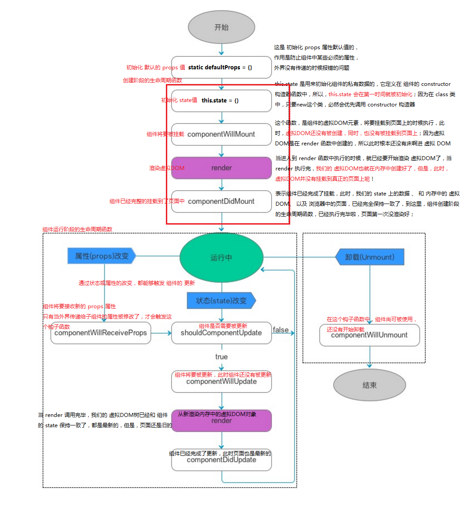

# React

## React 中的核心概念

### 虚拟 DOM

- DOM 的本质： js 表示的 UI 元素

- DOM 和 虚拟DOM

  - DOM 浏览器提供的功能，只能使用浏览器固定的 API
  - 虚拟 DOM 是程序员创建的，类似于浏览器中的 DOM，但是有本质的区别。

- 为什么要实现虚拟 DOM？

  页面中的数据，哪怕发生了一点点的变化，都会强制重建整个 DOM 树。

  这会涉及到很多元素的重绘和重排，导致性能浪费严重。

  解决办法：按需更新页面上的数据，把需要修改的数据所对应的 DOM 元素重新构建，其他没有变化的数据对应的 DOM 节点不需要被强制更新。

  - 虚拟 DOM 的本质：用 js 对象来模拟 DOM 树
  - 虚拟 DOM 的目的：为了实现 DOM 节点的高效更新

### DIFF 算法

- tree diff - 新旧 DOM 树，逐层对比的方式。

- component diff - 在对比每一层的时候，这些组件之间的对比：如果两个组件的**类型**相同，则暂时认为这个组件不需要被更新；如果组件的类型不同，则立即将旧的组件移除，新建一个组件，替换到被移除的位置。

- element diff - 在组件中，每个元素之间也要对比。元素级别的对比，就是 element diff。

- key - 这个属性，可以把 DOM 节点和虚拟 DOM 中的对象，做一层关联关系。

## React的使用

### 环境配置

1.下载

```bash
npm install react react-dom -S
npm install babel-preset-react -D
```

2.配置 webpack

```js
// 添加jsx解析
{ test: /\.jsx?$/, use: 'babel-loader', exclude: /node_modules/ }
```

```js
// 完整 webpack.config.js
var path = require('path')
var webpack = require('webpack')
var HtmlWebpackPlugin = require('html-webpack-plugin');
var ExtractTextPlugin = require('extract-text-webpack-plugin');
var OpenBrowserPlugin = require('open-browser-webpack-plugin');

// var nodeModulesPath = path.resolve(__dirname, 'node_modules')
// console.log(process.env.NODE_ENV)

module.exports = {
    entry: path.resolve(__dirname, 'app/index.jsx'),
    output: {
        path: __dirname + "/build",
        filename: "bundle.js"
    },

    resolve:{
        extensions:['', '.js','.jsx']
    },

    module: {
        // preLoaders: [
        //     // 报错 ？？？？？
        //     {test: /\.(js|jsx)$/, loader: "eslint-loader", exclude: /node_modules/}
        // ],
        loaders: [
            { test: /\.(js|jsx)$/, exclude: /node_modules/, loader: 'babel' },
            { test: /\.scss$/, exclude: /node_modules/, loader: 'style!css!postcss!sass' },
            { test: /\.css$/, exclude: /node_modules/, loader: 'style!css!postcss' },
            { test:/\.(png|gif|jpg|jpeg|bmp)$/i, loader:'url-loader?limit=10000' },  // 限制大小10kb
            { test:/\.(png|woff|woff2|svg|ttf|eot)($|\?)/i, loader:'url-loader?limit=10000'} // 限制大小小于10k
        ]
    },

    eslint: {
        configFile: '.eslintrc' // Rules for eslint
    },

    postcss: [
        require('autoprefixer') //调用autoprefixer插件，例如 display: flex
    ],

    plugins: [
        // html 模板插件
        new HtmlWebpackPlugin({
            template: __dirname + '/app/index.tmpl.html'
        }),

        // 热加载插件
        new webpack.HotModuleReplacementPlugin(),

        // 打开浏览器
        new OpenBrowserPlugin({
          url: 'http://localhost:8888'
        }),

        // 可在业务 js 代码中使用 __DEV__ 判断是否是dev模式（dev模式下可以提示错误、测试报告等, production模式不提示）
        new webpack.DefinePlugin({
          __DEV__: JSON.stringify(JSON.parse((process.env.NODE_ENV == 'dev') || 'false'))
        })
    ],

    devServer: {
        /*proxy: {
          // 凡是 `/api` 开头的 http 请求，都会被代理到 localhost:3000 上，由 koa 提供 mock 数据。
          // koa 代码在 ./mock 目录中，启动命令为 npm run mock
          '/api': {
            target: 'http://localhost:3000',
            secure: false
          }
        },*/
        port: 8888,
        contentBase: "./public", //本地服务器所加载的页面所在的目录
        colors: true, //终端中输出结果为彩色
        historyApiFallback: true, //不跳转
        inline: true, //实时刷新
        hot: true  // 使用热加载插件 HotModuleReplacementPlugin
    }
}
```

```js
// 完整 webpack.production.config.js
var path = require('path')
var webpack = require('webpack');
var HtmlWebpackPlugin = require('html-webpack-plugin');
var ExtractTextPlugin = require('extract-text-webpack-plugin');

module.exports = {
  entry: {
    app: path.resolve(__dirname, 'app/index.jsx'),
    // 将 第三方依赖 单独打包
    vendor: [
      'react',
      'react-dom',
      'react-redux',
      'react-router',
      'redux',
      'es6-promise',
      'whatwg-fetch',
      'immutable'
    ]
  },
  output: {
    path: __dirname + "/build",
    filename: "[name].[chunkhash:8].js",
    publicPath: '/'
  },

  resolve:{
      extensions:['', '.js','.jsx']
  },

  module: {
    loaders: [
        { test: /\.(js|jsx)$/, exclude: /node_modules/, loader: 'babel' },
        { test: /\.less$/, exclude: /node_modules/, loader: ExtractTextPlugin.extract('style', 'css!postcss!less') },
        { test: /\.css$/, exclude: /node_modules/, loader: ExtractTextPlugin.extract('style', 'css!postcss') },
        { test:/\.(png|gif|jpg|jpeg|bmp)$/i, loader:'url-loader?limit=5000&name=img/[name].[chunkhash:8].[ext]' },
        { test:/\.(png|woff|woff2|svg|ttf|eot)($|\?)/i, loader:'url-loader?limit=5000&name=fonts/[name].[chunkhash:8].[ext]'}
    ]
  },
  postcss: [
    require('autoprefixer')
  ],

  plugins: [
    // webpack 内置的 banner-plugin
    new webpack.BannerPlugin("Copyright by wangfupeng1988@github.com."),

    // html 模板插件
    new HtmlWebpackPlugin({
        template: __dirname + '/app/index.tmpl.html'
    }),

    // 定义为生产环境，编译 React 时压缩到最小
    new webpack.DefinePlugin({
      'process.env':{
        'NODE_ENV': JSON.stringify(process.env.NODE_ENV)
      }
    }),

    // 为组件分配ID，通过这个插件webpack可以分析和优先考虑使用最多的模块，并为它们分配最小的ID
    new webpack.optimize.OccurenceOrderPlugin(),

    new webpack.optimize.UglifyJsPlugin({
        compress: {
          //supresses warnings, usually from module minification
          warnings: false
        }
    }),

    // 分离CSS和JS文件
    new ExtractTextPlugin('[name].[chunkhash:8].css'),

    // 提供公共代码
    new webpack.optimize.CommonsChunkPlugin({
      name: 'vendor',
      filename: '[name].[chunkhash:8].js'
    }),

    // 可在业务 js 代码中使用 __DEV__ 判断是否是dev模式（dev模式下可以提示错误、测试报告等, production模式不提示）
    new webpack.DefinePlugin({
      __DEV__: JSON.stringify(JSON.parse((process.env.NODE_ENV == 'dev') || 'false'))
    })
  ]
}
```

3.配置 .babelrc 文件

```babelrc
{
  "presets": ["env", "stage-0", "react"],
  "plugins": ["transform-runtime"]
}
```

4.使用脚手架

```bash
npm install -g create-react-app
create-react-app my-app

cd my-app
npm start
```

如果 npm 版本高于 5.2.0，可以使用以下命令：

```bash
px create-react-app my-app

cd my-app
npm start
```

### ReactDOM.render()

React 是围绕可重用组件的概念设计的。所有的小组件都可以重复使用，甚至跨不同的项目。

一个React组件(最简单的形式)是一个简单的JavaScript函数

```js
function Button (props) {
  return (
    <button type="submit">{props.label}</button>
  )
}
ReactDOM.render(<Button label="Save" />, mountNode)
```

`ReactDOM.render('符合xml规范的HTML语法', 插入指定的DOM)`

```html
<!-- index.html -->
<body>
  <!-- 这是容器Div，将来使用React渲染的虚拟DOM，都会放到这个位置 -->
  <div id="app"></div>
</body>
```

```jsx
import React from 'react'
import ReactDOM from 'react-dom'

ReactDOM.render(
  <h1 id="mydiv" title="这是一个DIV">这是一个DIV</h1>,
  document.getElementById('app')
)
```

- 组件名以**大写字母开头**。小写的名称保留给HTML元素。事实上，将组件名小写命名，ReactDOM将忽略该函数并呈现常规空的HTML
- 每一个组件都接收一个属性列表，就像HTML元素一样。在 React 中，这个列表叫做 `props`。

#### jsx

HTML 语言直接写在 JavaScript 中，不加任何引号就是 jsx 的语法，jsx 允许将 HTML 与 JavaScript 混写。

```jsx
var names = ['zs', 'ls', 'ww']

function Hello (props) {
  return <div>
    <h1>{props.name}</h1>
  </div>
}

ReactDOM.render(
  <Hello>{...names}</Hello>,
  document.getElementById('app')
)
```

在 jsx 中循环遍历

```jsx
class CommentList extends ReactDOM.Component {
  constructor (props) {
    super(props)
    this.state = {
      cmts: [
        {user: 'zs', content: 'test cmt1'},
        {user: 'ls', content: 'test cmt2'},
        {user: 'ww', content: 'test cmt3'},
        {user: 'nl', content: 'test cmt4'}
      ]
    }
  }
  render () {
    return <div>
      {this.state.cmts.map((item, i) => {
        return <div key={i}>
          <p>{item.user}</p>
            <p>{item.content}</p>
        </div>
      })}
    </div>
  }
}

ReactDOM.render(<div>
  <CommentList></CommentList>
</div>, document.getElementById('app'))
```

```jsx
function CommentItem (props) {
  return <div>
    <h1>{props.user}</h1>
    <p>{props.content}</p>
  </div>
}

class CommentList extends ReactDOM.Component {
  constructor (props) {
    super(props)
    this.state = {
      cmts: [
        {user: 'zs', content: 'test cmt1'},
        {user: 'ls', content: 'test cmt2'},
        {user: 'ww', content: 'test cmt3'},
        {user: 'nl', content: 'test cmt4'}
      ]
    }
  }
  render () {
    return <div>
      {this.state.cmts.map((item, i) => {
        // return <CommentItem user="item.user" content="item.content" key={i}></CommentItem>
        return <CommentItem {...item} key={i}></CommentItem>
      })}
    </div>
  }
}

ReactDOM.render(<div>
  <CommentList></CommentList>
</div>, document.getElementById('app'))
```

## 组件

```jsx
// Hello.jsx
import React from 'react'

export default function Hello (props) {
  return <p>{props.name}</p>
}
```

```jsx
// Hi.jsx
import React from 'react'

export default Hi extends React.Component{
  constructor (props) {
    super(props)
    this.state = {
      msg: '这是 Hi 组件的私有 msg 数据'
    }
  }

  render () {
    return <div>
      <h3>这是 extends React.Component 创建的组件</h3>
      <h3>这是外部传来的数据：{this.props.address}</h3>
      <h3>这是 Hi 组件的私有 msg 数据: {this.state.msg}</h3>
    </div>
  }
}
```

```jsx
// main.js
import React from 'react'
import ReactDOM from 'react-dom'

import Hello from './components/Hello.jsx'

ReactDOM.render(
  <div>
    <Hello name="zs"></Hello>
    <Hi address="bj"></Hi>
  </div>,
  document.getElementById('app')
)
```

    注意：
    以上两种创建组件的方式，有本质的区别。
    1. 使用 function 构造函数创建的组件，内部没有 state 私有数据，只有一个 props 来接收外部传递过来的数据。
    2. 使用 class 关键字创建的组件，内部除了有 this.props 这个只读属性之外，还有一个专门用于存放自己私有数据的 this.state 属性，这个 state 是可读可写的。

- 无状态组件：使用 function 创建的组件。
  一个组件，只需要根据外部传递过来的 props，渲染固定的页面结构，适用 function 创建的无状态组件。
- 有状态组件：使用 class 创建的组件。
  一个组件，需要存放自己的私有数据，或者需要在组件的不同阶段执行不同的业务逻辑，适用 class 创建的有状态组件。

### 样式模块化

1.修改 webpack 配置

```js
// 修改 css-loader
css-loader?modules&localIdentName=[name]_[local]-[hash:8]
```

2.导入样式

```js
import itemStyles from ''
```

## React 的声明周期



## React-router

`react-router` 是一个独立的组件，安装 `npm install react-router --save`

在根目录下新建 `router` 文件夹，然后新建一个 `routerMap.jsx` 文件

```jsx
import React from 'react'
import { Router, Route, IndexRoute } from 'react-router'

import App from '../containers/App'
import Home from '../containers/HomePage/Home'
import List from '../containers/ListPage/List'
import NotFound from '../containers/NotFound/Notfound'

class RouteMap extends React.Component{
    render(){
        return(
            <Router history={this.props.history}>
                <Route path='/' component={App}>
                    <IndexRoute component={Home}/>
                    <Route path='list' component={List}/>
                    <Route path="*" component={NotFound}/>
                </Route>
            </Router>
        )
    }
}
export default RouteMap
```

在 App.jsx 里引用相应的路由切换组件 `{this.props.children}`

```jsx
import React from 'react'
import Head from '../components/head/head'
import Menu from '../components/Menu/menu'
class App extends React.Component {
  render() {
    return (
      <div>
        <Head/>
        <div className="wrap">
          <div className="menu">
            <Menu/>
          </div>
          <div>{this.props.children}</div>
        </div>
      </div>
    )
  }
}
export default App
```

在根目录下的入口文件index.jsx引入routerMap

```jsx
import React from 'react';
import ReactDOM from 'react-dom';

import RouteMap from './router/routerMap'
import {hashHistory} from 'react-router'

import  './static/index.scss'

ReactDOM.render(
  <RouteMap history={hashHistory}/>,
  document.getElementById('root')
);
```

使用菜单链接进行路由跳转

```jsx
import React from 'react'
import { Link } from 'react-router'
class Menu extends React.Component{
    render(){
        return(
            <div className="menu">
                <ul>
                    <li>
                        <Link to="/">Home</Link>
                    </li>
                    <li>
                        <Link to="/list" activeClassName="active">List</Link>
                    </li>
                </ul>
            </div>
        )
    }
}
export default Menu
```

## react-redux

### 1. 定义计算规则 reducers

在根目录下新建一个 reducers 文件夹，下面新建 index.js 用来存放所有的规则，比如需要定义 userinfo 部分的返回规则，就新建一个 userinfo.js：

```js
// /reducers/userinfo.js
import * as actionTypes from '../constants/userinfo'

const initialState = {}

export default function userinfo (state = initialState, action) {
  switch (action.type) {
    // login
    case actionTypes.USERINFO_LOGIN:
      return action.data
    // update city
    case actionTypes.UPDATE_CITYNAME:
      return action.data
    default:
      return state
  }
}
```

这里通过 actionTypes来统一管理这些变量的名称，一是两个地方用到，二是为了统一管理，所以单独起的一个constants的文件，然后里边有一个userinfo.js的文件

```js
// /constants/userinfo.js
export const USERINFO_LOGIN = 'USERINFO LOGIN'
export const UPDATE_CITYNAME = 'UPDATE CITYNAME'
```

```js
// /reducers/index.js
import { combineReducers } from 'redux'

import userinfo from './userinfo'

const rootReducer = combineReducers({
  userinfo
})

export default rootReducer
```

reducers文件夹下index.js就是为了统一管理各个模块的数据，当有多个js时就可以把他们全部注册进combineReducers然后统一输出rootReducer。

### 2. 生成 store

在根目录新建 store/configureStore.js

```js
import { createStore } from 'redux'
import rootReducer from '../reducers'  //引入第一步生成的规则

export default function configureStore (initialState) {
  const store = createStore(rootReducer, initialState,
    // 触发 redux-devtools
    window.devToolsExtension ? window.devToolsExtension() : undefined
  )
  return store
}
```

### 3. 引入 store，监听变化

```js
// 项目入口 index.js
import React from 'react'
import { render } from 'react-dom'
import { Provider } from 'react-redux'
import configureStore from './store/configureStore'

import Hello from './containers/Hello'

const store = configureStore()

render(
  <Provider store={store}>
    <Hello />
  </Provider>,
  document.getElementById('root')
)
```

### 4. 组件中把state值赋予到props，看hello.jsx的代码

```js
import React from 'react'
import { connect } from 'react-redux'
import { bindActionCreators } from 'redux'

import * as userinfoActions from '../actions/userinfo'

import A from '../components/A'
import B from '../components/B'
import C from '../components/C'

class Hello extends React.Component {
  render () {
    return (
      <div>
        <p>hello world</p>
        <hr />
        <A userinfo={this.props.userinfo} />
        <hr />
        <B userinfo={this.props.userinfo} />
        <hr />
        <C actions={this.props.userinfoActions} />
      </div>
    )
  }
  componentDidMount () {
    // 模拟登陆
    this.props.userinfoActions.login({
      userid: 'abc',
      city: 'beijing'
    })
  }
}
//把state赋予到props->userinfo
function mapStateToProps (state) {
  return {
    userinfo: state.userinfo
  }
}
//第五步：定义事件，触发action或者更改state的值，然后把事件赋予到props
function mapDispatchToProps (dispatch) {
  return {
    userinfoActions: bindActionCreators(userinfoActions, dispatch)
  }
}
//通过connect函数把两个方法跟组件联系到一起然后输出
export default connect(
  mapStateToProps,
  mapDispatchToProps
)(Hello)
```

### 5. 如果想改变reduce里边state的值，那么就需要通过事件去dispatch action

这里定义了一些action事件：

```js
// app/actions/userinfo.js
import * as actionTypes from '../constants/userinfo'

export function login (data) {
  return {
    type: actionTypes.USERINFO_LOGIN,
    data
  }
}
export function updateCityName (data) {
  return {
    type: actionTypes.UPDATE_CITYNAME,
    data
  }
}
```

然后在组件中通过 `import * as userinfoActions from '../actions/userinfo'` 进来，接着通过函数：

```js
function mapDispatchToProps (dispatch) {
  return {
    userinfoActions: bindActionCreators(userinfoActions, dispatch)
  }
}
```

赋予到 `props userinfoActions` 中；
接着使用：

```js
componentDidMount() {
  // 模拟登陆
  this.props.userinfoActions.login({
    userid: 'abc',
    city: 'beijing'
  })
}
```

## fetch

```jsx
getMoviesFromApiAsync() {
  return fetch('https://facebook.github.io/react-native/movies.json')
    .then((response) => response.json())
    .then((responseJson) => {
      return responseJson.movies;
    })
    .catch((error) => {
      console.error(error);
    });
}
```

ES7 的语法：

```jsx
// 注意这个方法前面有async关键字
async getMoviesFromApi() {
  try {
    // 注意这里的await语句，其所在的函数必须有async关键字声明
    let response = await fetch('https://facebook.github.io/react-native/movies.json');
    let responseJson = await response.json();
    return responseJson.movies;
  } catch(error) {
    console.error(error);
  }
}
```