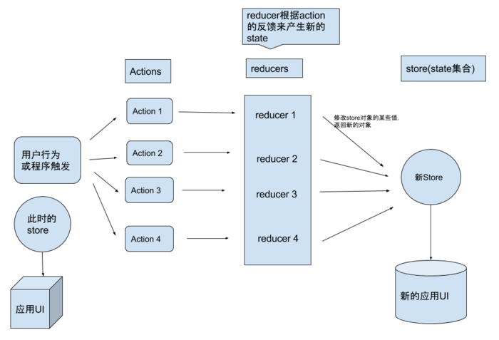
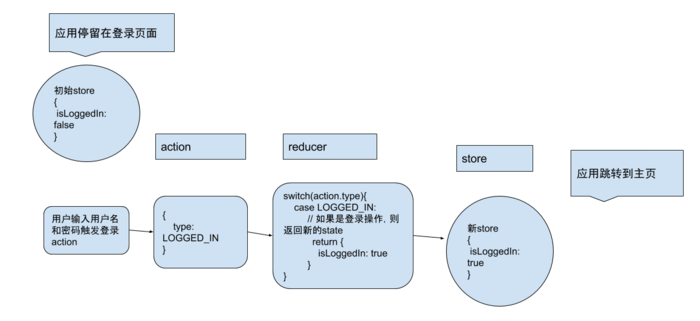

# React Native Redux

## Redux 是什么？

Redux 是一个用于管理 js 应用状态的容器。
React Native 的数据传递是父类传递给子类，子类通过 this.props.** 读取数据，这样会造成组件多重嵌套，于是用redux可以更好的解决了数据和界面View之间的关系， 当然用到的是react-redux,是对redux的一种封装。

## Redux 的使用三原则

- 1.**单一数据源**

整个应用的state，存储在唯一的一个 object 中，同时也只有一个 store 用于存储这个 object。

- 2.**状态只读**

唯一改变 state 的方法就是**触发 action 操作**。action 是用来描述正在发生的事件的一个对象。

- 3.**使用纯函数**

在改变 state tree 时，用到 action，同时也需要编写对应的 reducers 才能完成 state 的改变。
reducers 是一个**纯函数**。

## Redux 状态管理的流程

- action 是用户触发或程序触发的一个普通对象，是纯声明式的数据结构，只提供事件的所有要素，不提供逻辑，同时尽量减少在 action 中传递的数据
- reducer 根据 action 的操作做出不同的响应，返回一个新的 state，是一个匹配函数，action 的发送是全局的，所有的 reducer 都可以捕捉到并匹配与自己相关与否，相关就拿走 action 中的要素进行逻辑处理，修改 store 中的状态，不相关就不对 state 做处理原样返回。reducer 里就是判断语句。
- store 的最终值就是由 reducer 的值来确定的，当需要拆分数据处理逻辑时，你应该使用 reducer 组合，而不是创建多个 store。


上图展示了 redux 的状态改变流程。`action -> reducer -> new store -> UI`。
下图展示具体实例：


- store 是用于维护状态的容器，包括了应用的多个状态，比如用户是否登录，用户信息，用户任务等等。
- action 是一个普通对象，用于指明那种操作，这样才能在 reducers 中进行识别。
- reducers 是负责返回新的 state 函数。
- 在实际应用中，需要将 store 或 store 的某个页面绑定到界面，这样更新 store 的时候，该页面可以监听到值得更新，从而进行跳转或者刷新等操作。

## middleware

redux 设计如此简洁，以至于并没有进行异步处理的功能。但是留下了 middleware 这个概念。可以自己编写符合需要的中间件。目前第三方的中间件基本可以完成一个复杂应用的架构设计。那就先说一说，怎么去处理异步请求呢。
首先推荐 redux-thunk ，可以看到它的源码很简洁。就是判断 action 是否是函数，如果是函数进行递归式的操作。所以在 redux 中的异步，只能出现在 action 中，而且还需要有中间件的支持。

```javascript
export default function thunkMiddleware ({ dispatch, getState }) {
  return next => action => {
    if (typeof action === 'function') {
      return action(dispatch, getState)
    }
    return next(action)
  }
}
// redux-thunk的源码
```

> 同步 action 与异步 action 最大的区别是：
> 同步只返回一个普通 action 对象。而异步操作中途会返回一个 promise 函数。当然在 promise 函数处理完毕后也会返回一个普通 action 对象。thunk 中间件就是判断如果返回的是函数，则不传导给 reducer，直到检测到是普通 action 对象，才交由 reducer 处理。

## demo

```bash
create-react-native-app ReactNativeRedux
yarn add redux react-redux redux-thunk redux-persist
```

- redux
- react-redux
- redux-thunk (一个异步的中间件实现库)
- redux-persist (redux-persist是Redux的持久化的实现，可根据项目需求来确定要不要安装)