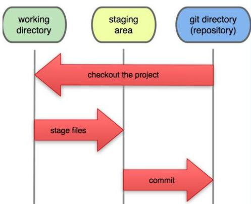

# linux 和 git

## Linux 部分

### 命令行

- dos windows 下
- shell Linux 下
- dos 与 shell 的区别 引用自 [cdsn](http://blog.csdn.net/xiaoxinyu316/article/details/43486411)
  - shell区分大小写，DOS不区分大小写
  - shell的命令的开关可以简写（比如说“-a -l“可以简写为“-al“），而DOS的则不允许
  - 在脚本编写上的语法差别极大，比如说：两者的流程控制语句语法不同，变量的语法不同等
  - shell可以在UNIX、GNU/Linux和Win下（cygwin bash shell）工作，DOS则还没有听说过能在Win/DOS以外的系统中工作；
  - shell原生支持正则表达式，DOS则不是。

### 常用命令

```bash
pwd # 查看当前目录 -- print working directory
cd # 切换目录 -- change directory
ls # 查看当前目录下内容
  ls -al
mkdir # 创建目录 -- make directory
touch # 创建文件
cat #查看文件内容
less # 查看文件
rm # 删除文件 remove
  rm -rf
rmdir # 删除文件夹 -- 只能删除空文件夹
mv # 移动文件 -- move
  mv a ../folder/b # 移动同时改名
cp # 复制文件
```

### 常用操作

```bash
tab # 自动补全
> # 写入 (覆盖)
>> # 写入 (追加)
  echo hello >> test.md
grep # 筛选
  ls | grep h # 配合管道符使用
```

### vi

vi 的三种模式:


#### vi 的常用操作

- 打开/创建文件， vi 文件路径
- 底行模式
  - 底行模式 :w保存，:w filenme另存为
  - 底行模式 :q退出
  - 底行模式 :wq保存并退出
  - 底行模式 :e! 撤销更改，返回到上一次保存的状态
  - 底行模式 :q! 不保存强制退出
  - 底行模式 :set nu 设置行号
- 命令模式
  - 命令模式 ZZ（大写）保存并退出
  - 命令模式 u辙销操作，可多次使用
  - 命令模式 dd删除当前行
  - 命令模式 yy复制当前行
  - 命令模式 p 粘贴内容
  - 命令模式 ctrl+f向前翻页
  - 命令模式 ctrl+b向后翻页
  - 命令模式 i进入编辑模式，当前光标处插入
  - 命令模式 a进入编辑模式，当前光标后插入
  - 命令模式 A进入编辑模式，光标移动到行尾
  - 命令模式 o进入编辑模式，当前行下面插入新行
  - 命令模式 O进入编辑模式，当前行上面插入新行

## GIT

版本控制工具: 方便, 高效

### git 的三个工作区域

工作目录, 暂存区, 本地仓库



### git 管理文件的 4 种状态

-	未追踪 untraced -- 工作目录
  -已暂存 staged -- 暂存区
  -已提交 commited -- 本地仓库
  -已修改 modified -- 工作目录

### git 命令

#### 新项目添加

```bash
# 配置用户信息
git config --global user.name 用户名
git config --global user.email 邮箱

# 查看配置信息
git config [--list|--global]

# 初始化本地仓库
git init

# 添加项目文件
git add *|文件列表 # 工作区添加到缓存区

# 提交代码
git commmit -m "" # 暂存区提交到本地仓库

# 推送代码
git push 远程仓库地址 本地分支名称:远程分支名称

# 其他命令
# 查看文件状态
git status

# 查看提交记录
git log
```

#### 回滚操作

```bash
# 从缓存区删除
git rm --cached 文件名

# 回滚所有暂存区已经修改的操作 -- 无法恢复
git checkout .  # 暂存区覆盖工作区

# 回滚到指定版本 会覆盖缓存区 覆盖工作目录 执行三种操作
git reset --hard commitId(前七位即可)

# 只回滚本地仓库快照 执行一种操作
git reset --soft commitId(前七位即可)

# 回滚本地仓库的快照 覆盖暂存区 不覆盖工作目录 执行两种操作
git reset [--mixed] commitId(前七位即可)

# 回滚最后一次提交
git reset --hard HEAD^ # HEAD - 本地仓库的最新快照, ^ - 上一次

```

#### 分支操作

```bash
# 查看分支
git branch -a(所有分支) -r(远程分支)

# 创建分支
git branch 分支名

# 切换分支
git checkout 分支名

# 创建并切换分支
git checkout -b 分支名称

# 合并分支
git merge 分支名(来源分支) # 在 master 上执行

# 删除分支
git branch -d 分支名 # 分支必须被合并过才能删除
git branch -D 分支名 # 强制删除

# 删除远程分支
git push origin --delete 分支名称
git push origin:分支名称
```

### 远程仓库

```bash
# 查看远程仓库别名
git remote -v

# 创建别名
git remote add 别名名称 远程仓库地址 # 别名名称常用 origin

# 重命名别名
git remote rename 原来名称 新名称

# 删除别名
git remote remove 别名名称
```

### 已有项目

```bash
# 下载项目
git clone 远程仓库地址 [项目名称]
git pull 远程仓库地址 远程分支名称:本地分支名称

# 忽略文件
# 在根路径创建 .gitignore 文件, 并上传

# 保存现场
git stash
# 恢复现场
git stash pop
```

