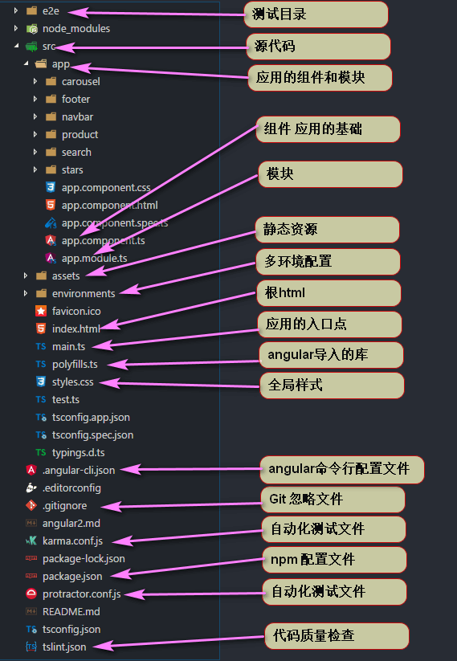

# angular2

## 安装

`npm install -g @angular-cli` 安装脚手架
`ng -v` 查看安装版本
`ng new appName` 创建项目



## 组件

### 装饰器

组件源数据装饰器 @Component() -- 告知 angular 框架如何处理一个 typescript 类

@Component() 装饰器包含多个属性 这些属性的值叫做源数据

angular 会根据这些源数据的值渲染组件, 并执行组件的逻辑

```typescript
// 装饰器 必须使用 @Component 注解
@Component({
  // 装饰器中的属性 -- 源数据
  selector: 'app-root', // 选择器 说明这个组件可以通过 app-root 这个标签调用
  // 模板 -- 组件的必备属性
  templateUrl: './app.component.html',
  styleUrls: ['./app.component.css']
})
// AppComponent 是普通 typescript 类
// @Component 告诉 angular 将 typescript 类识别为组件
export class AppComponent {
  // 定义组件的控制器
}
```

### 模板

模板定义组件的外观

模板以 html 形式存在, 可以使用 angular 数据绑定语法, 来呈现控制器中的数据

### 控制器

控制器被装饰器装饰

控制器包含所有的组件属性和方法, 绝大多数的页面逻辑都写在控制器中

控制器通过数据绑定与模板通讯, 模板展现控制器的数据, 控制器处理模板上发生的数据

### 其它可选属性

#### 输入属性 @Inputs()

接收外部传入的数据的, 使父组件可以直接传递数据给子组件

#### 提供器 providers

用来做依赖注入

#### 声明周期钩子 Lifecycle Hooks

组件从创建到销毁的过程中有多个钩子会被触发和执行各种应用逻辑

#### 样式表 styles

组件可以关联一些样式表文件, 来提供一些组件专用的样式

#### 动画 Animations

与组件相关的动画效果, 如: 淡入, 淡出等

#### 输出属性 @Outputs

用来在组件间共享数据

## 模块

模块也是带着装饰器的 typescript 类

```typescript
@NgModule({
  // 声明模块中有什么
  declarations: [
    // 只能声明 组件 指令 管道,
    AppComponent, NavbarComponent, FooterComponent, SearchComponent, CarouselComponent, ProductComponent, StarsComponent
  ],
  // AppModule 依赖的其他模块
  imports: [
    // web 应用的必选依赖
    BrowserModule
  ],
  // 模块中提供了什么服务 -- 只能声明服务
  providers: [],
  // 模块的主组件
  bootstrap: [AppComponent]
})
export class AppModule { }
```

## 路由

### Routes

路由配置, 保存着哪个 URL 对应展示哪个组件, 以及在哪个 RouterOutlet 中展示组件

### RouterOutlet

在 HTML 中标记路由内容呈现位置的占位符指令

### Router

负责在运行时执行路由的对象, 可以通过调用 navigate() 和 navigateByUrl() 方法来导航到一个指定的路由

### RouterLink

在 HTML 中声明路由导航用的指令

### ActivatedRoute

当前激活的路由对象, 保存着当前路由的信息, 如路由地址, 路由参数等