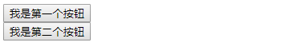
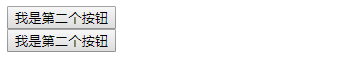

# AngularJs

angularjs 是一款非常优秀的前端框架

- 框架和库
  - 无论是 angularjs 还是 jQuery 都是原生 js 封装的
  - 框架: **提供代码的书写规则** 按照规则书写代码 框架会帮我们实现响应的功能
  - 库: 对代码进行封装 调用封装的方法 **简化操作**

- angularjs 的核心思想
  - 通过指令扩展 HTML 功能, 通过差值表达式绑定数据到 HTML
  - 不推荐在控制器中直接操作 dom, 而是通过指令操作
  - 以数据为中心, 用数据操作 dom

## 插值表达式

`{{}}` 这种双大括号的形式称之为插值表达式

- 差值表达式的作用
  - 在表达式中可以写ng中的变量
  - 可以显示字符串
  - 在表达式中可以进行计算
  - 可以在表达式中写三目运算符
  - 执行angularjs函数

## 路由

- 配置页面之间的跳转关系的
- 配置锚点与页面之间的对应关系

angularjs 的路由功能是作为一个单独模块存在的, 要使用路由, 需要将路由模块作为主模块的依赖

### angularjs 中模块的依赖步骤

- 将要依赖的模块文件引入页面
- 将模块的名字写在主模块的第二个参数中
  模块名: angular-route  =>  ngRouter
- 路由的配置方法

  ```javascript
  模块对象.config(function($routerProvider){
    // 路由的具体配置要写在回调函数中
    // $routerProvider 路由器配置对象
    // when 当...时生效
    $routerProvider.when('锚点', {
      templateUrl:'模板文件路径 相对路径'
    })
  })
  ```

  ```html
  <!-- angularjs会将获取到的模板文件内容放在页面中有ng-view指令的元素中  -->
  <div ng-view></div>
  ```

  ```html
  <body ng-app="myApp">

  <!-- 注意写法 -->
  <a href="#!/index">首页</a>
  <a href="#!/list">列表页</a>

  <div ng-view></div>

  <script src="node_modules/angular/angular.min.js"></script>
  <script src="node_modules/angular-route/angular-route.min.js"></script>
  <script>
    var app = angular.module('myApp',['ngRoute']);
    app.config(function($routeProvider){
      $routeProvider
        // 注意写法
        .when('/index',{
          // templateUrl:'./tpl/index.html', // localhost
          // template:'<div>我是首页</div>', // file | localhost
          controller:'indexCtrl',
          templateUrl:'indexTpl' // file | localhost
        })
        .when('/list',{
          // templateUrl:'./tpl/list.html',
          // template:'<div>我是列表页</div>',
          controller:'listCtrl',
          templateUrl:'listTpl'
        })
        .otherwise('/index')
    });

    app.controller('indexCtrl',function($scope){
      $scope.msg = "我是首页msg"
    })

    app.controller('listCtrl',function($scope){
      $scope.msg = "我是列表页msg"
    })
  </script>
  <script id="indexTpl" type="text/ng-template">
    <div>我是首页 indexTpl</div>
  </script>
  <script id="listTpl" type="text/ng-template">
    <div>我是列表页 listTpl</div>
  </script>
  </body>
  ```

### 路由传递参数

需求：从列表页跳转到详情页 将列表页的文章ID传递到详情页

路由传递参数分为三步

  1.在被传递参数页面(详情页)的路由中配置参数占位符(类似于函数的形参)

  2.在传递参数页面(列表页)的跳转链接中将实际的参数传递过去

  3.在被传递参数页面(详情页)的控制器中获取传递过来的参数

```html
<body ng-app="myApp">

  <a href="#!/index">首页</a>
  <a href="#!/list">列表页</a>

  <div ng-view></div>

  <script src="node_modules/angular/angular.min.js"></script>
  <script src="node_modules/angular-route/angular-route.js"></script>

  <script>
    var app = angular.module('myApp',['ngRoute'])

    app.config(function($routeProvider){

      $routeProvider
        .when('/index',{
          templateUrl:'indexTpl'
        })
        .when('/list',{
          templateUrl:'listTpl'
        })
        // 注意写法
        .when('/article/:id/:title',{
          templateUrl:'articleTpl',
          controller:'articleCtrl'
        })
        .otherwise('/index');
    })

    app.controller('articleCtrl',function($routeParams,$scope){

      // $routeParams 对象 里面保存这传递过来的路由参数
      console.log($routeParams)
      $scope.msg = "当前页面的ID是" + $routeParams.id;

    })

  </script>
  <script type="text/ng-template" id="indexTpl">
    <div>我是首页</div>
  </script>
  <script type="text/ng-template" id="listTpl">
    <ul>
      <li><a href="#!/article/1/我是第1篇文章">我是第1篇文章</a></li>
      <li><a href="#!/article/2/我是第2篇文章">我是第2篇文章</a></li>
      <li><a href="#!/article/3/我是第3篇文章">我是第3篇文章</a></li>
    </ul>
  </script>
  <script type="text/ng-template" id="articleTpl">
    <div>我是详情页</div>
    {{ msg }}
  </script>
</body>
```

## 控制器

### 控制器中的 $scope 为什么不能改成其他的名字

- angularjs 是根据形参名字传递实参的 如果名字改变了 angularjs

### 安全方式创建控制器

```javascript
模块对象.controller('名字', ['$scope', '$http', '$location', function($scope, $http, $location){

}])

```

```javascript
// 压缩工具不会对字符串进行压缩
angular.module('myApp',[]).controller('demoCtrl', ['$scope', '$timeout', '$http', '$location', function (a, b, c, d){
  a.msg = '我是msg'
}])
```

### angularjs 中的作用域

- 局部作用域
  - angularjs 中控制器控制的区域就是一块局部作用域
  - $scope 代表的就是局部作用域
  - 作用域嵌套的情况下 数据是一层一层通过 $scope 向外部查找的 直到全局作用域
  - 相邻控制器之间是独立的 互不影响的
- 全局作用域
  - $rootScope代表的就是全局作用域
  - 挂载到全局作用域中的数据 每个控制器中都可以拿到

## 常用指令

以 `ng-` 开头的属性,称之为指令

- 指令分类:内置指令(普通指令、事件指令) 自定义指令

### 普通指令

#### ng-app

ng-app 指定应用根元素，至少有一个元素指定了此属性。

- 页面加载完成以后angularjs会在页面中查找这个指令
- 没有找到:angularjs将不会启动
- 找到:angularjs将会执行指令所在标签内部包裹的代码
- 可以接受模块名字作为参数 angularjs会将当前页面交给指令所指定的模块去管理

#### ng-model

- 获取表单元素的值
- 实现双向数据绑定

- 双向绑定：
  - 双向: html 和 js
  - 数据：angularjs中的变量
  - html=>js  js=>html
  - html中通过表单元素将数据改变 js中跟着同步
  - js中将数据改变 html中跟着同步
- 实现双向数据绑定的必要条件
  - 必须是表单元素 并且元素身上有ng-model指令

#### ng-controller 指定控制器

####　ng-init

- 初始化数据

#### ng-repeat 遍历数据

ng-repeat 可以遍历数组, 对象, 数组中混合对象

`ng-repeat="变量 in 数据"`

```html
<ul>
  <li ng-repeat="item in data">{{item}}</li>
  <li ng-repeat="p in persons">
    {{p.name}}---{{p.age}}
    <!-- ng-repeat 支持嵌套 -->
    <span ng-repeat="item in p.hobby">{{item}}</span>
  </li>
  <li ng-repeat="(key,value) in obj">{{key}}---{{value}}</li>
</ul>
```

```javascript
<script src="node_modules/angular/angular.min.js"></script>
<script>
angular.module('myApp', [])
  .controller('demoCtrl', ['$scope', function($scope){
    $scope.data = ['小明','小红','小梁','小胖']
    $scope.person = [
      {name:'小明', age:18},
      {name:'小红', age:29},
      {name:'小梁', age:20},
      {name:'小胖', age:32}
    ]
    $scope.obj = {
      name:'小明',
      age:25,
      hobby:['吃饭','睡觉','打豆豆']
    }
  }])
</script>
```

**`ng-repeat` 中的默认参数**

- $index 当前循环的索引
- $first 当前循环是否是第一次循环
- $last 当前循环是否是最后一次循环
- $middle 当前是否是中间项 除了第一项和最后一项
- $even 是否是偶数项
- $odd  是否是奇数项

```html
<!-- 判断是否是第一次循环 加样式 -->
<ul>
  <li ng-repeat="item in arr" class="{{$first ? 'first' : ''}}">{{item}}</li>
</ul>

<!-- 通过奇偶数实现隔行变色 -->
<style>
  .even{background:pink;}
  .odd{background:lightblue;}
</style>
<ul>
  <li ng-repeat="item in person" class="{{$even ? 'even' : 'odd'}}">
    ...
  </li>
</ul>
```

默认情况下遍历的数组中不能有重复类型的值(基本数据类型) 否则会报错 信息如下

`[ngRepeat:dupes]  ng-repeat指令被愚弄(调戏)了`

当循环的数据中有重复项时, **使用 `track by $index`**

```html
<ul>
  <li ng-repeat="item in arr track by $index">{{item}}</li>
</ul>
<script src="node_modules/angular/angular.js"></script>
<script>
  angular.module('myApp', [])
    .controller('demoCtrl', ['$scope', function($scope){
      $scope.arr = ['a','b','b','a','c','c','d']
    }])
</script>
```

#### ng-class控制类名

- 1.指令的值以对象的形式存在
- 2.对象的属性值转化为布尔值是true时,将当前的属性名作为类名添加到class属性中
- 3.对象的属性值转化为布尔值是false时,将当前的属性名从class属性中删除掉
- 4.属性值可以是数据模型,也可以是JS表达式

注意：angular不推崇DOM操作,在当前例子中并没有直接操作类名的JS语句,而是通过数据模型isGreen的值是true还是false来确定添加哪个颜色的类名,至于如何添加到class属性中,由angular替我们完成。

```html
<body ng-app="myApp" ng-controller="demoCtrl">
  <style>
    button{
      width:120px;
      height:40px;
      border:none;
      outline:none;
      color:#fff;
      font-size:16px;
    }
    .red{
      background: red;
    }
    .green{
      background: green;
    }
  </style>

  <button ng-class="{'green':isGreen, 'red':!isGreen}" ng-click="setColor()">按钮</button>

  <script>
    angular.module('myApp',[]).
      controller('demo', ['$scope', function($scope){
        $scope.setColor = function(){
          $scope.isGreen = !$scope.isGreen
        }
      }])
  </script>
</body>
```

#### ng-bind ng-bind-template 数据绑定 解决表达式闪烁问题

在angular没有被加载进页面之前,浏览器会将下面的表达式当作普通字符串显示在页面中,angular在被加载进页面之后,才会将下面的表达式替换成了对应的数据,这样就会存在闪烁问题

用指令ng-bind绑定数据解决这个问题
*ng-bind指定是专门用来做数据绑定的*

语法:
`ng-bind="数据"`
`ng-bind-template="{{数据1}} {{数据2}}"`

#### ng-non-bindable 不解析表达式

包含 ng-non-bindable 指令的区域其他任何指令都是不生效的

```html
<div ng-non-bindable ng-init="msg='1122'">
  <!-- {{msg不会解析}} -->
  {{ hello }} {{msg}}
</div>
<!-- init 也是无效的 -->
{{msg}}
```

#### ng-show ng-hide ng-if 元素显示隐藏

- ng-show="布尔值" 控制元素的显示和隐藏
- ng-hide="布尔值" 控制元素的显示和隐藏
- ng-if="布尔值" 控制元素的显示和隐藏 true 显示 false 隐藏
- ng-show ng-hide 是通过样式的方式达到显示隐藏元素的目的
- ng-if 是通过增加和删除DOM节点的方式达到显示隐藏元素的目的

> ng-if 会隐式的产生新作用域，ng-switch、ng-include等动态创建一块界面的也是如此。
>
> 这样会导致，在 ng-if 中用基本变量绑定 ng-model，在外层 div 中把此 model 绑定给另一个显示区域，内层改变时，外层不会同步改变。因为此时已经是两个变量了。
>
> ```html
> <p>{{name}}</p>
> <div ng-if="true">
>     <input type="text" ng-model="name">
> </div>
> ```
>
> `ng-show` 不会有这个问题，因为他不自带一级作用域。
>
> 避免这类问题出现的办法是，始终将页面中的元素绑定到对象的属性（data.x）而不是直接绑定到基本变量（x）上。详见[AngularJS 中的作用域](http://huangtengfei.com/2015/09/scope-in-angularjs/)

#### ng-switch、ng-switch-when

ng-switch ng-switch-when 是一对指令类, 似于JS中 switch case 语句

匹配到哪项 哪项就显示 其他项就隐藏

常用于 做多个选项卡的显示和隐藏

```html
<body ng-app ng-init="showNum=1">
  <div ng-switch="showNum">
    <button ng-click="showNum=1">显示1</button>
    <button ng-click="showNum=2">显示2</button>
    <button ng-click="showNum=3">显示3</button>
    <div ng-switch-when="1">1</div>
    <div ng-switch-when="2">2</div>
    <div ng-switch-when="3">3</div>
  </div>
  <script src="node_modules/angular/angular.min.js"></script>
</body>
```

#### ng-options 循环下拉列表

### 事件指令

#### ng-click 给指令所在元素绑定点击事件

#### ng-dblclick

#### ng-blur

#### ng-focus

#### ng-change

### 其他指令

#### ng-src增强图片路径

#### ng-href增强地址

#### ng-include引入模板

#### ng-disabled表单禁用

#### ng-readonly表单只读

#### ng-checked单/复选框表单选中

#### ng-selected下拉框表单选中

## angular 中的数据请求方式

### 标准方法 $http

```javascript
$http({
  url:'',
  method:'get/post',
  params:{ // get 传参参数
    a:1,
    b:2
  },
  data:{  // post 传参参数
    c:3,
    d:4
  }
}).then(function(res){
  // do success
}, function(err){
  // do error
})
```

### 简化方法 \$http.get() \$http.post()

```javascript
$http.get('url', {params:{a:1,b:2}}).then(function(res){
  // do success
})

$http.post('url', {c:3,d:4}).then(function(res){
  // do success
})
```

## jqLite

为了方便DOM操作 angularjs给我们提供了一个jquery精简版 叫做jqLite

$(原生JS对象) 将原生JS对象转换成jquery对象 目的是为了使用jquery对象下面提供方法

angular.element(原生JS对象) 将原生JS对象转换成jqLite对象 目的是为了使用jqLite对象下面提供方法

```html
<body ng-app="myApp" ng-controller="demoCtrl">
  <div id="box"></div>

  <script src="node_modules/angular/angular.js"></script>
  <script>
    angular.module('myApp', [])
      .controller('demoCtrl', ['$scope', function($scope){
        angular.element(document.getElementById('box')).css('backgroundColor', 'red')
      }])
  </script>
</body>
```

## 控制器补充

### 以面向对象的方式使用控制器

- angular 内部会 new 控制器函数
- demoCtrl as hello 中 hello 就是 new 出来的对象
- 在视图中使用 hello.属性 的方式获取值
- 面向对象的方式和 $scope 可以同时使用

```html
<body ng-app="myApp" ng-controller="demoCtrl as hello">

  <p>{{hello.name}}</p>
  <p>{{age}}</p>

  <script src="./node_modules/angular/angular.min.js"></script>
  <script>
    angular.module('myApp', [])
      .controller('demoCtrl', ['$scope', function ($scope) {
        this.name = '孙悟空'
        $scope.age = 500
      }])
  </script>
</body>
```

### $scope.$watch

监控数据的变化
只要数据发生变化, 就执行回调函数

回调函数的参数: newValue oldValue
注意: 页面一加载, 就会执行一次回调函数

```html
<body ng-app="myApp" ng-controller="demoCtrl">

  <input type="text" ng-model="val"> {{tips}}

  <script src="./node_modules/angular/angular.min.js"></script>
  <script>
    angular.module('myApp', [])
      .controller('demoCtrl', ['$scope', function ($scope) {
        $scope.val = '初始值'
        $scope.$watch('val', function(newValue, oldValue){
          if(newValue.length > 10){
            $scope.tips = '大于10'
          } else {
            $scope.tips = '小于10'
          }
        })
      }])
  </script>
</body>
```

### $scope.$apply

通过非 angularjs 指令将 angularjs 中的数据做了改变以后, 破坏了 angularjs 的双向绑定机制, 需要调用 $scope.apply() 方法通知 angularjs 数据已经改变, 视图要做出相应改变

```html
<body ng-app="myApp" ng-controller="demoCtrl">

  <input type="text" ng-model="val">
  <button onclick="clickFn()">设置值</button>

  <script src="./node_modules/angular/angular.min.js"></script>
  <script>
    angular.module('myApp', [])
      .controller('demoCtrl', ['$scope', function ($scope) {
        // 1. 原生 js 改变
        window.clickFn = function(){
          $scope.val = "123"
          $scope.$apply()
        }
        // 2.setTimeout
        setTimeout(function(){
          $scope.val = "456"
          $scope.$apply()
        }, 2000)
        // 3.ajax
        var xhr = new XMLHttpRequest()
        xhr.open('get', './test.json', true)
        xhr.send()
        xhr.onreadystatechange = function(){
          if(xhr.readyState == 4){
            if(xhr.status == 200){
              $scope.val = xhr.responseText
              $scope.$apply()
            }
          }
        }
      }])
  </script>
</body>
```

## 自定义指令

**在 angularJS 中, 只要操作 dom 就要想到*指令***

### 自定义指令的作用

- 增强 HTML 标签的功能
- 自定义 HTML 标签
- 操作 DOM

### 自定义指令的语法

```javascript
模块对象.directive('名字', ['$timeout', function($timeout){
  return {
    // TODO
  }
}])
```

#### 自定义指令以标签的方式存在

```html
<body ng-app="myApp" ng-controller="demoCtrl">

  <!-- 自定义指令以标签的方式存在 -->
  <my-header>
    <i>标签内部内容</i>
  </my-header>

  <script src="./node_modules/angular/angular.min.js"></script>
  <script>
    angular.module('myApp', [])
      .directive('myHeader', [function(){
        return {
          // 使用的模板
          templateUrl: 'myHeaderTpl',
          // 是否用模板的内容替换掉自定义标签, 而不是将模板的内中追加到自定义标签内部
          relpace: true,
          // 保存自定义标签之间的内容
          transclude: true
        }
      }])
      .controller('demoCtrl', ['$scope', function ($scope) {
        //
      }])
  </script>
  <script type="text/ng-template" id="myHeaderTpl">
    <h1>这是一个my-header自定义标签<span ng-transclude></span></h1>
  </script>
</body>

```

#### 自定义指令以属性的方式存在

```html
<body ng-app="myApp" ng-controller="demoCtrl">

  <div my-dir="red" title="123" abc="456">1111</div>
  <div my-dir="blue" title="123" abc="456">2222</div>

  <script src="./node_modules/angular/angular.min.js"></script>
  <script>
    angular.module('myApp', [])
      .directive('myDir', [function () {
        return {
          // 专门写 dom 操作的地方
          link: function (scope, element, attributes) {
            // element 指令所在的元素
            // attributes 指令所在元素身上的属性集合
            element.css('background', attributes.myDir)
          }
        }
      }])
      .controller('demoCtrl', ['$scope', function ($scope) {

      }])
  </script>
</body>

```

#### 自定义指令 scope 的作用域

directive 默认使用 scope:false 不会创建子作用域
创建的指令继承了父级作用域的一切属性和方法
也就是在指令模板中可以直接使用父作用域中的变量, 函数

```html
<body ng-app="myApp" ng-controller="demoCtrl">

  <div my-dir></div>

  <script src="./node_modules/angular/angular.min.js"></script>
  <script>
    angular.module('myApp', [])
      .directive('myDir', [function () {
        return {
          template:'<button ng-click="clickFn()">{{msg}}</button>',
          link:function(scope, element, attributes){
            scope.msg = "我是指令中的msg",
            scope.clickFn = function(){
              alert('我是指令中的Fn')
            }
          }
        }
      }])
      .controller('demoCtrl', ['$scope', function ($scope) {

      }])
  </script>
</body>
```

设置 scope:true 时, 自定义指令会产生独立的新的作用域
这个作用域同样会继承父作用域, 但是指令内部的数据发生变化不会影响指令外
即下面例子执行后如图所示:

而没有设置或者设置 scope:false 时:
由于两次执行在同一个作用域, 第二次执行时覆盖了第一次执行的结果,

当 link 中 不设置 scope.msg 时, 会向上继续寻找到控制器,

```javascript
link: function (scope, element, attributs) {
  // scope.msg = attributs.myDir
}
```


```html
<body ng-app="myApp" ng-controller="demoCtrl">

  <div my-dir="我是第一个按钮"></div>
  <div my-dir="我是第二个按钮"></div>

  <script src="./node_modules/angular/angular.min.js"></script>
  <script>
    angular.module('myApp', [])
      .directive('myDir', [function () {
        return {
          scope: true,
          template: '<button>{{msg}}</button>',
          link: function (scope, element, attributs) {
            scope.msg = attributs.myDir
          }
        }
      }])
      .controller('demoCtrl', ['$scope', function ($scope) {
        $scope.msg = '我是控制器中的msg'
      }])
  </script>
</body>

```

#### 自定义指令的类型

- 标签指令 E element
  `<my-dir></my-dir>`
- 属性指令 A attributes
  `<div my-dir=""></div>`
- 样式指令 C class
  `<div class="my-dir"></div>`
- 注释指令 M comment
  `<!-- directive:my-dir -->`
- 注释指令需要配合 replace:true 一起使用
- 默认支持 EA, 使用样式指令, 注释指令需要配置 restrict

```javascript
angular.module('myApp',[])
  .directive('myDir',[function(){
    return {
      restrict:'EACM',
      template:'<button ng-transclude></button>',
      transclude:true,
      replace:true
    }
  }])
```

### 过滤器

#### 内置过滤器

- 语法: `{{ 数据 | 过滤器的名字:参数1:参数2}}`
- 常见的过滤器
  - currency 货币过滤器
  - date 日期过滤器
  - filter 过滤数据
    - 模糊匹配
    - 精确匹配
  - orderBy 根据字段进行排序
  - limitTo 限制过滤器
  - number 数字过滤器
  - uppercase 大写
  - lowercase 小写
  - json:空格数  用于调试 需要配合 `<pre>` 使用

#### 自定义过滤器

语法:

```javascript
模块对象.filter('过滤器名字', [function(){
  return function(value){
    return xxx
  }
}])
```

```html
<body ng-app="myApp" ng-controller="demoCtrl">

  <div>{{telphone | phonestar }}</div>
  <div>{{str | firstLetter2Upper:1:2}}</div>

  <script src="./node_modules/angular/angular.min.js"></script>
  <script>
    angular.module('myApp', [])
      .filter('phonestar', [function () {
        // 隐藏电话号码中间四位
        return function (value) {
          return value.substr(0, 3) + 'xxxx' + value.substr(7)
        }
      }])
      .filter('firstLetter2Upper', [function () {
        return function (value, arg1, arg2) {
          console.log(arg1, arg2)
          return value.substr(0, 1).toUpperCase() + value.substr(1)
        }
      }])
      .controller('demoCtrl', ['$scope', function ($scope) {
        $scope.telphone = '13013101320'
        $scope.str = 'testfilter'
      }])
  </script>
</body>

```

### 自定义服务

- 作用: 抽象公共代码
- 语法:

```javascript
模块对象.service('服务名称', [function(){
  this.name = 'zhangsan'
  this.say = function(){ }
}])
```

```html
<body ng-app="myApp">

  <div ng-controller="demoCtrlA">aaa</div>
  <div ng-controller="demoCtrlB">bbb</div>

  <script src="./node_modules/angular/angular.min.js"></script>
  <script>
    angular.module('myApp', [])
      .service('testService', [function () { // 构造函数方式
        this.name = 'zhangsan'
        this.say = function () {
          alert(this.name)
        }
      }])
      .controller('demoCtrlA', ['$scope', 'testService', function ($scope, testService) { // testService 是上面构造函数的实例
        // testService.say()
        testService.name = 'lisi'
      }])
      .controller('demoCtrlB', ['$scope', 'testService', function ($scope, testService) { // 两个 testService 是同一个实例
        testService.say()
      }])
  </script>
</body>
```

### ui-router

#### ui-router 的基本使用

```html
<body ng-app="myApp" ng-controller="demoCtrl">

  <!-- 不使用 <a href="#!/index"> 的方式 -->
  <!-- 路由设置中的名字 -->
  <a ui-sref="index">首页</a>
  <a ui-sref="list">列表页</a>

  <!-- 不是 ng-view -->
  <div ui-view></div>

  <script src="./node_modules/angular/angular.min.js"></script>
  <script src="./node_modules/angular-ui-router/angular-ui-router.min.js"></script>
  <script>
    // 引入依赖
    angular.module('myApp', ['ui.router'])
      .config(['$stateProvider', '$urlRouterProvider', function ($stateProvider, $urlRouterProvider) {
        // $stateProvider 配置路由的对象
        $stateProvider
          .state({
            url: '/index',  // 锚点值
            templateUrl: 'indexTpl', // 模板
            name: 'index',  // 路由名字
            controller: 'indexCtrl' // 控制器
          })
          .state({
            url: '/list',
            templateUrl: 'listTpl',
            name: 'list',
            controller: 'listCtrl'
          })

        // 没有匹配的路由时的默认跳转
        $urlRouterProvider.otherwise('/index') // 锚点值
      }])
      .controller('demoCtrl', ['$scope', function ($scope) {

      }])
      .controller('indexCtrl', ['$scope', function ($scope) {
        $scope.msg = 'indexCtrl'
      }])
      .controller('listCtrl', ['$scope', function ($scope) {
        $scope.msg = 'listCtrl'
      }])

  </script>
  <script type="text/ng-template" id="indexTpl">
    <div>我是首页 {{msg}} </div>
  </script>
  <script type="text/ng-template" id="listTpl">
    <div>我是列表页 {{msg}} </div>
  </script>
</body>
```

#### ui-router 传参

```html
<body ng-app="myApp">

  <a ui-sref="index">首页</a>
  <!-- 在路由的名字后面加 () 括号内是一个对象 将参数写入对象中 -->
  <a ui-sref="list({pagenumber:1, pagesize:10})">列表页</a>

  <div ui-view></div>

  <script src="./node_modules/angular/angular.min.js"></script>
  <script src="./node_modules/angular-ui-router/angular-ui-router.min.js"></script>
  <script>
    angular.module('myApp', ['ui.router'])
      .config(['$stateProvider', function ($stateProvider) {
        $stateProvider
          .state({
            name: 'index',
            url: '/index',
            template: '<div>首页</div>'
          })
          .state({
            name: 'list',
            // 参数配置与 ng-router 一样
            url: '/list/:pagesize/:pagenumber',
            template: '<div>列表页</div>',
            controller: 'listCtrl'
          })
      }])
      .controller('listCtrl', ['$stateParams', function ($stateParams) {
        console.log($stateParams)
      }])
  </script>
</body>
```

#### ui-router 多视图

```html
<body ng-app="myApp">

  <a ui-sref="index">首页</a>
  <a ui-sref="list">列表页</a>

  <div ui-view="view-a"></div>
  <div ui-view="view-b"></div>

  <script src="./node_modules/angular/angular.min.js"></script>
  <script src="./node_modules/angular-ui-router/angular-ui-router.min.js"></script>
  <script>
    angular.module('myApp', ['ui.router'])
      .config(['$stateProvider', '$urlRouterProvider', function ($stateProvider, $urlRouterProvider) {
        $stateProvider
          .state({
            url: '/index',
            views: {
              'view-a': {
                template: '<div>首页va</div>'
              },
              'view-b': {
                template: '<div>首页vb</div>'
              }
            },
            name: 'index'
          })
          .state({
            url: '/list',
            views: {
              'view-a': {
                template: '<div>列表页va</div>'
              },
              'view-b': {
                template: '<div>列表页vb</div>'
              }
            },
            name: 'list'
          })

        $urlRouterProvider.otherwise('/index')
      }])
  </script>
</body>
```

#### 路由嵌套

```html
<body ng-app="myApp">

  <div ui-view></div>

  <script src="./node_modules/angular/angular.min.js"></script>
  <script src="./node_modules/angular-ui-router/angular-ui-router.min.js"></script>
  <script>
    angular.module('myApp', ['ui.router'])
      .config(['$stateProvider', '$urlRouterProvider', function ($stateProvider, $urlRouterProvider) {
        $stateProvider
          .state({
            url: '/nav',
            name: 'nav',
            templateUrl: 'navTpl'
          })
          .state({
            url: '/index',
            name: 'nav.index',
            templateUrl: 'indexTpl'
          })
          .state({
            url: '/list',
            name: 'nav.list',
            templateUrl: 'listTpl'
          })
          .state({
            url: '/comment',
            name: 'nav.list.comment',
            templateUrl: 'commentTpl'
          })
          .state({
            url: '/category',
            name: 'nav.list.category',
            templateUrl: 'categoryTpl'
          })
          .state({
            url: '/article',
            name: 'article',
            templateUrl: 'articleTpl'
          })

        $urlRouterProvider.otherwise('/nav')
      }])
  </script>
  <script type="text/ng-template" id="navTpl">
    <a ui-sref="nav.index">首页</a>
    <a ui-sref="nav.list">列表页</a>
    <div ui-view></div>
  </script>
  <script type="text/ng-template" id="indexTpl">
    <div>我是首页</div>
  </script>
  <script type="text/ng-template" id="listTpl">
    <div>我是列表页</div>
    <a ui-sref="nav.list.comment">评论</a>
    <a ui-sref="nav.list.category">分类</a>
    <div ui-view></div>
  </script>
  <script type="text/ng-template" id="commentTpl">
    <div>我是评论页</div>
  </script>
  <script type="text/ng-template" id="categoryTpl">
    <div>我是分类页</div>
  </script>
  <script type="text/ng-template" id="articleTpl">
    <div>我是详情页</div>
  </script>
</body>
```

#### 单页面列表多视图

```html
<body ng-app="myApp">

  <a ui-sref="index">首页</a>
  <a ui-sref="list.child">列表页</a>

  <div ui-view></div>

  <script src="./node_modules/angular/angular.min.js"></script>
  <script src="./node_modules/angular-ui-router/angular-ui-router.min.js"></script>
  <script>
    angular.module('myApp', ['ui.router'])
      .config(['$stateProvider', '$urlRouterProvider', function ($stateProvider, $urlRouterProvider) {
        $stateProvider
          .state({
            url: '/index',
            templateUrl: 'indexTpl',
            name: 'index'
          })
          .state({
            url: '/list',
            templateUrl: 'listTpl',
            name: 'list'
          })
          .state({
            url: '/child',
            views: {
              'view-a': {
                template: '<div>va</div>'
              },
              'view-b': {
                template: '<div>vb</div>'
              }
            },
            name: 'list.child'
          })

        $urlRouterProvider.otherwise('/index')
      }])
  </script>

  <script type="text/ng-template" id="indexTpl">
    <div>我是首页</div>
  </script>
  <script type="text/ng-template" id="listTpl">
    <div>我是列表页</div>
    <div ui-view="view-a"></div>
    <div ui-view="view-b"></div>
  </script>
</body>
```