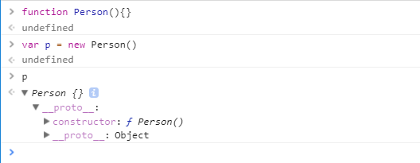
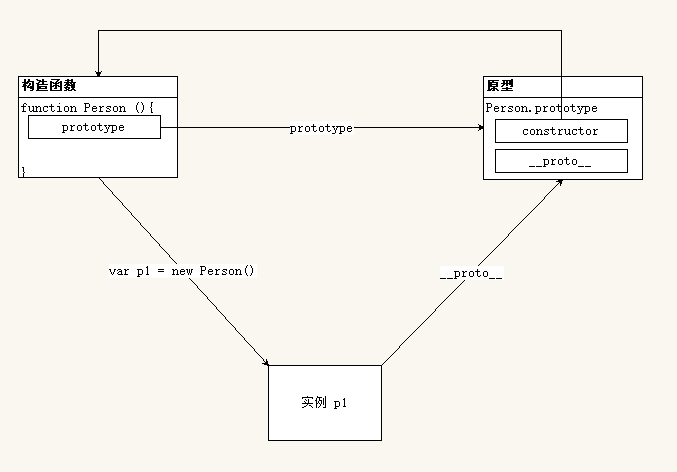

# 面向对象

## js 面向对象

### JavaScript 中的数据类型

#### 值类型和引用类型复制

```javascript
var foo = 'bar'  // 存的是值
var bar = foo

var obj = {  // obj 存的是地址
  foo: bar
}

var obj1 = obj // obj1 中存储的是和 obj 一样的地址

obj.foo = 'baz' // 地址一样, 指向的内用一样, 所以修改的是同一个对象
console.log(obj, obj1)
```


+ 基本类型数据: `undefined` `null` `Boolean` `Number` `String` 直接按值存放
  基本类型在内存中占据固定大小的空间, 被保存在**栈**内存中
  从一个变量向另一个变量复制基本类型的值 -- 复制的是值的副本

+ 引用类型数据: 变量保存的是**一个指针**, 这个指针地址指向堆内存中的数据.
  引用类型的值是对象, 保存在**堆**内存
  保存引用类型的变量保存的并**不是对象本身**, 而是一个指向该对象的指针
  从一个变量向另一个变量复制引用类型的值的时候, 复制的是**引用指针**, 因此两个变量指向的是同一个对象.

#### 值类型和引用类型参数传递

```javascript
var a = 123
var b = {
  foo: 'bar'
}

function f(a, b) {
  a = 456  // var 形参a = 实参a 复制值
  b.foo = 'baz'  // var 形参b = 实参b 复制引用
  b = {   // b 中的地址指向新的对象 与 之前的对象断开连接
    foo: 'bbb'
  }
}

f(a, b)
console.log(a, b)  // 123, Object{foo: 'bbb'}
```

+ 基本类型数据: 按值传递
+ 引用类型数据: 按引用传递

#### 深拷贝与浅拷贝

+ 浅拷贝

  当拷贝对象时, 如果属性时对象或者数组, 这时候传递的也只是一个地址. 两者的属性值指向同一内存空间.

  ```javascript
  var a = {
      key1:"11111"
  }
  function copy(p) {
      var c = {};
      for (var i in p) {
      　　c[i] = p[i];
      }
      return c;
  　　}
  a.key2 = ['小辉','小辉'];
  var b = copy(a);
  　b.key3 = '33333';
  alert(b.key1);     //11111
  alert(b.key3);    //33333
  alert(a.key3);    //undefined
  alert(a.key2);    // ['小辉','小辉']
  alert(b.key2);    // ['小辉','小辉']
  b.key2.push("大辉");
  alert(b.key2);    //小辉，小辉，大辉
  alert(a.key2);    //小辉，小辉，大辉
  ```

+ 深拷贝

  不希望拷贝前后的对象之间有关联, 那么这个时候就会用到**深拷贝**.

  ```javascript
  function isObject(obj) {
    return Object.prototype.toString.call(obj) === '[object Object]'
  }

  function isArray(obj) {
    return Object.prototype.toString.call(obj) === '[object Array]'
  }

  // 利用递归实现深拷贝对象复制
  function extend(target, source) {
    for(var key in source) {
      // 判断如果当前遍历项 source[key] 是一个数组，则先让 target[key] = 数组
      // 然后遍历 source[key] 将其中的每一项都复制到 target[key] 中
      if (isArray(source[key])) {
        target[key] = []
        // 遍历 source[key] 复制到 target[key] 中
        extend(target[key], source[key])
      } else if (isObject(source[key])) {
        target[key] = {}
        extend(target[key], source[key])
      } else {
        target[key] = source[key]
      }
    }
  }
  ```
  

#### 类型检测

+ `typeof`
+ `instanceof` -- 引用类型推荐使用
+ `Object.prototype.toString.call()` -- 可能存在写代码时造成的原型丢失问题.

### javascript执行过程

+ 预解析

  + 全局预解析
    + 所有变量个函数声明都会提前
    + 同名的函数和变量*函数*的优先级高

  + 函数内部预解析
    + 所有的*变量*, *函数* 和 *形参* 都会参与预解析

+ 执行

### 面向对象 - 创建对象

#### 简单方式

  直接通过 `new Object()` 创建
  ```javascript
  var person = new Object()
  person.name = 'Jack'
  person.age = 18

  person.sayHello = function(){
    console.log('Hello ' + this.name)
  }
  ```
  字面量的方式创建
  ```javascript
  var person = {
    name: 'jack'
    age: 18
    sayHello: function(){
      console.log('Hello ' + this.name)
    }
  }
  ```
  存在的问题: 生成多个 `person` 的实例对象, 代码过于冗余, 重复性太高

#### 工厂函数

  ```javascript
  function createPerson (name, age) {
    return {
      name: name
      age: age
      sayHello: function(){
        console.log('Hello ' + this.name)
      }
    }
  }

  var p1 = createPerson('xiaoqiang', 28)
  var p2 = createPerson('xiaogang', 18)
  ```
  通过工厂模式解决了创建多个相似对象代码冗余的问题, 但是也带来了新的问题 -- *使用工厂模式无法判断对象的类型*, 与字面量没什么不同, 都是 `Object`

#### 构造函数

```javascript
function Person (name, age) {
  this.name = name
  this.age = age
  this.sayHello = function(){
    console.log('Hello ' + this.name)
  }
}

var p1 = new Person('xiaoqiang', 18)
p1.sayHello()

var p2 = new Person('xiaogang', 28)
p2.sayHello()
```

构造函数 `Person()` 与 工厂函数 `createPerson()` 的不同:

+ 没有显示的创建对象
+ 直接将属性和方法赋给了 `this` 对象
+ 没有 `return` 语句
+ 函数名是大写的 `Person`

构造函数与普通函数的不同

+ 构造函数与普通函数类似, 不同的是约定 -- 构造函数采用 `Pascal` 命名 (首字母大写)
+ 调用构造函数采用 `new 构造函数名()`
+ 调用构造函数返回的就是新创建的对象, 不需要写 `return`
  + `return 简单类型` 仍返回新创建的对象
  + `return 引用类型` 返回引用
  ```javascript
  function Person(name, age){
    this.name = name
    this.age = age
    // return
    // return 0
    // return '123'
    // return true
    // return false
    // return [1,2,3]
    // return {}
  }

  var  p = new Person()
  console.log(p)

  // 没有 return -- 返回 new Person
  // return -- 返回 new Person
  // return 0 -- 返回 new Person
  // return '123' -- 返回 new Person
  // return true -- 返回 new Person
  // return false -- 返回 new Person
  // return [1,2,3] -- 返回 [1,2,3]
  // return {} -- 返回 {}
  ```
+ 在构造函数内部使用 `this` 来表示新创建的对象, 使用方式 `this.XXX = XXX`

创建 `Person` 的实例, 需要使用 `new` 操作符. 这种方式调用构造函数会经历以下4个阶段:

1.创建一个新对象
2.将构造函数的作用域赋给新对象 -- this 指向新对象
3.执行构造函数中的代码
4.返回新对象

```javascript
// 构造函数就是普通函数
// 好处：
//  1. 创建对象的代码更优雅了
//  2. 可以判断类型了，可以很方便的判断实例和构造函数之间的关系
function Person(name, age) {
  // 如果使用 new 操作符调用该函数，则：
  //    1. 先创建一个对象 var instance = {}
  //    2. 然后将内部的 this 指向 instance   this = instance
  //    3. 用户通过操作 this 从而操作 instance
  //    4. 在方法代码的最后将 this 或者 instance 作为返回值默认返回
  this.name = name
  this.age = age
  this.sayHello = function () {
    console.log('helloi ' + this.name)
  }

  // 在函数的结尾处会将 this 返回，也就是 instance
  // return this
}

function Car() { }

// 普通函数调用，内部 this 指向 window
// Person('小明', 15)

// 使用 new 操作符调用函数就叫做构造函数调用
var p1 = new Person('小明', 18)
var p2 = new Person('小刚', 15)
p1.sayHello()
p2.sayHello()

console.log(p1.constructor === Car)
console.log(p2.constructor === Person)

// instanceof 操作符也可以用来判断实例与构造函数的关系
// constructor 和 instanceof 都可以用来判断实例与构造函数的关系
// 但是跟建议使用 instanceof
console.log(p1 instanceof Person)
```

##### 构造函数和实例对象的关系

**每一个实例对象中都有一个 `constructor` 属性, 改属性指向创建该实例的构造函数.**

```javascript
console.log(p1.constructor === Person)    //true
console.log(p2.constructor === Person)    //true
console.log(p1.constructor === p2.constructor)    //true
```

```javascript
p1 instanceof Peson // true
p2 instanceof Peson // true
```

+ 构造函数是根据具体事物抽象出来的模板
+ 实例对象时根据抽象出来的构造函数模板得到的具体函数
+ 每一个实例对象都有一个 `constructor` 属性, 改属性指向创建该实例的构造函数
+ 可以通过实例的 `constructor` 属性来判断实例与构造函数之间的关系

##### 构造函数的问题

```javascript
function Person(name, age) {
  this.name = name
  this.age = age
  this.type = type
  this.sayHello = function () {
    console.log('helloi ' + this.name)
  }
}

var p1 = new Person('xiaoqiang', 16)
var p2 = new Person('xiaogang', 18)
```

每实例化一个对象, `type` 和 `sayHello` 都是一样的内容, 每生成一个实例, 都会多占用一些内存,

```javascript
p1.sayHello === p2.sayHello // false
```

对于这种问题, 需要将共享的函数定义到构造函数外部:

```javascript
function Person(name, age) {
  this.name = name
  this.age = age
  this.type = type
  this.sayHello = sayHello
}
function sayHello = function () {
  console.log('helloi ' + this.name)
}
```

```javascript
p1.sayHello === p2.sayHello // true
```

虽然解决了内存问题, 但是有多个共享函数又会造成命名冲突的问题.
解决办法: 将多个函数放入一个对象中来避免全局命名冲突:

```javascript
var fns = {
  sayHello: function () { },
  showAge: function () { }
}
function Person(name, age) {
  this.name = name
  this.age = age
  this.sayHello = fns.sayHello
  this.showAge = fns.showAge
}
var p1 = new Person('lpz', 18)
var p2 = new Person('Jack', 16)

console.log(p1.sayHello === p2.sayHello) // => true
console.log(p1.sayAge === p2.sayAge) // => true
```

#### 原型

##### 更好的解决办法 `prototype`

javascript规定: 每一个构造函数内部都有一个 `prototype` 属性, 该属性指向另一个对象. 这个对象的**所有属性和方法, 都会被构造函数的实例继承**.
我们可以把所有对象实例需要共享的属和方法直接定义在 `prototype` 对象上.

```javascript
function Person (name, age) {
  this.name = name
  this.age = age
}

console.log(Person.prototype)

Person.prototype.type = 'human'

Person.prototype.sayHello = function(){
  console.log('helloi ' + this.name)
}

var p1 = new Person(...)
var p2 = new Person(...)

console.log(p1.sayHello === p2.sayHello)  // true
```

所有实例的 `type` 属性和 `sayHello` 方法, 指向的都是同一内存地址 -- `prototype` 对象

##### 构造函数、实例、原型三者之间的关系

每创建一个函数, 系统就会为这个函数自动分配一个 prototype 指针, 指向他的原型对象. 这个原型对象包含两个部分( `constructor` 和 `__proto__` ) 其中 `constructor` 指向函数自身

```javascript
function Person(){ }
console.log(Person.prototype.constructor === Person)  // true
```

通过构造函数得到的实例对象中只有 `__proto__` 属性, 所有的实例都指向自己构造函数的原型.

```javascript
p.__proto__ === Person.prototype  // true
```

`__proto__` 属性里面有构造器 `constructor` 和 `__proto__`
`constructor` 指向原型所属的构造函数
`__proto__` 指向Object的原型




### 面向对象 - 基本特性

+ 抽象性
  -- 只有在具体的环境中对象才可以表示具体的事物
  -- 而在程序设计中实际只考虑对象的目标数据
+ 封装性
  -- 将具体的操作步骤打包起来
  -- 使用时无需关心具体的实现过程, 知道怎样使用即可
+ 继承性
  -- 继承在 `OOP` 中的表现就是扩展. 在原有的对象的基础上, 添加一些新的东西得到新的对象, 这个新的对象就继承自原有的对象.
+ 多态性
  -- 调用同一个方法, 根据传入的参数不同, 得到不同的结果

### 面向对象 - Error 对象

#### 异常的概念

在代码运行的过程中, 得到与预期不同的结果

#### 处理异常

语法

```javascript
try {
  // 需要判断的代码
} catch (e) {
  // 异常的处理
}
```

#### 异常对象的传递

代码出现异常, 那么异常后面的代码不再执行, 将错误传递给调用该函数的函数, 直至传到最顶层.

如果有 `try - catch` 那么出现异常后会执行 `catch` 中异常处理的代码

#### 异常对象

在出现异常的时候, 异常出现的位置以及异常的类型, 内容等数据都会被封装起来, 以一个对象的形式传递给 `catch` 语句中的参数 `e` ,用户可以使用 `throw 异常对象` 抛出异常, 或者 `new Error(e)`得到异常信息.

```javascript
try {
  // 需要判断的代码
} catch (e) {
  console.log(new Error(e))
  throw e
}
```

### 面向对象 - DOM对象

HTML中所有的节点都是对象

```html
<body>
  你好, 今天<i>天气很好</i>.
<body>
```

其中:
"你好, 今天" 是一个对象
i 标签也是一个对象
"添加很好" 也是一个对象

### 面向对象 - 继承

#### 原型继承

对象 `p` 中没有 `sayHello` 方法, 因为构造函数 `Person` 中什么都没有
但是 `p` 连接到*原型*中了, 因此 `p` 就可以调用 `sayHello` 方法
这就是原型继承, `p` 没有, 但是 `p` 继承自原型对象, 所以 `p` 有了

+ 一般的方法

  所有的方法写在原型中

  ```javascript
  function Person ( name, age, gender ) {
    this.name = name;
    this.age = age;
    this.gender = gender;
  }
  Person.prototype.sayHello = function () {
    console.log( '你好, 我是 ' + this.name );
  };
  ```

+ 替换原型

  ```javascript
  function Person ( name, age, gender ) {
    this.name = name;
    this.age = age;
    this.gender = gender;
  }
  Person.prototype = {
    constructor: Person // 最好手动添加 constructor 的指向
    sayHello: function () { },
    walk:function () { }
  }
  var p = new Person()
  p.sayHello()
  ```

+ `Object.create()` 方法

  Object.create(proto [, propertiesObject ]) 是E5中提出的一种新的对象创建方式，第一个参数是要继承的原型，如果不是一个子函数，可以传一个null，第二个参数是对象的属性描述符，这个参数是可选的。

  ```javascript
  function Car (desc) {
      this.desc = desc;
      this.color = "red";
  }
  Car.prototype = {
      getInfo: function() {
        return 'A ' + this.color + ' ' + this.desc + '.';
      }
  };
  //instantiate object using the constructor function
  var car =  Object.create(Car.prototype);
  car.color = "blue";
  alert(car.getInfo()); // A blue undefined.
  ```

  `propertiesObject` 参数的详细解释：（默认都为false）
  + `writable`: 是否可任意写
  + `configurable`：是否能够删除，是否能够被修改
  + `enumerable`：是否能用 for in 枚举
  + `value：值` 访问属性
  + `get()`: 访问
  + `set()`: 设置

  ```html
  <!DOCTYPE html>
  <html>
  <head>
    <meta charset="utf-8" />
  </head>
  <body>
    <script type="text/javascript">
      var obj = {
        a: function () { console.log(100) },
        b: function () { console.log(200) },
        c: function () { console.log(300) }
      }
      var newObj = {}
      newObj = Object.create(obj, {
        t1: {
          value: 'yupeng',
          writable: true
        },
        bar: {
          configurable: false,
          get: function () { return bar },
          set: function (value) { bar = value }
        }
      })

      console.log(newObj.a())   // 100
      console.log(newObj.t1)    // yupeng
      newObj.t1 = 'yupeng1'
      console.log(newObj.t1)    // yupeng1
      newObj.bar = 201
      console.log(newObj.bar)   // 201

      function Parent() { }
      var parent = new Parent()
      var child = Object.create(parent, {
        dataDescriptor: {
          value: "This property uses this string as its value.",
          writable: true,
          enumerable: true
        },
        accessorDescriptor: {
          get: function () { return "I am returning: " + accessorDescriptor },
          set: function (val) { accessorDescriptor = val },
          configurable: true
        }
      })

      child.accessorDescriptor = 'YUPENG'
      console.log(child.accessorDescriptor)   // I am returning: YUPENG

      var Car2 = function () {
        this.name = 'aaaaaa'
      } //this is an empty object, like {}
      Car2.prototype = {
        getInfo: function () {
          return 'A ' + this.color + ' ' + this.desc + '.'
        }
      }

      var newCar = new Car2()

      var car2 = Object.create(newCar, {
        //value properties
        color: { writable: true, configurable: true, value: 'red' },
        //concrete desc value
        rawDesc: { writable: true, configurable: true, value: 'Porsche boxter' },
        // data properties (assigned using getters and setters)
        desc: {
          configurable: true,
          get: function () { return this.rawDesc.toUpperCase() },
          set: function (value) { this.rawDesc = value.toLowerCase() }
        }
      })
      car2.color = 'blue'
      console.log(car2.getInfo())   // A blue PORSCHE BOXTER.
      car2.desc = "XXXXXXXX"
      console.log(car2.getInfo())   // A blue XXXXXXXX.
      console.log(car2.name)        // aaaaaa
    </script>
  </body>
  </html>
  ```

#### 混合继承