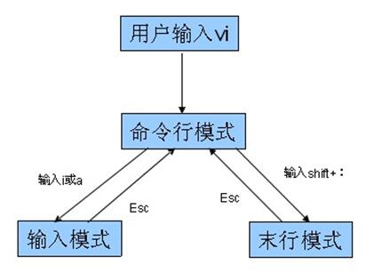
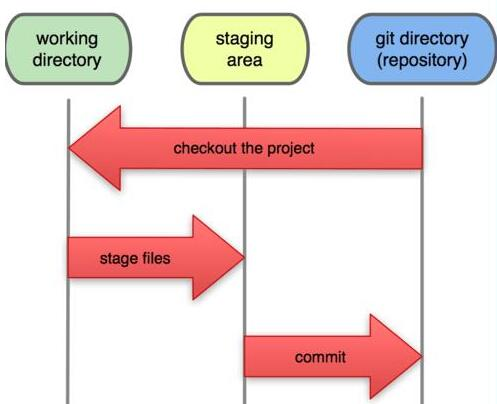

# linux 和 git

## Linux 部分

### 命令行

- dos
  windows 下
- shell
  Linux 下

- dos 与 shell 的区别 引用自 [cdsn](http://blog.csdn.net/xiaoxinyu316/article/details/43486411)
  - shell区分大小写，DOS不区分大小写
  - shell的命令的开关可以简写（比如说“-a -l“可以简写为“-al“），而DOS的则不允许
  - 在脚本编写上的语法差别极大，比如说：两者的流程控制语句语法不同，变量的语法不同等
  - shell可以在UNIX、GNU/Linux和Win下（cygwin bash shell）工作，DOS则还没有听说过能在Win/DOS以外的系统中工作；
  - shell原生支持正则表达式，DOS则不是。

### 常用命令

```bash
pwd # 查看当前目录 -- print working directory
cd # 切换目录 -- change directory
ls # 查看当前目录下内容
  ls -al
mkdir # 创建目录 -- make directory
touch # 创建文件
cat #查看文件内容
less # 查看文件
rm # 删除文件 remove
  rm -rf
rmdir # 删除文件夹 -- 只能删除空文件夹
mv # 移动文件 -- move
  mv a ../folder/b # 移动同时改名
cp # 复制文件
```

### 常用操作

```bash
tab # 自动补全
> # 写入 (覆盖)
>> # 写入 (追加)
  echo hello >> test.md
grep # 筛选
  ls | grep h # 配合管道符使用
```

### vi

vi 的三种模式: 

#### vi 的常用操作

- a) 打开/创建文件， vi 文件路径
- b) 底行模式 :w保存，:w filenme另存为
- c) 底行模式 :q退出
- d) 底行模式 :wq保存并退出
- e) 底行模式 :e! 撤销更改，返回到上一次保存的状态
- f) 底行模式 :q! 不保存强制退出
- g) 底行模式 :set nu 设置行号
- h) 命令模式 ZZ（大写）保存并退出
- i) 命令模式 u辙销操作，可多次使用
- j) 命令模式 dd删除当前行
- k) 命令模式 yy复制当前行
- l) 命令模式 p 粘贴内容
- m) 命令模式 ctrl+f向前翻页
- n) 命令模式 ctrl+b向后翻页
- o) 命令模式 i进入编辑模式，当前光标处插入
- p) 命令模式 a进入编辑模式，当前光标后插入
- q) 命令模式 A进入编辑模式，光标移动到行尾
- r) 命令模式 o进入编辑模式，当前行下面插入新行
- s) 命令模式 O进入编辑模式，当前行上面插入新行

## GIT

### git 的三个工作区域



### git 管理文件的 4 种状态

- 未追踪untraced
- 已暂存staged
- 已提交commited
- 已修改modified

### git 命令

```bash
git config [--list|--global]  # 查看配置信息
git status # 查看文件状态
git log # 查看提交记录
git add # 工作区添加到缓存区
git checkout  # 暂存区覆盖工作区
git commmit -m "" # 暂存区提交到本地仓库
hit reset --hard  # 回滚到指定版本

```